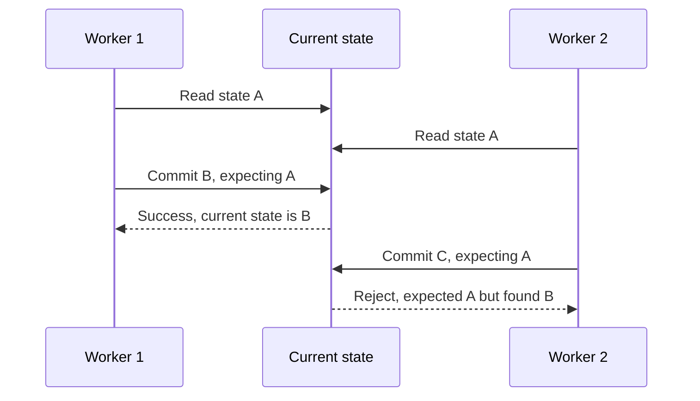

# Enterprise Knowledge Systems — Decision & Trade-off Matrix

> **Terminology note:** Technical abbreviations are expanded on first use where practical. See the [Technical glossary](../GLOSSARY.md) for a single reference covering ACL, ANN, BM25, HNSW, IVF, Maximum Marginal Relevance (MMR), MRR, RAG, RRF, and related terms.

This companion to the [Enterprise Knowledge Systems — Interview Playbook](ENTERPRISE_KNOWLEDGE_SYSTEMS_INTERVIEW_GUIDE.md) focuses on one question senior interviewers keep asking:

> **Why did you choose this design, what alternatives did you consider, what did you give up, and when would you change the decision?**

Use each section as a decision story, not as a list to memorize.


## Architecture decision matrix — at a glance

| Decision area | Options considered | Tropos baseline | Why this choice | Cost / downside | Revisit when | Status |
| --- | --- | --- | --- | --- | --- | --- |
| Source identity | filename/path, source-native ID, content identity | source-system namespace + source-record ID | survives presentation changes and keeps source lineage explicit | moves/renames and cross-source duplicates are separate problems | source systems lack stable IDs or cross-source canonical identity is required | **Implemented** |
| Duplicate delivery | assume exactly-once, de-duplicate downstream, idempotent consumer | ingestion fingerprint + completed-run lookup | retries and duplicate delivery are normal in sync/queue systems | requires idempotency state and careful key design | retention/volume makes idempotency state expensive | **Implemented** |
| Parsing | source-specific logic everywhere, bounded in-house parser, Tika/managed extraction | bounded deterministic parser behind a parser boundary | small supported format set, no extra infrastructure, deterministic behavior | limited format coverage and more parser maintenance | PDF/PPT/XLS/OCR/large-format surface becomes required | **Implemented baseline** |
| Canonicalization | raw bytes, deterministic normalization, LLM semantic rewriting | deterministic normalization | reproducible equality and safe version comparison | semantically equivalent rewrites may still appear different | domain needs semantic equivalence beyond deterministic rules | **Implemented** |
| Change detection | compare full text, raw-file hash, canonical-content hash | SHA-256 of deterministic canonical serialization | compact persistent equality key aligned to canonicalization rules | hash does not understand meaning; theoretical collision risk | canonicalization rules, not SHA-256, are the likely change point | **Implemented** |
| Knowledge history | update in place, event-sourced model, immutable versions + current projection | immutable versions + current-state projection | auditability plus simple active-state lookup | more rows, retention and migration complexity | history/storage cost becomes material or temporal queries dominate | **Implemented** |
| ACL evolution | content version for every ACL change, source lookup on every query, separate governance state | separate access fingerprint + governance refresh | permissions evolve independently of content | governance state must stay synchronized with searchable chunks | source-of-truth authorization can be queried cheaply enough per request | **Implemented** |
| Concurrent writes | last-write-wins, pessimistic locking, optimistic concurrency | expected-state validation in transaction | prevents lost updates without long-held locks when conflicts are rare | conflicting operations must retry/reconcile | write contention becomes frequent | **Implemented** |
| Out-of-order source events | ignore order, timestamps only, source-native sequence/cursor validation | preserve source version now; mature ordering control belongs in future sync layer | source-native ordering is more trustworthy than arrival time | not yet a complete enterprise sync solution | durable multi-record sync is built | **Planned** |
| Version commit consistency | independent writes, distributed transaction, local atomic DB transaction | atomic SQLite transaction for version/chunks/current state | these writes are one canonical state transition | only protects one DB boundary, not external indexes/services | separate search index/event bus is introduced | **Implemented** |
| Chunking | fixed tokens, arbitrary characters, structural chunks, semantic chunking | deterministic structural-character baseline | reproducibility, traceability and simple failure analysis | may miss optimal semantic boundaries; zero overlap can lose cross-boundary context | eval data shows chunk-boundary recall problems | **Implemented baseline** |
| Lexical retrieval | SQL LIKE, FTS/BM25, vector-only | SQLite FTS5 + BM25 | strong exact-term/identifier retrieval with low operational complexity | weak paraphrase/semantic recall | semantic misses are measured | **Implemented** |
| Retrieval authorization | retrieve then filter, post-filter and refill, pre-filter authorized candidates | current-version + tenant/group authorization during retrieval | unauthorized evidence should not cross retrieval boundary | complicates vector/ANN design and may reduce index choices | never relax security invariant; implementation may change | **Implemented invariant** |
| Retrieval evaluation | manual spot checks, online-only metrics, versioned offline golden set | labeled golden corpus + Recall@K/MRR/Precision/no-answer checks | makes retrieval changes comparable and regressions visible in CI | synthetic corpus can overfit and is not production truth | held-out/production-like data becomes available | **Implemented baseline** |
| Semantic retrieval | skip vectors, vector-only replacement, additive vector path | exact dense retrieval as a second strategy behind the same retrieval contract | measured BM25 semantic misses justify an evidence-based comparison | embedding cost, model lifecycle, vector storage complexity | after BM25-vs-vector evaluation | **Implemented V1; real-model quality evidence pending** |
| Vector search | exact flat scan, HNSW, IVF, managed vector DB | exact/flat cosine search for V1 | isolates embedding quality from ANN approximation and infrastructure | does not scale to large corpora | corpus/latency makes exact scan materially slow | **Implemented V1 / ANN deferred** |
| Hybrid retrieval | replace BM25 with vector, weighted raw-score blend, rank fusion, cross-encoder reranking | Reciprocal Rank Fusion (RRF) across BM25 + dense ranks | combines complementary retrievers without pretending BM25/cosine scores share a scale | operates two retrieval paths and needs candidate-depth/fusion tuning | reranking or ANN becomes justified by measured quality/latency needs | **Implemented V1** |
| Persistence | SQLite, Postgres/pgvector, dedicated search/vector stack | SQLite while service/runtime scale is local | simplest durable baseline for correctness and evaluation | limited concurrency/operations/scale | shared hosted service, multi-tenant runtime, or scale requires it | **Implemented baseline** |
| Enterprise sync | single-record capture, periodic full scan, delta/cursor sync engine | single-record connector + retry boundary today | isolates acquisition contract before adding operational sync complexity | no backfill/deletion/checkpoint/resume engine yet | enterprise connector rollout begins | **Deferred / planned** |

---

# 1. Stable source identity

## Problem

A document can be renamed, reformatted, moved, or fetched repeatedly. The system still needs to know whether it is dealing with the same source object.

## Options considered

| Option | Benefit | Problem |
| --- | --- | --- |
| Filename/path as identity | easy to understand | rename/move can create a fake new object |
| Hash content as identity | deduplicates byte-identical content | same object with changed content becomes a different identity |
| Source-native stable ID | follows the object through content changes | source-specific and does not solve cross-source duplicates |

## Decision

Use a configured source-system namespace plus the source-native record ID as source identity.

```text
source identity
= source_system + source_record_id
```

### Why

Identity answers **which object is this?**; content fingerprints answer **did its representation change?**. Mixing those questions makes versioning brittle.

### Cost / downside

Cross-source duplicates are not automatically the same knowledge object. A SharePoint copy and a Jira copy can contain the same text but still have different source identities.

### Revisit trigger

Introduce canonical cross-source identity only when a real product requirement exists for deduplicating or reconciling multiple authoritative sources.

### Interview probe

**“Why not just use the document hash as the document ID?”**

A strong answer separates object identity from content state.

---

# 2. Idempotent ingestion instead of assuming exactly-once delivery

## Problem

Source APIs, queues, retries and worker restarts can deliver the same captured state more than once.

## Options considered

| Option | Benefit | Problem |
| --- | --- | --- |
| Assume exactly-once delivery | simplest consumer | unrealistic across many distributed systems |
| Allow duplicates and clean later | simple write path | downstream version/chunk/index pollution |
| Make consumer idempotent | safe retries | requires deterministic processing identity and retained state |

## Decision

Compute a deterministic ingestion fingerprint and check whether that knowledge ID + fingerprint already completed successfully.

### Why

Retries should be normal operational behavior, not a correctness risk.

### Cost / downside

The idempotency key definition becomes part of the contract. A poorly chosen key can suppress legitimate work or fail to collapse true duplicates.

### Revisit trigger

If the retained idempotency history becomes large, add explicit retention/partitioning rules rather than weakening the invariant.

---

# 3. Bounded deterministic parsing before adopting a broad extraction platform

## Problem

DOCX, HTML, Markdown and text have different physical formats, but downstream versioning should receive one common extracted representation.

## Options considered

| Option | Benefit | Problem |
| --- | --- | --- |
| Source-specific parsing inside every connector | fast initial implementation | duplicates logic and couples connectors to formats |
| Small deterministic parser layer | reproducible, low-dependency baseline | limited file-type coverage |
| Apache Tika / managed extraction | broad format coverage | extra dependency/runtime/operational boundary |

## Decision

Keep parsing behind one reusable parser boundary and implement only the bounded formats Tropos currently needs.

### Why

The system can validate parsing/versioning behavior without introducing an extraction platform before there is a format breadth requirement.

### Cost / downside

PDF, PowerPoint, spreadsheets, OCR and complex layout are not solved by the current baseline.

### Revisit trigger

Move to Tika or a managed document-processing layer when broad enterprise format support becomes a real ingestion requirement.

---

# 4. Deterministic canonicalization instead of LLM normalization

## Problem

Formatting noise should not create fake knowledge versions, but version identity must be reproducible.

## Options considered

| Option | Benefit | Problem |
| --- | --- | --- |
| Compare raw bytes | simple | every re-save/markup difference can look like a content change |
| Deterministic normalization | reproducible | cannot collapse all semantic paraphrases |
| LLM semantic rewriting | may detect deeper equivalence | non-deterministic, model/version/cost dependence, risky for identity |

## Decision

Use deterministic Unicode, newline, whitespace and structural normalization, then version the normalization strategy itself.

### Why

Canonicalization is an identity rule. Re-running the same source under the same strategy must produce the same canonical output.

### Cost / downside

`"work from home two days"` and `"perform duties remotely twice each week"` may still produce different canonical text even if a human considers them equivalent.

### Revisit trigger

If the product later requires semantic deduplication, add it as a separate matching/review capability rather than silently replacing deterministic content identity.

---

# 5. Canonical SHA-256 fingerprint instead of raw-file fingerprint for knowledge versioning

## Problem

The system needs a compact equality key for canonical state.

## Options considered

| Option | Benefit | Problem |
| --- | --- | --- |
| Compare full canonical serialization | exact and conceptually simple | larger state/comparisons and awkward keys |
| Hash raw bytes | cheap | measures file equality, not canonical knowledge equality |
| Hash canonical serialization | compact and aligned to version semantics | depends entirely on correctness of canonicalization |

## Decision

SHA-256 the deterministic canonical serialization and persist that as the content fingerprint. Keep raw-payload fingerprints separately for source lineage.

### Why

The two hashes answer different questions:

```text
raw payload hash        → did the source bytes change?
canonical content hash  → did the normalized knowledge representation change?
```

### Cost / downside

A hash does not understand meaning. It is only a digest of the representation chosen upstream.

### Revisit trigger

The likely evolution point is the canonicalization policy, not the cryptographic hash algorithm.

---

# 6. Immutable versions plus a current-state projection

## Problem

The system needs both historical auditability and a cheap answer to “what is active now?”.

## Options considered

| Option | Benefit | Problem |
| --- | --- | --- |
| Update current row in place | simple current reads | destroys history |
| Recompute current from all versions | pure history model | every consumer pays temporal query cost |
| Immutable history + explicit current projection | history and fast current reads | duplicate state and consistency responsibility |

## Decision

Append knowledge versions and maintain a small current-state projection used by reconciliation and retrieval.

### Why

History and active state answer different questions.

### Cost / downside

Retention, migrations and consistency checks become part of operations.

### Revisit trigger

If temporal/event queries become dominant, evaluate a fuller event-sourced or bitemporal model. Do not remove history merely to reduce table size without a retention policy.

---

# 7. Separate governance state from content versioning

## Problem

Permissions can change without business content changing.

## Options considered

| Option | Benefit | Problem |
| --- | --- | --- |
| Create a content version for every ACL change | one version mechanism | pollutes content history |
| Resolve all ACLs live from source on every query | freshest source authorization | latency, availability and source coupling |
| Track governance separately | clean semantics and local retrieval enforcement | ACL synchronization becomes its own lifecycle |

## Decision

Use a separate access-policy fingerprint and refresh governance without creating a fake content version.

### Why

`CONTENT HISTORY ≠ PERMISSION HISTORY`.

### Cost / downside

Permission revocation freshness is now a first-class operational requirement.

### Revisit trigger

If a source can provide authoritative low-latency policy checks at query time, evaluate a hybrid authorization model, but keep fail-closed retrieval behavior.

---

# 8. Optimistic concurrency instead of last-write-wins or long-held locks

## Problem

Two workers can read state A, independently derive B and C, then race to commit.

## Options considered

| Option | Benefit | Problem |
| --- | --- | --- |
| Last-write-wins | simple | silently loses valid updates |
| Pessimistic lock while processing | strong serialization | long lock duration, throughput/availability cost |
| Optimistic concurrency | low lock contention | conflict requires retry/reconciliation |

## Decision

Make the decision against a specific previous state and validate `expected_previous` again inside the write transaction.



### Why

Conflicts are expected to be uncommon, so there is no reason to lock knowledge state for the whole parse/normalize/chunk pipeline.

### Cost / downside

The caller or future worker orchestration must re-read and reconcile after a conflict. Detection is implemented; sophisticated durable retry orchestration is separate work.

### Revisit trigger

If conflict frequency becomes high enough that retries dominate, reconsider partitioning/serialization or shorter critical sections before jumping to coarse pessimistic locking.

---

# 9. Source ordering is a separate problem from concurrency

## Problem

Revision 20 can be accepted and a delayed revision 19 can arrive later.

## Options considered

| Option | Benefit | Problem |
| --- | --- | --- |
| Trust arrival time | simple | networks/queues do not preserve business recency reliably |
| Compare generic timestamps | better | clock/semantics can be ambiguous |
| Use source-native revision/sequence/delta cursor | aligned to source truth | connector-specific logic |

## Decision

The current core preserves source version information, but mature source ordering belongs in the future sync layer using source-native revision/cursor semantics.

### Why

Concurrency asks **“did someone change state since I read it?”**. Ordering asks **“is this event older than the state already accepted from the source?”**.

### Cost / downside

The current single-record ingestion baseline does not yet solve full out-of-order enterprise synchronization.

### Revisit trigger

Before introducing production multi-record source sync with backfill/deltas/checkpoints.

---

# 10. One local transaction for one canonical state transition

## Problem

Creating a version involves multiple writes: version row, chunks and current-state advancement.

## Options considered

| Option | Benefit | Problem |
| --- | --- | --- |
| Independent writes | simple code | partial failure creates inconsistent canonical state |
| Distributed transaction across every subsystem | strongest atomicity | high complexity and weak ecosystem support |
| Atomic transaction in canonical DB | protects local invariant | external indexes/services are eventually consistent separately |

## Decision

Commit canonical version, chunks and current-state transition atomically in SQLite.

### Why

These writes represent one business state transition and should not be partially visible.

### Cost / downside

A future external vector/search index will create a second consistency boundary requiring an outbox/reconciliation strategy.

### Revisit trigger

As soon as canonical persistence and retrieval index live in different systems.

---

# 11. Deterministic structural chunking as the baseline

## Problem

Retrieving a whole long document is too coarse, but arbitrary splits can destroy context and provenance.

## Options considered

| Option | Benefit | Problem |
| --- | --- | --- |
| Whole document | maximum context | poor ranking specificity and large context cost |
| Fixed characters/tokens | easy | splits semantic structure |
| Structural deterministic chunks | explainable and reproducible | not always optimal for semantic recall |
| Semantic/LLM chunking | context-aware | cost, model dependence and harder reproducibility |

## Decision

Use deterministic structural-character chunking as the first retrieval unit.

### Why

It preserves traceability and gives a stable baseline for retrieval evaluation.

### Cost / downside

Boundary effects remain possible and zero overlap can lose context spanning adjacent chunks.

### Revisit trigger

Change chunking only when labeled retrieval cases demonstrate boundary-related misses. Evaluate new chunking against the same corpus before migration.

---

# 12. BM25 lexical retrieval before vector retrieval

## Problem

The platform needs a reliable baseline search path before adding embedding/model infrastructure.

## Options considered

| Option | Benefit | Problem |
| --- | --- | --- |
| SQL substring/LIKE | trivial | poor ranking and scale |
| BM25 lexical retrieval | strong exact-term ranking | weak paraphrase recall |
| Vector-only from day one | semantic matching | model/infrastructure complexity and weaker exact identifiers in some cases |
| Hybrid immediately | potentially best coverage | too many variables before measuring either path |

## Decision

Start with SQLite FTS5/BM25, evaluate it, then add semantic retrieval only when measured misses justify it.

### Why

Exact identifiers, policy names, acronyms and product codes are common enterprise queries and lexical search is cheap, transparent and deterministic.

### Cost / downside

Paraphrases can miss even when the evidence is conceptually relevant.

### Evidence / revisit trigger

The current golden retrieval baseline intentionally contains semantic misses. That is the evidence motivating Vector Retrieval V1.

---

# 13. Authorization inside retrieval rather than post-filtering

## Problem

A search system can rank unauthorized evidence above authorized evidence.

## Options considered

| Option | Benefit | Problem |
| --- | --- | --- |
| Retrieve globally, then filter top-K | easy | leakage risk and under-return of authorized results |
| Retrieve more globally, filter and refill | better recall | unauthorized evidence still crosses internal ranking boundary |
| Scope candidate set by current state + authorization | security-aligned | harder with some ANN/index architectures |

## Decision

Filter current version, tenant and restricted-group eligibility as part of retrieval.

### Why

The invariant is stronger than “don't display unauthorized text”:

> **Unauthorized evidence should not cross the governed retrieval boundary.**

### Cost / downside

This constrains future vector-index choices. Metadata filtering cannot be treated as an afterthought.

### Revisit trigger

Implementation can change, but the security invariant should not.

---

# 14. Offline labeled evaluation before semantic expansion

## Problem

A retriever can pass unit tests while returning irrelevant evidence.

## Options considered

| Option | Benefit | Problem |
| --- | --- | --- |
| Manual spot checks | fast initially | subjective and not regression-safe |
| Online metrics only | reflects production behavior | hard to diagnose and risky before deployment |
| Versioned offline golden set | reproducible comparisons in CI | synthetic/small datasets can overfit |

## Decision

Use a labeled retrieval dataset and deterministic metrics such as Recall@K and MRR, with no-answer and access-control cases.

### Why

Architecture changes should be justified by measured failure modes rather than “RAG best practice.”

### Cost / downside

The current synthetic V1 corpus is a development seed, not proof of enterprise accuracy.

### Revisit trigger

Add held-out production-like datasets, graded relevance/nDCG and category-specific thresholds as real data becomes available.

---

# 15. Vector retrieval as an additive strategy, not an immediate BM25 replacement

## Problem

BM25 misses semantic paraphrases, but vector retrieval can regress exact identifiers and introduces model lifecycle cost.

## Options considered

| Option | Benefit | Problem |
| --- | --- | --- |
| Keep BM25 only | simple | known semantic misses remain |
| Replace BM25 with vectors | one search path | may lose exact lexical strengths and creates model dependency |
| Add vector retriever behind same contract | controlled comparison | two strategies to operate/evaluate |

## Decision

Build Vector Retrieval V1 behind the existing strategy-neutral retrieval contract and run the same golden cases through BM25 and vector search.

### Why

This isolates the question: **does semantic representation recover the observed misses without governance regressions?**

### Cost / downside

Embedding generation, storage, model versioning and re-embedding become new processing concerns.

### Revisit trigger

After comparative metrics exist; only then decide whether vector is additive, replacement-worthy, or insufficient.

### Status

**Implemented in Vector Retrieval V1.** The mechanism is implemented behind the existing retrieval contract. Real-model semantic-quality claims remain pending until the credentialed golden-set comparison is captured.

---

# 16. Exact vector similarity before HNSW/IVF

## Problem

Semantic quality and vector-index scalability are two different experiments.

## Options considered

| Option | Benefit | Problem |
| --- | --- | --- |
| Flat exact similarity | exact baseline and simple | O(N) query cost |
| Hierarchical Navigable Small World (HNSW) | fast high-recall ANN | memory/index tuning/approximation |
| Inverted File (IVF) / Product Quantization (PQ) | scalable/compressible | training/tuning/approximation complexity |
| Managed vector DB | operational features | vendor/service cost and another dependency |

## Decision

For Vector Retrieval V1, use exact/flat similarity at the current small evaluation scale before introducing ANN infrastructure.

### Why

If vector recall is poor, exact search lets us attribute the miss to representation/chunking/query behavior rather than ANN approximation.

### Cost / downside

Flat scan is deliberately not the production topology for millions of vectors.

### Revisit trigger

Benchmark corpus size and p95 latency; introduce ANN only when exact search becomes a measured bottleneck.

### Status

**Implemented V1; ANN deferred.**

---

# 17. Hybrid retrieval through Reciprocal Rank Fusion after complementary strengths were measured

## Problem

Lexical and semantic retrieval win different query classes. BM25 is strong for identifiers and exact language; dense retrieval can recover paraphrases. Their raw scores are not naturally calibrated to the same scale.

## Options considered

| Option | Benefit | Problem |
| --- | --- | --- |
| Pick one retriever globally | simplest runtime | discards complementary strengths |
| Weighted raw-score blend | simple formula | BM25 and cosine score scales are not comparable without calibration |
| Reciprocal Rank Fusion (RRF) | score-scale independent | adds fusion/candidate-depth tuning |
| Cross-encoder reranking | strong relevance potential | extra latency, cost and model dependency |

## Decision

Use RRF to combine the ranked outputs of BM25 and exact dense retrieval while preserving both underlying strategies independently.

### Why

The evaluation work established enough complementary behavior to justify an additive hybrid path. RRF combines rank positions rather than uncalibrated raw scores.

### Cost / downside

Hybrid retrieval runs more than one strategy and introduces candidate-depth/fusion parameters. It does not solve abstention/no-answer calibration by itself.

### Revisit trigger

Evaluate reranking or a different fusion policy only when production-like evaluation shows material benefit. Introduce ANN only when corpus scale/latency makes exact dense search a measured constraint.

### Status

**Implemented V1.** See ADR-015 and `HYBRID_RETRIEVAL_V1.md`.

---

# 18. SQLite now; larger serving infrastructure only when the service boundary earns it

## Problem

A local/solo build needs durability and real SQL behavior without prematurely operating a distributed serving stack.

## Options considered

| Option | Benefit | Problem |
| --- | --- | --- |
| In-memory only | fastest prototyping | no durable behavior or realistic transaction tests |
| SQLite | durable, transactional, zero service dependency | limited concurrency/scale/operations |
| Postgres + pgvector now | service-ready path | infrastructure/dependency cost before API/runtime need |
| Dedicated search/vector systems | scale/features | even larger operational surface |

## Decision

Use SQLite for the current foundation and migrate only when the hosted multi-consumer service requires stronger concurrency, operations or scale.

### Why

The current engineering questions are correctness, lineage, governance and retrieval quality—not horizontal database scale.

### Cost / downside

SQLite is not the final production topology for a large multi-tenant service.

### Revisit trigger

Workspace isolation, hosted APIs, multi-consumer concurrency, persistent production runtime or data scale make SQLite a measured constraint.

---

# 19. Connector boundary now; durable enterprise sync engine later

## Problem

Fetching one known source record is much simpler than continuously synchronizing millions of enterprise records.

## Options considered

| Option | Benefit | Problem |
| --- | --- | --- |
| Put discovery/sync/retry inside each connector | quick vertical integration | duplicates orchestration and makes connectors stateful |
| Full generic sync engine immediately | comprehensive | large design surface before one-record ingestion is stable |
| Stable capture contract first, sync orchestration later | isolates concerns | enterprise sync is intentionally incomplete for now |

## Decision

Keep connectors responsible for acquisition/metadata/ACL translation and the core ingestion pipeline source-agnostic. Add discovery, pagination, deltas, checkpoints, deletions and resume semantics as a separate sync capability when needed.

### Why

A connector answers **“how do I capture this source record?”**. A sync engine answers **“how do I continuously reconcile a changing source corpus?”**.

### Cost / downside

Current source reliability is bounded single-record retry, not durable fleet-scale synchronization.

### Revisit trigger

The first real enterprise source integration that needs backfill + incremental delta sync.

---

# Interview decision drill

For any Tropos component, answer these seven questions without opening the repository:

1. **What production failure are we trying to prevent?**
2. **What invariant must remain true?**
3. **What realistic alternatives exist?**
4. **Why is the selected option appropriate at the current scale and constraints?**
5. **What did we give up by choosing it?**
6. **What metric/event would tell us the decision no longer fits?**
7. **How would we migrate without breaking consumers or losing lineage?**

A senior-level answer should be able to move from a mechanism back to this chain:

```text
"We use optimistic concurrency"
        ↓ why?
prevent lost updates
        ↓ why this technique?
conflicts expected to be rare
        ↓ cost?
retry/reconciliation on conflict
        ↓ revisit?
high sustained write contention
```

The same pattern should be applied to future Tropos feature PRs. A new technical mechanism is not fully documented until the associated alternative, downside, and revisit condition are also recorded.

---

# 20. Embeddings are derived processing, not part of the canonical transaction

## Problem

Embedding generation can fail because of provider latency, credentials, quota, model outages, or model migration. None of those failures means the authoritative business knowledge failed to ingest.

## Options considered

| Option | Benefit | Problem |
| --- | --- | --- |
| Generate embeddings inside canonical commit | immediate search readiness | external/probabilistic failure can block source-of-truth persistence |
| Embed raw source before normalization | early semantic index | weak lineage and representation mismatch |
| Commit chunks first, materialize embeddings afterwards | preserves authoritative transaction and enables retry | temporary partial dense coverage |

## Decision

Persist canonical chunks first. Materialize embeddings as a derived processing step after canonical state commits.

### Why

`AUTHORITATIVE KNOWLEDGE ≠ DERIVED RETRIEVAL REPRESENTATION`.

### Cost / downside

Dense retrieval can temporarily lag ingestion. The current implementation is synchronous when invoked; durable background execution is not yet implemented.

### Revisit trigger

When materialization runs across services or queues, introduce durable job/outbox/reconciliation semantics and coverage observability.

### Status

**Implemented V1.**

---

# 21. Embedding identity is chunk + embedding strategy

## Problem

The same immutable chunk can be embedded with multiple models or model configurations over time.

## Options considered

| Option | Benefit | Problem |
| --- | --- | --- |
| Key only by chunk ID | simplest storage | model migration overwrites prior vector space |
| Key by chunk + model name | supports model changes | dimensions/adapter behavior can still change under the same model family |
| Key by chunk + embedding strategy version | explicit processing lineage | retains more derived history |

## Decision

Use `(chunk_id, embedding_strategy_version)` as embedding identity and persist model identifier, dimensions, similarity metric, and creation time.

### Why

Changing the embedding model is a processing migration, not a business-content version.

### Cost / downside

Historical vectors accumulate until a retention policy is introduced.

### Revisit trigger

When vector-history storage becomes material, define explicit retention and migration cleanup rules rather than deleting old representations opportunistically.

### Status

**Implemented V1.**

---

# 22. Durable embedding records double as the cache

## Problem

Repeated source deliveries, process retries, or re-runs should not pay for the same embedding again.

## Options considered

| Option | Benefit | Problem |
| --- | --- | --- |
| Always call provider | simple | unnecessary model cost and latency |
| Separate generic embedding cache | reusable | another subsystem and weaker lineage semantics |
| Treat persisted chunk+strategy embedding as cache hit | no duplicate subsystem and lineage-aware | requires durable lookup before provider call |

## Decision

Materialization first checks whether the current chunk already has the selected embedding strategy. Existing records are reused.

### Cost / downside

Cache invalidation becomes strategy-version design: incorrect versioning could accidentally reuse incompatible vectors.

### Revisit trigger

If identical text across distinct chunks becomes common enough that cross-chunk reuse materially reduces cost, evaluate a secondary content-hash cache without weakening chunk-level provenance.

### Status

**Implemented V1.**

---

# 23. No arbitrary dense-retrieval relevance threshold in V1

## Problem

A vector search always has a nearest neighbor, so unrelated queries may still return apparently plausible evidence.

## Options considered

| Option | Benefit | Problem |
| --- | --- | --- |
| Hard-coded cosine threshold | easy abstention | score ranges are model/corpus/query dependent |
| Always return top-K | exposes raw retriever behavior | weak no-answer behavior |
| Calibrated threshold/reranker/abstention model | stronger decision boundary | requires labeled evidence and extra tuning/model work |

## Decision

V1 returns raw top-K exact similarities and lets the existing no-answer evaluation expose the failure mode.

### Why

A threshold should be an evidence-backed policy, not a magic constant.

### Cost / downside

Dense V1 may regress no-answer accuracy.

### Revisit trigger

Use real-model score distributions and labeled no-answer cases to decide whether threshold calibration, reranking, hybrid evidence, or an abstention classifier is justified.

### Status

**Implemented V1 behavior; calibration deferred.**

---

# 24. Framework patterns are borrowed; framework ownership is not

## Problem

Libraries such as LangChain provide useful embedding/vector abstractions, caching and retriever patterns, but Tropos also owns enterprise-specific identity, lifecycle and governance semantics.

## Options considered

| Option | Benefit | Problem |
| --- | --- | --- |
| Make LangChain the core domain boundary | fast ecosystem adoption | framework semantics leak into identity/governance architecture |
| Ignore ecosystem patterns | full control | needless reinvention |
| Borrow proven abstractions behind Tropos-owned ports | ecosystem alignment without domain lock-in | adapters must be maintained |

## Decision

Keep Tropos-owned `EmbeddingProvider`, `EmbeddingRepository`, and `KnowledgeChunkRetriever` ports. Provider/framework libraries remain replaceable adapters.

### Cost / downside

Tropos owns a small amount of adapter and orchestration code that a framework could otherwise hide.

### Revisit trigger

Adopt a framework adapter when it materially reduces integration cost without taking ownership of canonical identity, ACL, lifecycle, or evaluation semantics.

### Status

**Implemented architectural boundary.**

# 25. Stable evidence references with temporary model aliases

## Problem

Models need compact citation identifiers, but prompt-local ordinals are not durable provenance and long internal IDs are harder for models to reproduce reliably.

## Options considered

| Option | Benefit | Problem |
| --- | --- | --- |
| Persist E1/E2 ordinals | simple | identity changes every prompt |
| Ask model to copy stable IDs | no resolver | brittle copying and infrastructure leakage |
| Add citations after generation | flexible | risks post-hoc justification |
| Temporary alias → stable EvidenceRef | simple model interface + durable lineage | explicit projection/resolution step |

## Decision

Map stable `EvidenceRef` objects to temporary `E1..EN` aliases per invocation and resolve returned aliases exactly before constructing the domain artifact.

### Cost / downside

A valid alias proves reference identity, not semantic support. Groundedness still needs independent evaluation.

### Revisit trigger

If structured model/tool interfaces reliably carry stable references directly, or if a shared claim-level evidence graph becomes necessary.

### Status

**Implemented in Training and Knowledge Article generation.** See ADR-016.

---

# 26. Bounded business controls instead of arbitrary prompt editing

## Problem

Business users need to influence output, but free system-prompt editing can weaken grounding, security, conflict handling and regression stability.

## Options considered

| Option | Benefit | Problem |
| --- | --- | --- |
| Fully editable system prompt | maximum flexibility | governance and testability collapse into user text |
| No user control | simplest governance | poor product usability |
| Typed bounded controls | useful flexibility with enforceable invariants | new preferences require schema work |

## Decision

Expose subject, article type, product/module, bounded context, retrieval keywords, detail level, focus areas and preferred terminology. Keep evidence, access, fixed structure, conflict handling and unsupported-claim policy system-owned.

### Cost / downside

Advanced users cannot arbitrarily reshape generation. A future template/prompt-admin feature needs explicit versioning, approval, regression testing and permissions.

### Revisit trigger

When product requirements justify a governed prompt/template administration capability.

### Status

**Implemented for Knowledge Article intake.** See ADR-017.

---

# 27. Tropos owns evaluation semantics; hosted eval tools are adapters

## Problem

LangSmith, Langfuse, Phoenix and similar tools provide useful experiment/tracing UIs, but tying golden data and score meaning to one vendor creates migration risk.

## Options considered

| Option | Benefit | Problem |
| --- | --- | --- |
| Vendor-native datasets/runs as source of truth | fastest hosted setup | quality semantics become vendor-owned |
| Separate eval model per capability | local autonomy | duplication and incompatible concepts |
| Shared Tropos contracts + adapters | portability and one quality vocabulary | adapter/migration work |

## Decision

Tropos owns `EvalCase`, `EvalDataset`, `EvalRun`, `EvalObservation`, `EvalScore`, approval/split/origin semantics and release interpretation. Hosted tools may receive synchronized data through adapters.

### Cost / downside

Tropos maintains a small shared evaluation domain and provider adapters rather than using one vendor's data model everywhere.

### Revisit trigger

If multiple real integrations expose a common capability that cannot be represented without distorting the generic contract.

### Status

**Shared contracts implemented. Hosted adapters planned.** See ADR-014.

---
