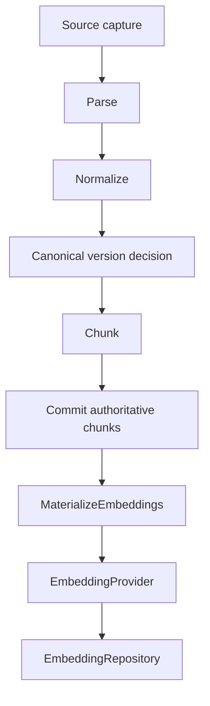
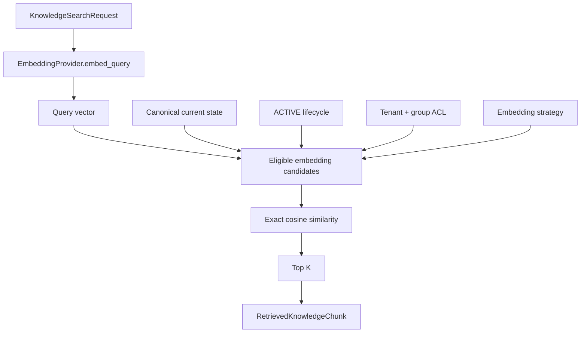

# Dense Retrieval V1 — System Design, Decisions, and Evidence Plan

Dense retrieval is being added because the lexical baseline has two measured semantic-gap failures: conceptually relevant evidence can use different vocabulary from the query.

The build is intentionally an additive retrieval strategy, not a replacement for BM25.

## Production problem

A lexical index answers roughly:

```text
Do the query and evidence share important terms?
```

Dense retrieval answers a different question:

```text
Are the query and evidence close in a learned semantic space?
```

Tropos needs the second capability without weakening the invariants already established for canonical identity, version lineage, lifecycle, tenant isolation, or ACL enforcement.

## Invariant

> Only current, ACTIVE, authorized knowledge may cross the governed retrieval boundary.

Embedding state does not decide whether knowledge is current, active, or authorized. Canonical knowledge state does.

## Write-side architecture



Embedding generation happens after canonical persistence. This keeps probabilistic/external model work out of the authoritative content transaction.

### Alternatives considered

| Option | Benefit | Problem |
| --- | --- | --- |
| Embed raw files | earliest possible semantic representation | ignores parsing/canonical structure and produces poor evidence lineage |
| Embed whole canonical documents | simple | too coarse for passage retrieval |
| Embed chunks inside the canonical transaction | immediately searchable | model/API failure can block authoritative ingestion |
| Persist chunks first, derive embeddings afterwards | clean consistency boundary and retryable derived processing | temporary partial embedding coverage must be observable |

### Decision

Embed canonical chunks after the canonical transaction has committed.

### Cost

Search coverage can temporarily lag ingestion if embedding materialization fails or is delayed.

### Revisit trigger

When materialization becomes asynchronous across services, introduce durable job/outbox/reconciliation semantics rather than relying on an in-process call.

---

## Embedding identity and processing lineage

One immutable chunk may have multiple valid embeddings over time.

```text
canonical content
    ↓
chunking strategy
    ↓
chunk_id
    ├── embedding strategy A
    └── embedding strategy B
```

The stored identity is:

```text
(chunk_id, embedding_strategy_version)
```

The embedding strategy records the vector-space contract: provider/model, dimensions, and adapter behavior. Similarity metric is stored alongside the vector.

Changing the embedding model does **not** create a new canonical knowledge version. It creates a new derived processing representation.

### Why not key only by chunk ID?

A model migration must be able to materialize the new vector space while retaining the old one for rollback, comparison, or staged migration.

### Why not mix model spaces?

Coordinates are model-specific. A query vector from model B cannot be meaningfully compared with document vectors from model A.

---

## Idempotent materialization as durable caching

Before calling the model, Tropos checks whether the current chunk already has:

```text
(chunk_id, embedding_strategy_version)
```

If yes, it reuses the existing representation. If no, it embeds and persists it.

This gives the useful behavior commonly described as embedding caching without adding a separate cache subsystem.

### Alternatives considered

| Option | Benefit | Problem |
| --- | --- | --- |
| Re-embed every ingestion run | simplest control flow | needless cost and nondeterministic external work |
| Generic text-hash cache | reusable across objects | weakens explicit chunk/lineage semantics |
| Durable embedding record keyed by chunk + strategy | lineage-aware and naturally idempotent | storage grows across model migrations |

### Revisit trigger

Introduce retention/garbage-collection policy only when historical vector storage becomes material. Do not delete historical vectors merely because they are no longer live retrieval candidates.

---

## Revised, deleted, and permission-changed knowledge

### Content revision

Old chunks and vectors may remain for history. They stop being live candidates because the current-state join points at the new canonical content fingerprint.

### Source deletion

An authoritative tombstone changes canonical lifecycle from `ACTIVE` to `DELETED`. Historical vectors remain physically stored but are excluded from retrieval.

### ACL-only change

The text and vector do not change, so re-embedding is unnecessary. Retrieval eligibility changes through current governance state.

This preserves the separation:

```text
representation
≠
retrieval eligibility
```

---

## Query architecture



Tropos selects eligible candidates before semantic ranking in V1.

### Why not global vector top-K then ACL filter?

A globally top-ranked unauthorized set can crowd authorized evidence out of the initial K. Post-filtering can therefore under-return relevant authorized evidence, in addition to weakening the retrieval security boundary.

Future ANN implementations may use filtered traversal, partitions, partial indexes, or iterative scans, but the security invariant does not change.

---

## Exact similarity before ANN

V1 performs an exact scan over eligible vectors.

### Options considered

| Option | Benefit | Problem |
| --- | --- | --- |
| Exact cosine scan | deterministic, exact nearest-neighbor baseline | O(N) query work |
| HNSW | strong latency/recall at scale | approximate, memory/index tuning |
| IVF/PQ | scalable/compressible | training/tuning and approximation complexity |
| Managed vector service | operational features | external service, cost, vendor dependency |

### Decision

Use exact search while the evaluation corpus is small.

This isolates two separate questions:

1. Does the embedding representation improve retrieval quality?
2. How should millions of vectors be searched efficiently?

ANN is deferred until corpus size and latency justify it.

---

## Why cosine is explicit, not universal

Similarity is part of the embedding strategy contract. V1 implements cosine because the first provider is configured for cosine-style retrieval.

The abstraction keeps the metric explicit so a future provider can require dot product or L2 without silently changing ranking semantics.

---

## No-answer behavior

A vector search always has a nearest neighbor, even when nothing is relevant.

Therefore V1 deliberately does **not** introduce an arbitrary similarity threshold.

The existing golden dataset contains no-answer cases, so dense retrieval can be evaluated for both:

```text
semantic recall gains
and
abstention regressions
```

A future threshold, reranker, hybrid policy, or abstention classifier must be justified by measured score distributions and labeled evidence rather than a magic constant.

---

## BM25, dense, hybrid, and reranking

The current experiment is:

```text
same golden dataset
        │
   ┌────┴────┐
   │         │
 BM25      Dense
   │         │
   └────┬────┘
        ↓
case-by-case comparison
```

Expected strengths are hypotheses, not proof:

- BM25 should remain strong for exact identifiers, rare terms, policy names, and codes.
- dense retrieval should recover paraphrases and low-overlap semantic matches.

If the two strategies prove complementary, the next design candidate is rank fusion such as RRF. A reranker can then operate on a bounded candidate set.

MMR/diversity selection is also a later option when top results become redundant, but it is not part of V1.

---

## Framework boundary

Tropos borrows patterns that appear in retrieval frameworks such as separate `embed_documents` and `embed_query` methods, vector-store abstraction, caching/idempotency, metadata filtering, and later MMR.

Tropos does not make LangChain the core architecture boundary.

Tropos must continue to own:

- canonical identity;
- source/content/processing lineage;
- ACTIVE/DELETED lifecycle;
- tenant and ACL semantics;
- embedding migration rules;
- retrieval eligibility;
- evaluation evidence.

Frameworks and providers remain adapters.

---

## V1 implementation map

```text
core/application/embeddings/models.py
    EmbeddingVector
    KnowledgeEmbedding
    EmbeddedKnowledgeChunk
    SimilarityMetric

core/application/ports/embeddings.py
    EmbeddingProvider
    EmbeddingRepository

core/application/embeddings/materialize.py
    MaterializeEmbeddings

core/adapters/embeddings/openai.py
    OpenAIEmbeddingProvider

core/adapters/embeddings/sqlite.py
    SQLiteEmbeddingRepository

core/adapters/retrieval/exact_vector.py
    ExactVectorKnowledgeRetriever
```

The existing `KnowledgeChunkRetriever` contract remains unchanged.

---

## Evidence plan

CI uses deterministic fake embeddings only to prove mechanics:

- idempotent materialization;
- separate embedding-strategy lineage;
- semantic ranking mechanics;
- tenant/group authorization;
- ACTIVE/DELETED lifecycle exclusion.

Fake embeddings are **not** evidence that semantic retrieval works.

A separate real-model evaluation runner uses the same versioned golden corpus and the OpenAI embedding adapter:

```text
OPENAI_API_KEY=... uv run python scripts/evaluate_dense_retrieval.py
```

It reports the same Recall@K, Precision@5, MRR, and no-answer metrics for BM25 and dense retrieval, plus case-level retrieved knowledge IDs.

No semantic-quality claim should be made until that real-model run is captured.

---

## Deferred decisions

V1 deliberately does not implement:

- BM25 + dense fusion;
- RRF;
- reranking;
- MMR;
- similarity-threshold abstention;
- HNSW / IVF / PQ;
- vector database;
- multimodal or multilingual embeddings;
- domain fine-tuning;
- asynchronous worker infrastructure.

Each becomes eligible only after the current experiment produces evidence for the corresponding failure mode or scale requirement.


---

## Real-model evaluation evidence

A one-off GitHub Actions evaluation was run against the unchanged `tropos-retrieval-golden-v1` corpus using the real `sentence-transformers/all-mpnet-base-v2` model with normalized embeddings and cosine similarity.

This was a real-model quality experiment, not a fake-vector unit test and not an evaluation of the OpenAI adapter specifically.

| Metric | BM25 baseline | Dense real model |
| --- | ---: | ---: |
| Recall@1 | 0.80 | 1.00 |
| Recall@3 | 0.80 | 1.00 |
| Recall@5 | 0.80 | 1.00 |
| Precision@5 | 0.16 | 0.20 |
| MRR | 0.80 | 1.00 |
| No-answer accuracy | 1.00 | 0.25 |

The two intentionally semantic-gap cases were both recovered at rank 1:

- `semantic-remote-work` → `flexible-location-guidance`
- `semantic-late-package` → `late-delivery-trace`

The experiment also confirmed the expected dense-retrieval abstention problem. With no calibrated threshold or reranker, unrelated queries still received nearest neighbors. Only the cross-tenant no-answer case returned an empty result set; the other three no-answer cases returned authorized but irrelevant candidates.

### Interpretation

The experiment supports the hypothesis that dense retrieval fixes the measured semantic-recall gap on this corpus. It also shows that dense retrieval cannot replace the current lexical/no-answer behavior as-is.

The next design decision should therefore be based on two measured facts:

1. Dense retrieval adds semantic recall.
2. Raw dense top-K materially regresses no-answer behavior.

This is evidence for evaluating hybrid retrieval and/or an evidence-backed abstention policy next, not for adding an arbitrary similarity threshold.

### Limitations

The V1 golden corpus is intentionally small and synthetic. A perfect answerable-case score is not a production accuracy claim. Before promoting any threshold, hybrid policy, or reranker, Tropos still needs larger held-out and production-like retrieval sets.
