# Enterprise Knowledge Systems — First-Principles Interview Guide

> A visual, interview-oriented companion to the Tropos architecture.
>
> The goal is not to memorize Tropos. The goal is to be able to **reconstruct why Tropos looks the way it does** from system problems, failure modes, invariants, and trade-offs.

## How to use this guide

For technical explanation questions, use this rhythm:

1. **Clarify** — narrow the scope and define the exact concept or failure mode.
2. **Explain step-by-step** — use plain language, an example, and the mechanism.
3. **Conclude and discuss** — summarize the key idea, then surface trade-offs or adjacent design choices.

For system-design or architecture questions, use this rhythm:

1. **Clarify and scope** — users, scale, functional requirements, non-functional requirements.
2. **Draw the high-level flow** — major components and data movement.
3. **Deep dive** — pick one or two important components or failure modes.
4. **Identify bottlenecks and trade-offs** — reliability, consistency, security, latency, cost, scale.
5. **Bring it together** — check the design against the original goals and explain what would change at higher scale.

The interview style is intentionally inspired by the structured, conversational approach used by IGotAnOffer and Exponent/Aced, but all explanations and examples here are original and specific to enterprise knowledge systems and Tropos.

---

# 1. The system story

The enterprise problem sounds simple:

> “Take knowledge from company systems and make it reliably usable by humans and AI.”

In practice, each word hides an engineering problem.

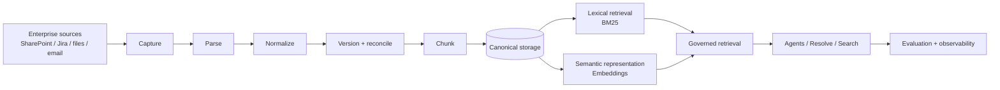

The architecture has to answer five classes of questions:

| Area | Core question |
| --- | --- |
| Identity | What exactly is this thing, and is it the same thing I saw before? |
| Change | Did meaningful content change, or only formatting/permissions/processing? |
| Reliability | What happens on retries, concurrency, out-of-order events, and partial failure? |
| Retrieval | How do I find the right current evidence quickly and securely? |
| Trust | Can I prove where the evidence came from, who was allowed to see it, and whether retrieval quality is good? |

---

# 2. Concept map

| Concept | Problem it solves | Typical technique |
| --- | --- | --- |
| Stable identity | Same object arrives repeatedly | source ID / knowledge ID |
| Hashing | Efficient deterministic equality check | SHA-256 fingerprint |
| Canonicalization | Ignore irrelevant representation changes | deterministic normalization |
| Versioning | Preserve meaningful state changes | immutable versions + current pointer |
| Idempotency | Same operation happens more than once | idempotency / ingestion fingerprint |
| Optimistic concurrency | Two writers update the same state | expected-state / compare-and-swap |
| Event ordering | Older update arrives after newer one | source version / sequence / checkpoint |
| Transactions | Related writes must succeed together | atomic DB transaction |
| Access control | Prevent unauthorized retrieval | tenant/group filtering |
| Chunking | Define retrieval-sized evidence units | structural chunking |
| Lexical retrieval | Exact term / code / identifier search | inverted index + BM25 |
| Embeddings | Represent semantic similarity | embedding model |
| Vector search | Find semantically nearby chunks | cosine/dot-product + vector index |
| Hybrid retrieval | Combine exact and semantic strengths | rank fusion / reranking |
| Checkpointing | Resume long-running syncs | cursor / delta token / checkpoint |
| Evaluation | Know whether retrieval actually works | golden set + Recall@K / MRR |
| Observability | Diagnose where the pipeline failed | run state, logs, metrics, traces |
| Migration | Change algorithms/models safely | dual-write / backfill / rebaseline |

---

# 3. Identity, hashing, and canonicalization

<details open>
<summary><strong>Try this question: “What is hashing, and why would you use it in a knowledge-ingestion system?”</strong></summary>

### What the interviewer is testing

Whether you understand hashing as a reusable systems primitive rather than as a Tropos-specific implementation detail.

### Sample answer

**Candidate:** “I’d first separate hashing from semantic understanding. A hash function takes arbitrary input and produces a fixed-size digest. For our ingestion flow, the useful properties are determinism and efficient comparison: the same canonical input gives the same digest, while a changed input will almost always produce a different digest.”

**Candidate:** “The important design choice is what I hash. If I hash the raw DOCX bytes, a harmless formatting change may produce a different hash. So I first normalize the content into a deterministic canonical representation and then hash that representation. The hash becomes a compact fingerprint for equality.”

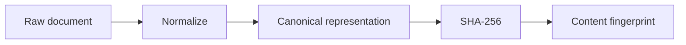

**Candidate:** “So the hash is not deciding whether two documents mean the same thing. The normalization policy decides which differences matter; hashing just makes the resulting equality check cheap and easy to persist.”

### Strong follow-ups

- Why not compare the full canonical text directly?
- What is a hash collision?
- When would you use cryptographic vs non-cryptographic hashing?
- Why is password hashing a different problem?
- Where else would you use content fingerprints: caches, dedupe, artifact verification, idempotency?

### Tropos translation

Tropos uses deterministic canonical serialization and a SHA-256 content fingerprint to compare canonical knowledge state.

</details>

<details>
<summary><strong>Try this question: “Why normalize before hashing?”</strong></summary>

### Sample answer

**Candidate:** “Because raw representations contain noise. Two DOCX files can differ in whitespace, markup, line endings, or presentation while representing the same canonical text. If I hash first, I turn every representation difference into a version change.”

**Candidate:** “So the order is deliberate: parse the source format, normalize into a stable internal representation, serialize that representation deterministically, and only then fingerprint it.”

```text
raw bytes
  ↓
parse format
  ↓
normalize structure/text
  ↓
canonical serialization
  ↓
hash
```

**Candidate:** “The trade-off is that normalization itself becomes part of the system’s business semantics. If I normalize too aggressively, I can erase meaningful differences. That is why the normalization strategy is versioned.”

### Reusable principle

> **Canonicalization defines equality. Hashing only accelerates the comparison.**

</details>

---

# 4. Versioning and reconciliation

<details open>
<summary><strong>Try this question: “A new source document revision arrives. How do you decide whether to create a new knowledge version?”</strong></summary>

### Clarify

**Candidate:** “I’d distinguish source revision from canonical knowledge version. A source system can create a new revision for formatting, metadata, ACL, or business-content changes, and I don’t want all of those to create a new knowledge version.”

### Explain step-by-step

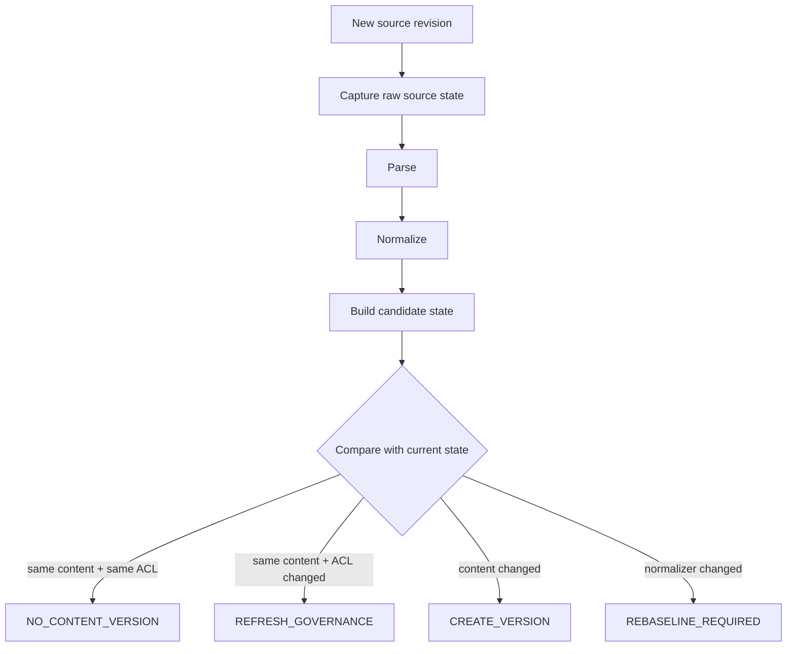

The comparison state contains three independent dimensions:

```text
content_fingerprint
access_fingerprint
normalization_strategy_version
```

**Candidate:** “If the canonical content fingerprint changed, I create a new immutable content version and new chunks. If content is the same but access changed, I refresh governance without pretending the business content changed. If nothing changed, I no-op. If the normalization strategy itself changed, I treat it as a processing migration or rebaseline.”

### Conclude

**Candidate:** “The core principle is that a source-system version tells me something changed upstream; it does not tell me what changed semantically.”

### Follow-ups

- Why preserve old versions?
- How does retrieval know which version is current?
- What if source version 19 arrives after source version 20?
- What if the chunking algorithm changes?
- What if the embedding model changes?

</details>

<details>
<summary><strong>Try this question: “Why keep immutable history plus a current-state pointer?”</strong></summary>

### Sample answer

**Candidate:** “I want both auditability and a simple answer to ‘what is active now?’ If I update rows in place, I lose evidence of previous states. If I keep every version but do not model current state explicitly, every consumer has to rediscover which version is active.”

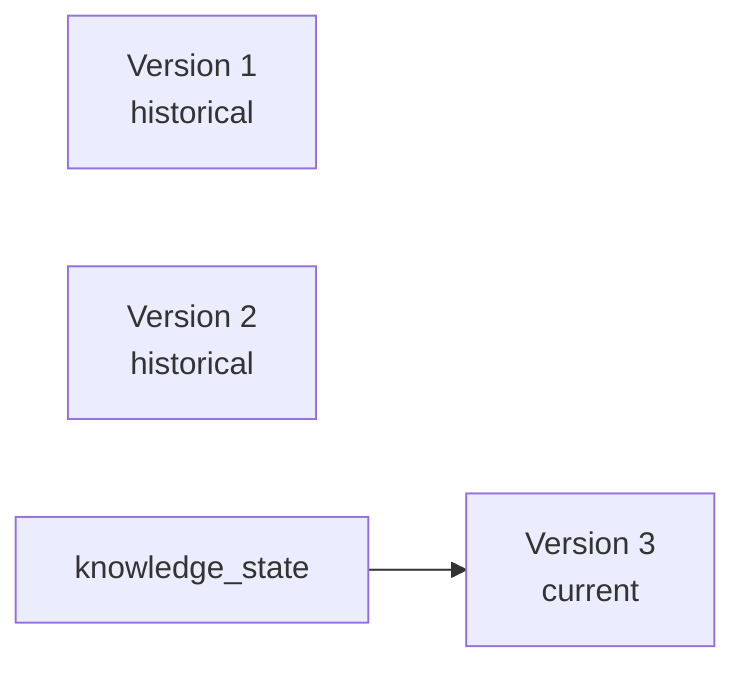

**Candidate:** “So the version table is append-oriented history, while `knowledge_state` is the current projection. Retrieval joins against the current state, which allows history to remain stored without stale versions becoming searchable.”

### Reusable principle

> **History answers ‘what happened?’; current state answers ‘what should the system act on now?’**

</details>

---

# 5. Duplicate processing and idempotency

<details open>
<summary><strong>Try this question: “What happens if the same source event is delivered twice?”</strong></summary>

### Sample answer

**Candidate:** “I treat duplicate delivery as normal distributed-system behavior, not as an exceptional case. The ingestion command has a deterministic ingestion identity or fingerprint. Before processing, I check whether that knowledge ID and ingestion fingerprint already completed successfully.”

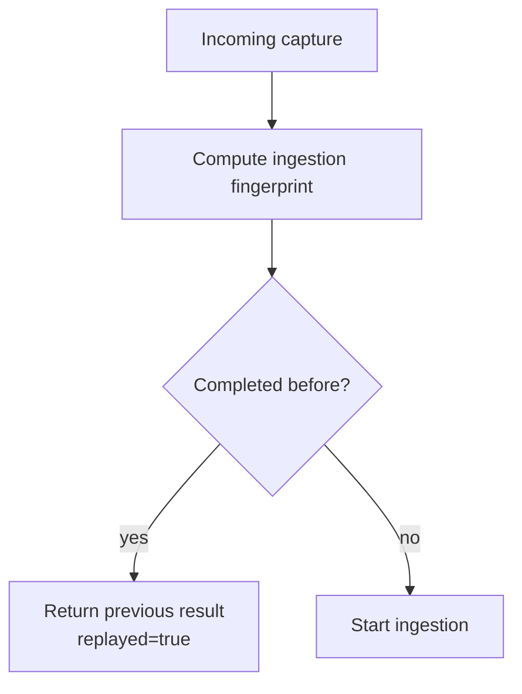

**Candidate:** “That makes ingestion idempotent from the caller’s point of view: retrying the same capture does not create additional business effects.”

### Follow-ups

- How do you choose an idempotency key?
- How long should idempotency state be retained?
- What if two identical requests arrive at exactly the same time?
- What if the first request timed out after the server actually committed?

### Reusable principle

> **Retries are safe only when repeated execution is controlled.**

</details>

---

# 6. Conflict resolution and concurrency

<details open>
<summary><strong>Try this question: “How do you resolve conflicts if two workers update the same knowledge at the same time?”</strong></summary>

### Clarify

**Candidate:** “I’d first clarify the conflict class. Duplicate events, concurrent writers, and out-of-order source events are different problems. For two concurrent writers, the risk is a lost update.”

### Explain step-by-step

Assume both workers read current state `A`:

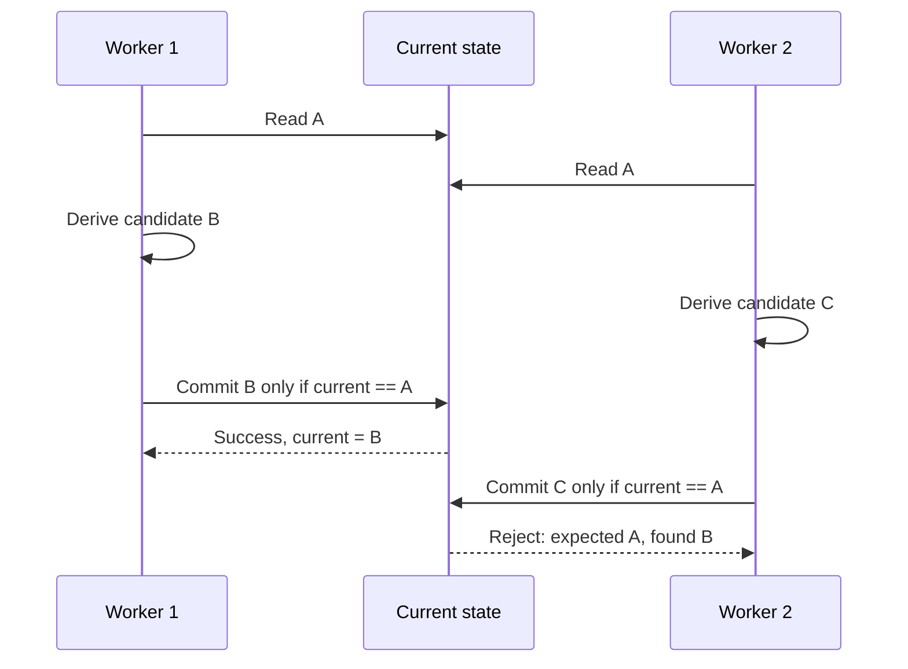

**Candidate:** “The version decision is made against a specific previous state. At commit time, inside a database transaction, I re-read the current state. If it no longer matches `expected_previous`, I reject the write with a concurrent-update error instead of silently overwriting the newer state.”

**Candidate:** “The stale worker then has to re-read the new current state and reconcile its candidate again. That is optimistic concurrency control: assume conflicts are uncommon, but verify the assumption before commit.”

### Why not auto-merge?

**Candidate:** “Because knowledge conflicts can encode business meaning. If one update says ‘three remote days’ and another says ‘four’, blindly merging is unsafe. The system can mechanically detect the conflict; deciding which business state wins may require source-order policy or human/business rules.”

### Follow-ups

- Why optimistic rather than pessimistic locking?
- Where should retry happen?
- What if conflicts are frequent?
- How would this change in a distributed database?
- What if two different source systems claim authority?

</details>

<details>
<summary><strong>Try this question: “What if an older event arrives after a newer event?”</strong></summary>

### Sample answer

**Candidate:** “That is not a concurrent-write problem; it is an ordering problem. Optimistic concurrency can prevent stale writes based on state changes, but if the system accepts source events without understanding their ordering, a delayed older revision could still be reconciled as if it were fresh.”

**Candidate:** “For an enterprise sync system I would preserve source-native ordering information—revision number, sequence, delta cursor, or source-updated timestamp—and validate that the incoming source state is not older than the accepted source state.”

```text
source v20 accepted
      ↓
delayed source v19 arrives
      ↓
source-order check
      ↓
reject / archive / mark stale
```

### Reusable principle

> **Concurrency control protects simultaneous state transitions; ordering control protects time sequence.**

</details>

---

# 7. Transactions and consistency

<details open>
<summary><strong>Try this question: “Why do you need a transaction when creating a new knowledge version?”</strong></summary>

### Sample answer

**Candidate:** “A version creation is not one write. It usually means inserting the canonical version, inserting its chunks, and advancing the current-state pointer. Those operations represent one business state transition.”

```text
insert version       ✅
insert chunks        ✅
advance current      ❌
```

**Candidate:** “Without an atomic transaction, a partial failure could leave the database in an internally inconsistent state. So I define a transactional boundary around the writes that must succeed or fail together.”

**Candidate:** “That does not automatically make external indexes or downstream services strongly consistent. If the search index is separate, I then have a second design question: synchronous indexing, outbox/eventual consistency, or reconciliation.”

### Follow-ups

- What is atomicity?
- What is eventual consistency?
- How would you repair DB/index divergence?
- Would you use the outbox pattern?
- How would you rebuild the search index?

</details>

---

# 8. Parsing, normalization, and chunking

<details>
<summary><strong>Try this question: “What is the difference between parsing and normalization?”</strong></summary>

### Sample answer

**Candidate:** “Parsing answers ‘what does this source format contain?’ A DOCX parser, HTML parser, and plain-text parser convert different source formats into a common extracted representation.”

**Candidate:** “Normalization answers a different question: ‘what stable representation should we use for identity and downstream processing?’ It standardizes structure and text after parsing.”

```text
DOCX / HTML / TXT
      ↓ parsing
Extracted text + structure
      ↓ normalization
Canonical knowledge representation
```

**Candidate:** “Keeping the two separate prevents source-specific logic from leaking into versioning and allows multiple connectors to reuse the same format parser.”

</details>

<details>
<summary><strong>Try this question: “Why chunk documents at all?”</strong></summary>

### Sample answer

**Candidate:** “The whole document is often the wrong retrieval unit. A 40-page policy can contain many unrelated topics, while the user usually needs one specific piece of evidence. Chunking defines the unit the retriever can rank and the LLM can cite.”

**Candidate:** “The trade-off is context versus specificity. Very small chunks can lose surrounding meaning; very large chunks dilute the relevant passage and consume more context window. Structural boundaries—headings, paragraphs, lists, sections—are usually better starting points than arbitrary byte cuts.”

### Important follow-ups

- Why overlap chunks?
- When can overlap hurt?
- How do tables/images change the problem?
- How do chunk IDs remain traceable to source offsets?
- Does rechunking create a new knowledge version? Usually no: it is processing lineage.

</details>

---

# 9. Retrieval fundamentals

<details open>
<summary><strong>Try this question: “Why start with BM25 instead of vector search?”</strong></summary>

### Sample answer

**Candidate:** “I would start by asking what retrieval failures matter. Enterprise knowledge contains exact identifiers, error codes, policy names, product codes, and acronyms. Lexical retrieval is strong when exact terms matter, and BM25 gives a deterministic, inexpensive baseline.”

**Candidate:** “The second reason is experimental discipline. If I immediately introduce embeddings, ANN indexing, and hybrid fusion, I cannot tell which added complexity is improving quality. A lexical baseline plus a labeled eval set gives me a reference point.”

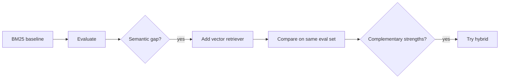

**Candidate:** “So the decision is not ‘BM25 is better than vectors.’ It is ‘establish the simplest measurable baseline, then add semantic retrieval when the data shows a gap.’”

</details>

<details>
<summary><strong>Try this question: “What is an inverted index?”</strong></summary>

### Sample answer

**Candidate:** “Instead of scanning every document for every query, an inverted index maps terms to the documents or chunks containing them. It is conceptually the reverse of storing document → words; it stores word → documents.”

```text
refund  → chunk 2, chunk 17, chunk 91
invoice → chunk 8, chunk 17
MFA     → chunk 3, chunk 44
```

**Candidate:** “A lexical ranking function such as BM25 then scores candidate documents using factors such as term frequency, rarity, and document length.”

</details>

---

# 10. Embeddings and vector search

<details open>
<summary><strong>Try this question: “What is an embedding?”</strong></summary>

### Sample answer

**Candidate:** “An embedding model maps an input such as a chunk of text into a numeric vector. The useful property is that inputs with similar semantic meaning tend to be positioned closer together in that learned vector space.”

```text
"work from home policy"
        ↓ embedding model
[0.12, -0.38, 0.71, ...]
```

**Candidate:** “For retrieval, I embed both the stored knowledge chunks and the user query using a compatible embedding strategy, then rank chunks by vector similarity.”

**Candidate:** “The embedding model is not the index. The model decides how meaning is represented; the index decides how those vectors are searched efficiently.”

</details>

<details>
<summary><strong>Try this question: “Embedding strategy vs indexing strategy — what is the difference?”</strong></summary>

### Sample answer

**Candidate:** “I separate three decisions: chunking decides the unit of evidence, embedding decides the numeric representation of meaning, and vector indexing decides how to search many vectors efficiently.”

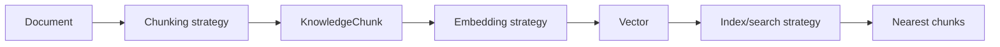

**Candidate:** “That separation lets me evaluate semantic quality using exact flat search before introducing ANN structures such as HNSW. Otherwise a miss could be caused either by a poor embedding or by approximate-index behavior.”

### Reusable principle

> **Representation quality and search scalability are different problems.**

</details>

<details>
<summary><strong>Try this question: “What happens if you change the embedding model?”</strong></summary>

### Sample answer

**Candidate:** “Different embedding models create different coordinate spaces, so I cannot safely compare document vectors from model A with a query vector from model B. A model change therefore requires re-embedding the corpus.”

**Candidate:** “But I would not create a new business-content version. The knowledge did not change; its processing representation changed. I would version the embedding strategy and allow old and new embedding generations to coexist during migration.”

```text
KnowledgeChunk 42
   ├── embedding-v1
   └── embedding-v2
```

**Candidate:** “Then I can evaluate v2, switch retrieval traffic when it meets the quality bar, and retire v1 later.”

</details>

---

# 11. Access control and governance

<details open>
<summary><strong>Try this question: “Should you retrieve globally and filter unauthorized results afterward?”</strong></summary>

### Sample answer

**Candidate:** “I would avoid post-filtering as the default. Authorization should constrain the retrieval candidate set where possible.”

**Candidate:** “There are two problems with global top-K followed by filtering. First, unauthorized chunks can occupy top-K positions and push authorized relevant evidence out of the result set. Second, I want a clean security invariant: unauthorized evidence should never cross the governed retrieval boundary.”

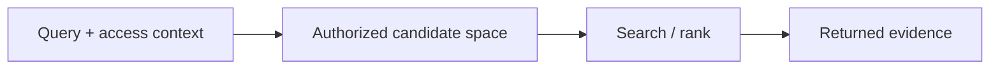

**Candidate:** “The exact implementation depends on the search engine, but tenant and group constraints are part of retrieval semantics, not merely a UI filter.”

### Follow-ups

- How fast must permission revocation propagate?
- What if source ACLs cannot be mapped?
- How do you test cross-tenant leakage?
- What if vector infrastructure only supports post-filtering?

</details>

---

# 12. Enterprise synchronization

<details open>
<summary><strong>Try this question: “What is the difference between a connector and a sync engine?”</strong></summary>

### Sample answer

**Candidate:** “A connector knows how to talk to one source and translate a source record into our ingestion contract. A sync engine coordinates large-scale change discovery over time.”

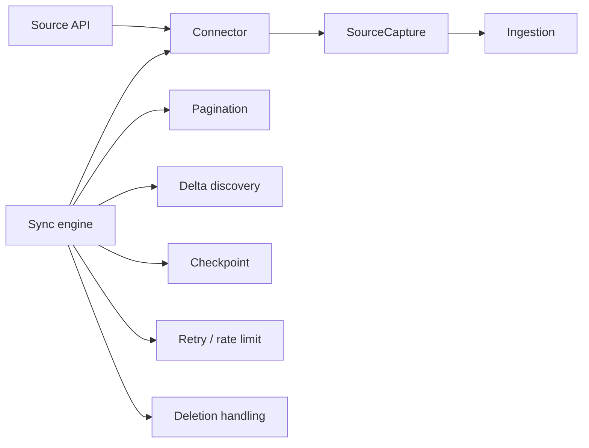

**Candidate:** “So `capture(record_id)` is useful, but enterprise synchronization also needs discovery, pagination, checkpoints, resumability, deletion/tombstone handling, rate limits, and backfill.”

</details>

<details>
<summary><strong>Try this question: “How would you resume a five-million-document sync after failure?”</strong></summary>

### Sample answer

**Candidate:** “I would avoid treating the whole sync as one transaction. I would process bounded pages or batches and persist a checkpoint only after the corresponding batch is durably accepted.”

```text
page 1 → ingest → commit checkpoint 1
page 2 → ingest → commit checkpoint 2
page 3 → failure
restart → resume from checkpoint 2
```

**Candidate:** “The checkpoint might be a source delta token, cursor, page token, or sequence position depending on the source API. The key invariant is that the checkpoint cannot advance beyond durable work, otherwise a restart can skip data.”

</details>

---

# 13. Retries and backoff

<details>
<summary><strong>Try this question: “Which failures should you retry?”</strong></summary>

### Sample answer

**Candidate:** “I separate transient failures from terminal failures. A timeout, temporary 503, or explicit rate limit may succeed later, so those are candidates for bounded retry. Invalid credentials, malformed input, or a permanently missing resource usually require intervention rather than repeated calls.”

**Candidate:** “For transient failures I use bounded exponential backoff and honor `Retry-After` when the dependency provides it. In a larger distributed system I would usually add jitter so many workers do not retry in lockstep.”

### Reusable principle

> **Retry only when the failure mode is plausibly temporary, and make the underlying operation idempotent.**

</details>

---

# 14. Evaluation

<details open>
<summary><strong>Try this question: “How do you know your retriever is actually good?”</strong></summary>

### Sample answer

**Candidate:** “A passing API test only tells me the retriever executed correctly. It does not tell me whether it found the right evidence. I need a labeled evaluation set containing a corpus, representative queries, and known relevant knowledge.”

```mermaid
flowchart LR
    G[Golden corpus + queries + labels]
    --> R[Run retriever]
    --> C[Compare actual vs expected]
    --> M[Recall@K / MRR / precision / no-answer]
    --> Q[CI regression gate]
```

**Candidate:** “Recall@K tells me whether expected evidence appears within the first K results. MRR tells me how high the first relevant result appears. I keep security cases separate: cross-tenant leakage is not something I average into a 92% score; it is a release blocker.”

### Follow-ups

- What is a golden dataset?
- Who labels relevance?
- Why use a held-out set?
- When would you use nDCG?
- How do you avoid tuning only to the eval set?
- How do you compare BM25 vs vector fairly?

</details>

---

# 15. Observability and operations

<details>
<summary><strong>Try this question: “A user says a document is missing from search. How do you debug it?”</strong></summary>

### Sample answer

**Candidate:** “I want the ingestion pipeline to expose enough lineage to trace one source record end-to-end. I would check the last source capture, ingestion run state, parser output, canonical version decision, chunk persistence, current-state pointer, index state, and finally retrieval authorization/ranking.”

```text
source capture
→ ingestion run
→ parse
→ normalize
→ version decision
→ chunks
→ current state
→ index
→ retrieval
```

**Candidate:** “This is why observability is a product capability rather than just logging. A multi-stage knowledge pipeline needs run IDs, stage transitions, errors, latency, and source/knowledge identifiers that can be correlated.”

### Useful metrics

- sync lag
- ingestion success/failure rate
- retry count
- records processed per minute
- indexing lag
- retrieval p50/p95 latency
- Recall@K / MRR
- cross-tenant leakage
- stale-version leakage
- embedding/model cost

</details>

---

# 16. Migration and scale

<details>
<summary><strong>Try this question: “How would you move from flat vector search to HNSW?”</strong></summary>

### Sample answer

**Candidate:** “I would treat that as an indexing migration, not an embedding migration. I would keep the same embeddings and establish exact search as the quality reference. Then I would build HNSW in parallel and compare ANN recall and latency against exact search.”

**Candidate:** “The trade-off is speed and memory versus approximation. I would not accept the index because it is fashionable; I would accept it when corpus size makes exact scan too expensive and the measured recall loss is within our quality bar.”

### Metrics to compare

| Quality | Operations |
| --- | --- |
| Recall@K | p50/p95 latency |
| ANN recall vs exact | index build time |
| MRR | memory |
| security filter correctness | storage / cost |

</details>

<details>
<summary><strong>Try this question: “What changes when you go from 10,000 to 100 million chunks?”</strong></summary>

### Sample answer

**Candidate:** “I would revisit assumptions rather than just swap technologies. At small scale, one SQLite store and exact vector scan may be enough. At 100 million chunks, ingestion throughput, partitioning, index build time, vector-search latency, tenant isolation, re-embedding cost, and recovery all become first-class constraints.”

**Candidate:** “Likely changes include horizontal partitioning, dedicated search infrastructure, batch/stream ingestion, durable queues, checkpointed backfills, ANN indexes, and clearer SLOs. I would choose those based on measured bottlenecks and workload shape rather than preemptively introducing them.”

</details>

---

# 17. RAG and model-assistance questions

<details>
<summary><strong>Try this question: “What new failure modes appear when an LLM is added after retrieval?”</strong></summary>

### Sample answer

**Candidate:** “Retrieval correctness and generation correctness are separate. Even with good evidence, the model can misstate it, omit qualifiers, merge conflicting passages, or answer when it should abstain.”

**Candidate:** “So I would add generation-specific controls: versioned prompts, bounded authorized context, citation/provenance requirements, structured output validation where appropriate, prompt-injection defenses, and evaluation for groundedness, answer relevance, task correctness, and abstention.”

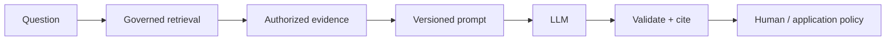

</details>

---

# 18. Rapid-fire conceptual interview bank

Use these for blank-page practice. Do not look at Tropos first; derive the answer from the problem.

## Identity and change

- What is the source of truth in a knowledge platform?
- How do you know two records represent the same document?
- How do you detect duplicate content across different source records?
- When should a source revision create a canonical content version?
- What should happen if only metadata changes?
- What should happen if only permissions change?
- What is the difference between content lineage and processing lineage?
- What happens if the normalization algorithm changes?

## Reliability

- What is idempotency?
- What makes an API idempotent?
- What happens if a timeout occurs after the server committed?
- How do you prevent duplicate work from two workers?
- What is optimistic concurrency?
- What is pessimistic locking?
- What is a lost update?
- What is compare-and-swap?
- How do you handle out-of-order events?
- Where would you use a queue?
- What is a dead-letter queue?
- What is backpressure?

## Data and consistency

- What must be inside the same transaction?
- What is strong consistency?
- What is eventual consistency?
- How do you reconcile a database and search index that disagree?
- What is the outbox pattern?
- How would you rebuild an index from source-of-truth storage?
- How do schema migrations affect long-running workers?

## Retrieval

- What is an inverted index?
- How does BM25 differ from substring matching?
- What is top-K retrieval?
- What is semantic search?
- What is cosine similarity?
- Why can vector similarity scores not automatically be treated as probabilities?
- What is exact nearest-neighbor search?
- What is approximate nearest-neighbor search?
- What is HNSW?
- When would you use IVF or product quantization?
- What is reranking?
- What is reciprocal rank fusion?

## Enterprise governance

- Should authorization happen before or after retrieval?
- How do source ACLs propagate to derived chunks?
- What happens when access becomes more restrictive?
- How do you prevent cross-tenant leakage?
- How would you audit which evidence a user saw?
- What do you do when a source permission model cannot be translated exactly?

## Evaluation

- What is Recall@K?
- What is Precision@K?
- What is MRR?
- What is nDCG?
- What is a golden dataset?
- What is a held-out evaluation set?
- Why can 100% test coverage coexist with poor retrieval quality?
- How do you evaluate no-answer behavior?
- Which metrics should be hard release blockers rather than averages?

## Program / TPM follow-ups

- What was the single most important system invariant?
- Which design choice reduced the most risk?
- Which trade-off did you knowingly accept?
- What was deferred and why?
- What would you change at 10x scale?
- What is your migration path if the current storage choice stops scaling?
- What metrics would you use to know the system is healthy?
- Which dependency is most likely to become a bottleneck?
- What is the rollback plan for a retrieval-strategy change?
- What would you put behind a feature flag or staged rollout?

---

# 19. The interview story to remember

Do not say:

> “We built connectors, normalization, versioning, BM25, and evals.”

Say something closer to:

> “The core problem was making enterprise knowledge reliably consumable by downstream agents. We separated source identity from canonical knowledge identity because upstream revisions do not always represent meaningful content change. We used deterministic normalization and fingerprints to detect canonical changes, and kept access state independent because governance can change without content changing.
>
> We then addressed distributed-system failure modes. Ingestion fingerprints give us idempotency for duplicate delivery, while expected-state validation gives us optimistic concurrency for simultaneous writers. Historical versions remain immutable and a current-state projection determines what retrieval is allowed to serve.
>
> For retrieval we deliberately established BM25 as a measurable lexical baseline before adding semantic complexity. We built a labeled evaluation corpus, used it to expose semantic misses, and only then justified vector retrieval. We keep chunking, embedding, indexing, and retrieval strategy separate so each can evolve and be evaluated independently.”

That answer is useful because the underlying concepts transfer to many other systems:

```text
canonicalization
hashing
versioning
idempotency
optimistic concurrency
transactions
state projections
access control
indexing
evaluation
migration
```

---

# 20. Concept-foundation template for future feature PRs

From now on, when a Tropos feature introduces a meaningful engineering concept, its learning note should answer:

1. **Concept** — what is it?
2. **Real-world problem** — what failure mode does it solve?
3. **First-principles derivation** — how would we arrive at it from the problem?
4. **Alternatives** — what other designs were available?
5. **Trade-offs** — what did we gain and give up?
6. **Tropos implementation** — where is it applied?
7. **Failure cases** — how does it break?
8. **Evaluation** — how do we know it works?
9. **Interview probes** — what follow-up questions should we be ready for?
10. **Scale / migration implication** — when would the choice need to change?

This learning material should evolve in the same PR as the feature when the concept materially changes.

---

# References for interview structure

These external resources informed the **answer structure and interview framing**, not the technical content of Tropos:

- IGotAnOffer — *How to answer system design interview questions*: clarify requirements, design at a high level, drill down, identify bottlenecks, and bring the solution together.
- IGotAnOffer — *Technical Program Manager Interview Questions and Prep*: technical-explanation pattern of clarify → explain step-by-step → conclude/discuss.
- Exponent/Aced — *Technical Program Manager Interview Prep*: clarify and scope, high-level architecture, deep dive, risks/trade-offs, and measurable success.
- Exponent/Aced — TPM system-design question bank and company guides: architecture, end-to-end data flow, bottlenecks, scale, metrics, and trade-offs.

## Related Tropos docs

- [Architecture overview](../architecture/ARCHITECTURE_OVERVIEW.md)
- [Ingestion and normalization](../architecture/INGESTION_NORMALIZATION.md)
- [Knowledge model](../architecture/KNOWLEDGE_MODEL.md)
- [RAG architecture](../architecture/RAG_ARCHITECTURE.md)
- [Evaluation strategy](../quality/EVAL_STRATEGY.md)
- [Architecture decisions](../decisions/README.md)
