# Enterprise Knowledge Systems — Interview Playbook

You are building a platform that takes knowledge from enterprise systems such as SharePoint, Jira, Confluence, files, email, and support tools, then makes that knowledge safe and useful for search, retrieval-augmented generation (RAG), and downstream agents.

> **Terminology note:** Technical abbreviations are expanded on first use. For quick reference, see the [Technical glossary](../GLOSSARY.md).

The difficult part is not “put documents in a vector database.” The difficult part is preserving identity, meaning, permissions, history, freshness, and reliability while the source systems keep changing.

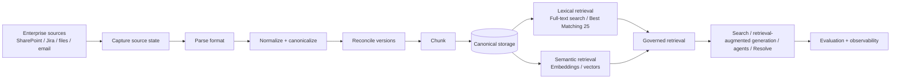

The interview story is therefore a sequence of engineering problems:

| Production problem | Engineering concept |
| --- | --- |
| The same SharePoint item is seen twice during sync | idempotency, stable identity |
| An Office Open XML Word document (DOCX) is re-saved but business content did not change | parsing, canonicalization, hashing |
| The text changes but permissions do not | content versioning |
| Permissions change but text does not | governance state |
| Two workers update the same knowledge concurrently | optimistic concurrency control |
| Source revision 19 arrives after revision 20 | ordering and checkpointing |
| Version row succeeds but chunk writes fail | transactions and consistency |
| Historical versions remain stored | immutable history + current-state projection |
| Exact product code search works, paraphrases do not | lexical vs semantic retrieval |
| Search works technically but returns poor evidence | offline retrieval evaluation |
| A user loses permission but an old index still exposes content | authorization and freshness |

---

# 1. Source identity, duplicate delivery, and idempotency

## Production scenario

A SharePoint synchronization job is reading changes using Microsoft Graph delta queries. The same `DriveItem` can appear more than once in a delta feed, and a worker can also see the same item again after retries or a restart. Microsoft recommends tracking items by identifier (ID) and following `@odata.nextLink` until a `@odata.deltaLink` is returned.

This is not unusual distributed-system behavior. At-least-once delivery systems such as standard Amazon Simple Queue Service (SQS) can also deliver the same message more than once, so consumers are expected to be idempotent.

### Interviewer

**“Your sync job receives the same document twice. How do you stop it from creating duplicate knowledge versions?”**

### Candidate

> “I separate source identity from processing identity. The source connector gives me a stable source-system namespace and source-record ID, so I know which enterprise object I am looking at. I also compute an ingestion fingerprint for the exact captured state. Before running the expensive pipeline, I check whether that knowledge ID plus ingestion fingerprint has already completed successfully. If it has, I return the previous result rather than create another version or another set of chunks.
>
> “That makes duplicate delivery safe. I do not assume exactly-once delivery from the source or queue; I make the consumer idempotent.”

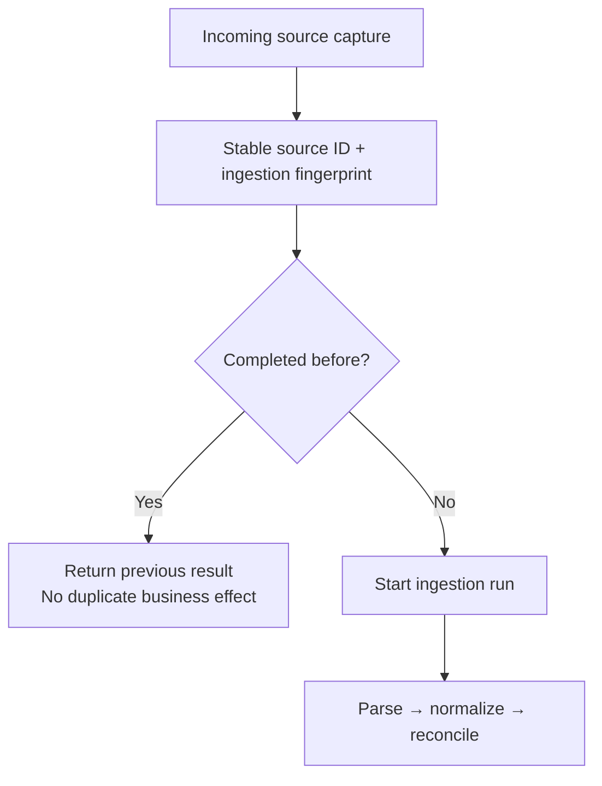

### Interviewer follow-up: “What exactly is the idempotency key?”

For Tropos, the useful distinction is:

```text
source identity
= source_system + source_record_id

capture / ingestion identity
= deterministic fingerprint of the captured source envelope + payload
```

The source identity answers **“which enterprise object is this?”**. The ingestion fingerprint answers **“have I already processed this exact captured state?”**.

### Failure without idempotency

```text
SharePoint item 456
        ↓
worker processes revision
        ↓
worker crashes before checkpoint advances
        ↓
sync resumes
        ↓
item 456 appears again
        ↓
without idempotency:
duplicate version / duplicate chunks / duplicate embedding cost
```

### Transferable pattern

Use the same reasoning for payment application programming interfaces (APIs), file uploads, webhook consumers, job queues, or batch pipelines: retries are normal; repeated execution must not create unintended extra effects.

### Industry references

- Microsoft Graph DriveItem delta: <https://learn.microsoft.com/en-us/graph/api/driveitem-delta?view=graph-rest-1.0>
- Amazon SQS at-least-once delivery: <https://docs.aws.amazon.com/AWSSimpleQueueService/latest/SQSDeveloperGuide/standard-queues-at-least-once-delivery.html>

---

# 2. Parsing: turning many file formats into one internal representation

## Production scenario

SharePoint can give you Office Open XML Word documents (DOCX), HyperText Markup Language (HTML), Markdown, or plain text. A versioning system cannot compare those formats meaningfully if each downstream component understands files differently.

The first problem is therefore not “is this a new version?” It is:

> **What information is actually inside this source artifact?**

### Interviewer

**“Walk me through how you parse a DOCX or HTML file before versioning it.”**

### Candidate

> “I keep source acquisition and file-format parsing separate. The connector is responsible for fetching the source item and its metadata. A parser then converts the source bytes into a common extracted-text structure.
>
> “For DOCX, I treat the file as an Open Packaging Convention ZIP archive. I read `word/document.xml`, parse the Extensible Markup Language (XML), walk paragraph and table nodes, and preserve useful structure such as headings, lists, paragraphs, and tables. For HTML, I parse tags, skip non-content elements such as script and style, and map headings, paragraphs, and list items into the same markdown-like intermediate representation. Plain text and Markdown take simpler paths.
>
> “The output of parsing is not yet the canonical version. It is simply a format-independent extracted representation that the normalizer can process deterministically.”

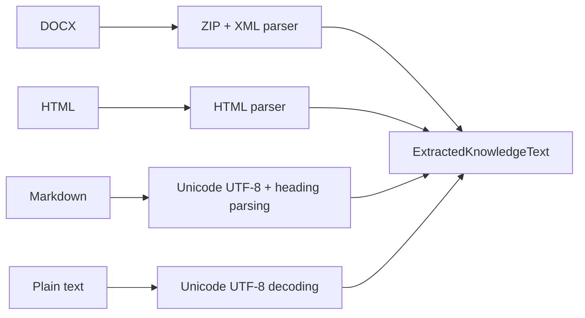

## What Tropos actually uses today

`DeterministicKnowledgeParser` uses only Python standard-library primitives:

| Format concern | Tool / module | What it does |
| --- | --- | --- |
| DOCX container | `zipfile.ZipFile`, `io.BytesIO` | opens DOCX as a ZIP package |
| DOCX XML | `xml.etree.ElementTree` | reads WordprocessingML XML |
| HTML | `html.parser.HTMLParser` | walks HTML tags and text |
| text decoding | UTF-8 / UTF-8-SIG | converts source bytes to text |
| structure matching | `re` | recognizes headings and styles |

Tropos specifically reads `word/document.xml`, optional `word/numbering.xml`, and optional core metadata. It maps heading styles, list numbering, paragraphs, and tables to a markdown-like structure.

### Example: DOCX to common structure

Conceptually, the DOCX may contain:

```text
Heading 1: Remote Work Policy
Paragraph: Employees may work remotely two days per week.
Bullet: Manager approval required.
```

The parser emits something close to:

```markdown
# Remote Work Policy

Employees may work remotely two days per week.

- Manager approval required.
```

Now HTML, DOCX, and Markdown can converge onto a common downstream model.

### Interviewer follow-up: “Would you keep writing parsers yourself in production?”

> “Not indefinitely. The current parser is intentionally small and deterministic because the supported formats are bounded. If the platform expands to Portable Document Format (PDF), PowerPoint, Excel, email attachments, optical character recognition (OCR), and hundreds of enterprise formats, I would evaluate a mature extraction layer such as Apache Tika or a managed document-extraction service. The architecture boundary should stay the same even if the implementation changes.”

Apache Tika exposes text and metadata extraction across more than a thousand file types through a common interface, which is the kind of capability a broader enterprise ingestion layer eventually needs.

### Industry reference

- Apache Tika: <https://tika.apache.org/docs/>

---

# 3. Normalization and canonicalization: deciding what differences should matter

## Production scenario

Two DOCX revisions can contain the same policy but differ in line endings, Unicode representation, extra blank lines, or trailing spaces.

Raw file bytes therefore answer:

> **“Are these exact files identical?”**

but versioning needs to answer:

> **“Is the knowledge representation materially different according to our rules?”**

### Interviewer

**“What exactly do you normalize, and how?”**

### Candidate

> “After parsing, I normalize deterministically. I do not ask a large language model (LLM) to rewrite the text because version identity has to be reproducible. In our baseline I normalize Unicode to Normalization Form C (NFC), remove a byte order mark (BOM) if present, standardize carriage-return/line-feed (CRLF) and carriage-return (CR) line endings to line-feed (LF), trim trailing spaces and tabs, collapse repeated blank lines, normalize inline whitespace, and then extract explicit structural blocks such as headings, paragraphs, and list items.
>
> “I then render those blocks into a canonical representation and serialize the structure deterministically. That canonical serialization is what I fingerprint for content identity.”

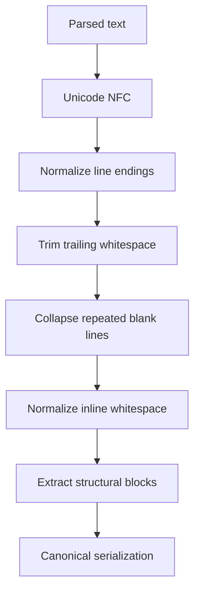

## Concrete example

Revision A:

```text
Remote Work Policy\r\n
\r\n
Employees may work remotely two days per week.
```

Revision B:

```text
Remote Work Policy\n
\n
\n
Employees may work remotely two days per week.    
```

After normalization, both can become the same canonical structure:

```text
HEADING(level=1, text="Remote Work Policy")
PARAGRAPH(text="Employees may work remotely two days per week.")
```

## What Tropos actually does

`DeterministicKnowledgeNormalizer` uses:

- `unicodedata.normalize("NFC", ...)`
- deterministic newline normalization
- trailing whitespace cleanup
- repeated blank-line compaction
- regex-based heading and list recognition
- explicit `StructuralBlock` objects
- stable JavaScript Object Notation (JSON) serialization with sorted keys

A simplified canonical payload looks like:

```json
{
  "blocks": [
    {
      "kind": "heading",
      "level": 1,
      "text": "Remote Work Policy"
    },
    {
      "kind": "paragraph",
      "level": null,
      "text": "Employees may work remotely two days per week."
    }
  ],
  "title": "Remote Work Policy"
}
```

### Interviewer follow-up: “Why not normalize more aggressively?”

> “Because normalization defines equality. If I start removing punctuation, lower-casing everything, reordering lists, or semantically rewriting sentences, I may collapse two business states that should remain distinct. Canonicalization is therefore a product/domain decision, not merely text cleanup, and the strategy itself has to be versioned.”

### Reusable principle

> **Canonicalization decides which differences matter. Everything downstream inherits that decision.**

---

# 4. Hashing and fingerprints: efficient equality after canonicalization

## Production scenario

Once two large documents have been converted into deterministic canonical representations, the system needs an efficient way to compare them and store comparison state.

### Interviewer

**“What is the role of hashing in this design? Why not compare the full text?”**

### Candidate

> “A hash gives me a fixed-size deterministic digest for arbitrary input. In this design I use Secure Hash Algorithm 256-bit (SHA-256) as a fingerprint of the canonical serialization. If the canonical input is identical, the fingerprint is identical. If the canonical input changes, the fingerprint will overwhelmingly likely change as well.
>
> “I could compare the entire canonical text directly, but a fingerprint is compact to persist and cheap to compare. The important point is that the hash is not deciding semantic sameness. The normalization policy decides the canonical representation; the hash only fingerprints it.”

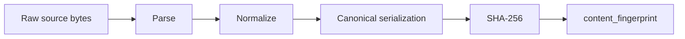

## Two different fingerprints answer two different questions

```text
raw_payload_fingerprint
→ are the exact captured bytes identical?

canonical content_fingerprint
→ is the normalized canonical representation identical?
```

That distinction is why a harmless DOCX save can change raw bytes without creating a new knowledge version.

### Interviewer follow-up: “Where else would you use hashing?”

Strong examples:

- file deduplication
- content-addressed storage
- cache keys
- artifact integrity
- deterministic change detection in data pipelines
- idempotency keys derived from stable input
- ETags / conditional update schemes conceptually

Do not confuse this with password hashing. Password storage uses deliberately slow, salted password-hashing functions such as Argon2 or bcrypt; that is a different threat model.

---

# 5. Version reconciliation: source revision is not knowledge version

## Production scenario

SharePoint revision 18 arrives for an existing policy. It might represent:

- only formatting changes;
- a permission change;
- an actual policy change;
- or no meaningful change after normalization.

### Interviewer

**“A new source revision arrives. Walk me through exactly how you decide what to do.”**

### Candidate

> “First, I preserve the source revision as evidence, but I do not automatically create a knowledge version. I parse and normalize the source into a canonical candidate. From that candidate I derive three comparison dimensions: the content fingerprint, the access-policy fingerprint, and the normalization-strategy version. I load the current canonical state and compare them.
>
> “If there is no previous state, it is first-seen content and I create a version. If the normalization strategy changed, I stop and require a controlled rebaseline because the comparison rules themselves changed. If the content fingerprint changed, I create a new immutable content version and new chunks. If content is unchanged but access changed, I refresh governance only. If all three are unchanged, I no-op.”

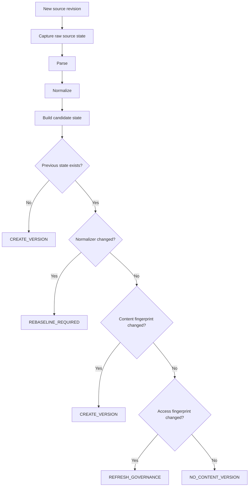

## The comparison state

```text
CanonicalKnowledgeState
├── content_fingerprint
├── normalization_strategy_version
└── access_fingerprint
```

## Example 1: formatting only

Previous canonical text:

```text
Employees may work remotely two days per week.
```

Incoming source text:

```text
Employees may work remotely   two days per week.   
```

After normalization both produce the same canonical fingerprint.

Result:

```text
NO_CONTENT_VERSION
```

## Example 2: actual policy change

Previous:

```text
Employees may work remotely two days per week.
```

Incoming:

```text
Employees may work remotely three days per week.
```

Canonical fingerprint changes.

Result:

```text
CREATE_VERSION
→ materialize new KnowledgeDocument
→ create new chunks
→ advance current state
```

## Example 3: permissions only

Content fingerprint is unchanged, but allowed groups change from:

```text
["HR"]
```

to:

```text
["HR", "Managers"]
```

Result:

```text
REFRESH_GOVERNANCE
```

No fake content version is created.

### Interviewer follow-up: “Why keep immutable history plus a current-state pointer?”

> “The immutable version history answers ‘what existed before?’ for audit and rollback. The current-state projection answers ‘what should retrieval act on now?’ Historical rows can remain stored while retrieval joins against the current state so stale content is not served.”

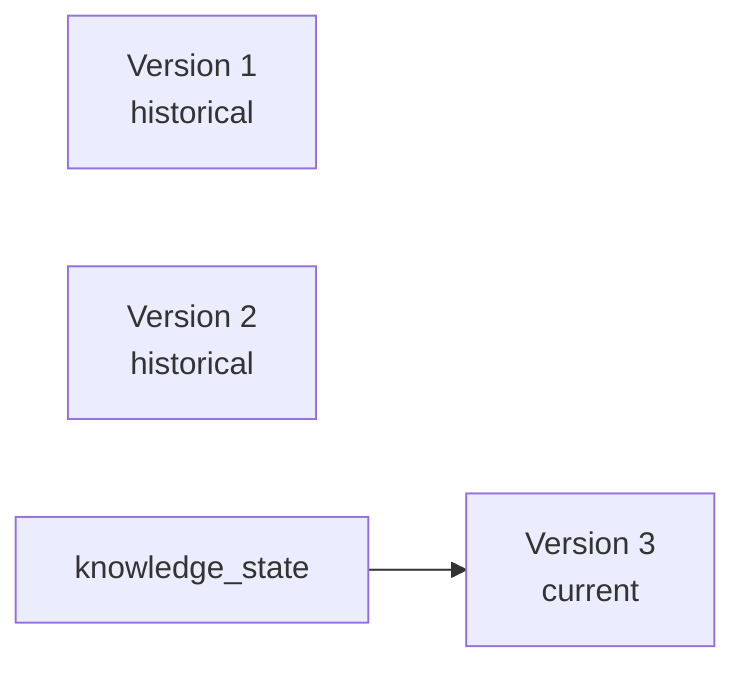

---

# 6. Conflict resolution: duplicate, concurrent, and out-of-order are different problems

When an interviewer says **“How do you resolve conflicts?”**, do not jump immediately to one mechanism. Clarify which conflict class is meant.

| Conflict class | Example | Mechanism |
| --- | --- | --- |
| duplicate processing | same capture handled twice | idempotency |
| concurrent write | two workers both derive updates from state A | optimistic concurrency |
| out-of-order source state | revision 19 arrives after 20 | ordering / source revision / checkpoint |
| conflicting authorities | SharePoint and Jira disagree on same policy | ownership / precedence / human policy |
| content + Access Control List (ACL) change together | both content and governance moved | reconcile dimensions independently |

## 6.1 Two workers update the same knowledge concurrently

### Interviewer

**“Two workers both read the same current version and then receive different updates. What happens?”**

### Candidate

> “The risk is a lost update. Suppose both workers read current state A. Worker 1 derives candidate B and Worker 2 derives candidate C. If they both write blindly, the second commit can overwrite the first worker’s state transition.
>
> “So the decision is tied to the state it was derived from. When a worker commits, it passes `expected_previous=A`. Inside the transaction the repository re-reads current state. Worker 1 sees A and commits B. Worker 2 then expects A but finds B, so its write is rejected with a concurrent-update error. It must re-read B and reconcile C again against the new current state.
>
> “That is optimistic concurrency control: allow work to proceed without holding a long-lived lock, but validate the assumption at commit time.”

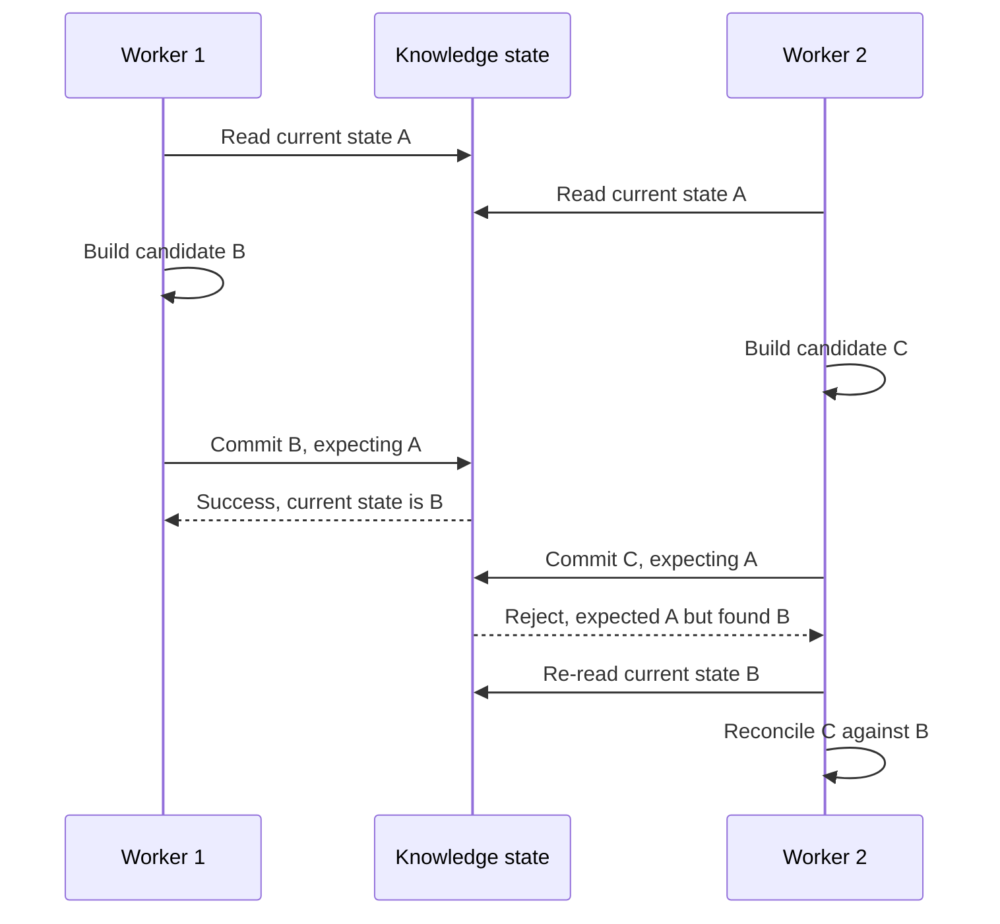

## What Tropos actually does

`create_version(...)` starts a SQLite database `BEGIN IMMEDIATE` transaction, reloads the current canonical state, and compares it with `expected_previous`. A mismatch raises `ConcurrentKnowledgeUpdateError` before the new version/chunks/current-state update is committed.

The same expected-state pattern is used when refreshing governance.

### Interviewer follow-up: “Why not automatically merge B and C?”

> “Because the conflict can encode business meaning. If B changes a policy from two days to three and C changes it to four, the system can safely detect the conflict but cannot infer which policy is authoritative. Automatic text merge is not the same as business conflict resolution.”

### Interviewer follow-up: “When would pessimistic locking be better?”

> “If contention is high and retries become expensive, or if a critical transition must be serialized before substantial work is done, pessimistic locking can be justified. For relatively rare conflicts and expensive pre-processing, optimistic concurrency keeps lock duration small and the normal path simple.”

---

# 7. Out-of-order events and sync checkpoints

## Production scenario

Revision 20 is accepted. Later, because of queue delay or a resumed sync, revision 19 arrives.

Optimistic concurrency alone does not define whether revision 19 is newer or older in source-system time.

### Interviewer

**“What if an older source revision arrives after a newer one?”**

### Candidate

> “That is an ordering problem, not just a concurrent-write problem. I preserve source-native ordering information such as revision number, sequence, delta token, or source-updated timestamp. Before allowing the candidate to become current, I validate that the incoming source state is not older than the latest accepted source state.
>
> “For large enterprise syncs I would also persist a checkpoint or delta cursor so a worker can resume from a known synchronization boundary rather than repeatedly full-scan the source.”

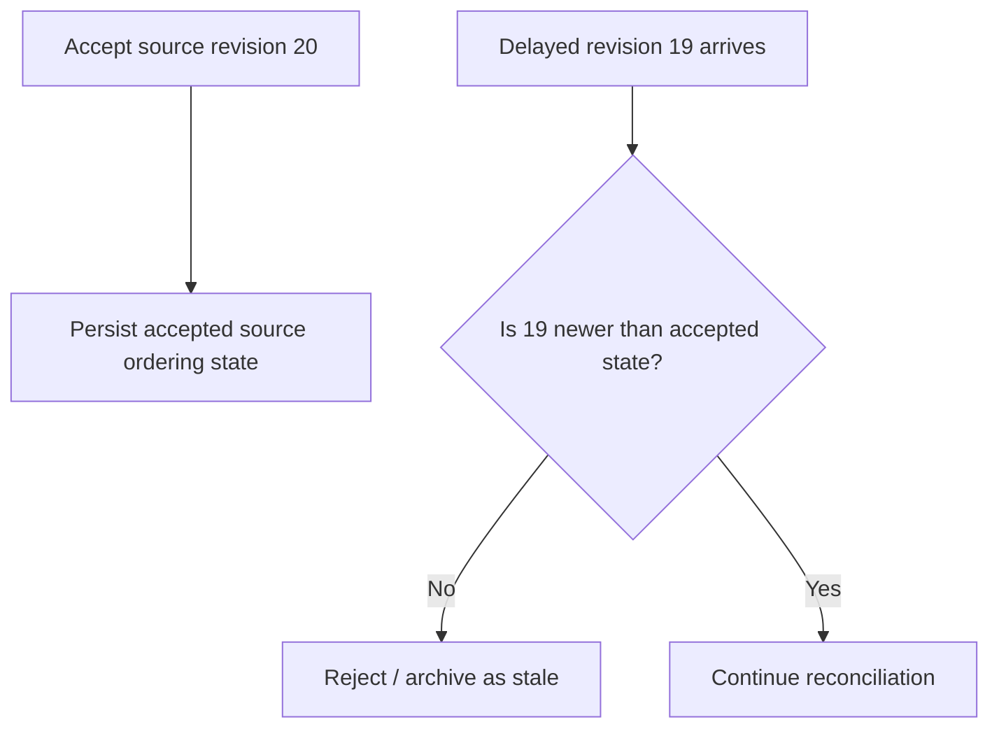

## Microsoft Graph connection

Graph delta synchronization returns `@odata.nextLink` while more pages remain and eventually an `@odata.deltaLink` representing the synchronization state for the next round. The same item may appear more than once, so sync logic needs stable IDs, checkpointing, and idempotent application of changes.

### Current Tropos limitation

Tropos currently preserves source version metadata and protects canonical writes with optimistic concurrency, but it does **not yet implement a full enterprise source-ordering and durable sync engine**. Delta cursors, deletion/tombstone handling, large backfills, and out-of-order source validation belong in that future layer.

---

# 8. Transactions: what must succeed together?

## Production scenario

Creating a knowledge version requires several writes:

```text
insert version       ✅
insert chunks        ✅
advance current      ❌
```

Without a transaction, a crash can leave an internally inconsistent system.

### Interviewer

**“Where is your transaction boundary, and why?”**

### Candidate

> “I define the transaction around the state transition that must be atomic. For version creation, the new version row, its chunks, and the current-state update represent one logical commit. Either all of them succeed, or none should become visible as the new canonical state.
>
> “That protects database consistency. It does not automatically solve consistency with an external vector index or another service; if indexing becomes external, I would need an outbox/event-driven propagation and a reconciliation strategy.”


### Interviewer follow-ups

- What if embedding generation happens outside the transaction?
- How do you repair DB/index divergence?
- Would you use an outbox pattern?
- What is your source of truth during recovery?

---

# 9. Access control: content state and governance state evolve independently

## Production scenario

The policy text is unchanged, but an employee loses access to the SharePoint folder.

If the retrieval index still serves the old Access Control List (ACL), you have a security problem even though “content freshness” is perfect.

### Interviewer

**“Why do you model access separately from content version?”**

### Candidate

> “Because permissions can change without business content changing, and permission revocation often needs to take effect immediately. I therefore fingerprint access policy separately from content identity. If only the ACL changes, I update the governance state and the current chunks’ authorization metadata without manufacturing a new content version.”

Tropos uses tenant, scope, and allowed groups as the canonical access-policy state.

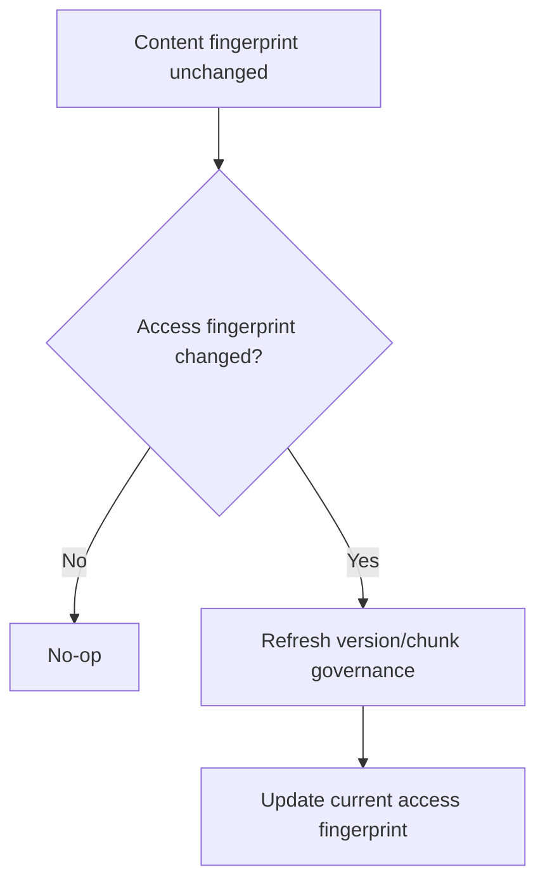

### Interviewer follow-up: “Why not retrieve globally and filter unauthorized results afterward?”

> “Post-filtering can under-return relevant authorized evidence because unauthorized candidates may occupy the top-K before filtering. More importantly, unauthorized evidence should not cross the governed retrieval boundary. Authorization needs to constrain the eligible search space as early as the retrieval technology allows.”

---

# 10. Retrieval: lexical first, semantic second, hybrid only with evidence

## Production scenario

A support engineer searches for an exact error code such as `AADSTS50076`. Best Matching 25 (BM25) works well because the identifier is explicit. Another user asks “Can I work from home?” while the policy says “Employees may perform duties away from company premises.” Exact lexical matching may miss it.

### Interviewer

**“Why did you start with BM25 instead of going directly to vector search?”**

### Candidate

> “I wanted a deterministic lexical baseline before adding another retrieval variable. BM25 is strong for exact names, identifiers, acronyms, product codes, and policy terminology. I then evaluate that baseline against labeled queries. If semantic/paraphrase cases systematically miss, I have evidence to justify vector retrieval rather than adding it because it is fashionable.”

Tropos currently uses SQLite Full-Text Search version 5 (FTS5) with BM25 ranking over current authorized chunks.

SQLite’s FTS5 documentation exposes a built-in `bm25()` ranking function; Tropos also weights title matches above body text.

### Interviewer

**“What is the difference between embeddings and vector indexing?”**

### Candidate

> “Embeddings decide how text is represented numerically in a semantic space. Vector indexing decides how those vectors are searched efficiently. They are separate concerns. I can evaluate an embedding model using exact flat similarity search on a small corpus before introducing Hierarchical Navigable Small World (HNSW) or Inverted File (IVF) indexing. That isolates semantic quality from approximate-index behavior.”

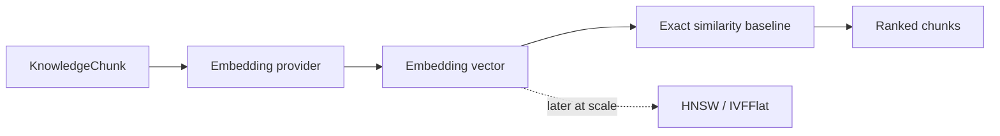

### Why exact search first?

If a semantic result is poor after adding HNSW immediately, several variables could be responsible:

```text
embedding model?
chunk quality?
distance metric?
approximate nearest-neighbor (ANN) behavior?
index parameters?
```

Exact similarity removes the ANN approximation variable while the corpus is small.

### Later scale trade-off

Vector systems such as pgvector expose both HNSW and Inverted File with flat vectors (IVFFlat). HNSW generally uses more memory and has slower builds but offers stronger query speed/recall trade-offs; IVFFlat uses less memory and builds faster but requires cluster/list/probe tuning.

### Industry references

- SQLite FTS5 / BM25: <https://www.sqlite.org/fts5.html>
- pgvector HNSW / IVFFlat: <https://github.com/pgvector/pgvector>

---

# 11. Embedding model changes are processing changes, not knowledge changes

## Production scenario

The policy text has not changed, but the platform migrates from embedding model A to embedding model B.

### Interviewer

**“Do you create a new knowledge version when the embedding model changes?”**

### Candidate

> “No. The business content did not change. The embedding is derived processing state. I version the embedding strategy and model separately, re-embed the existing chunks, evaluate the new retrieval strategy, and cut over only when the new generation is ready.”

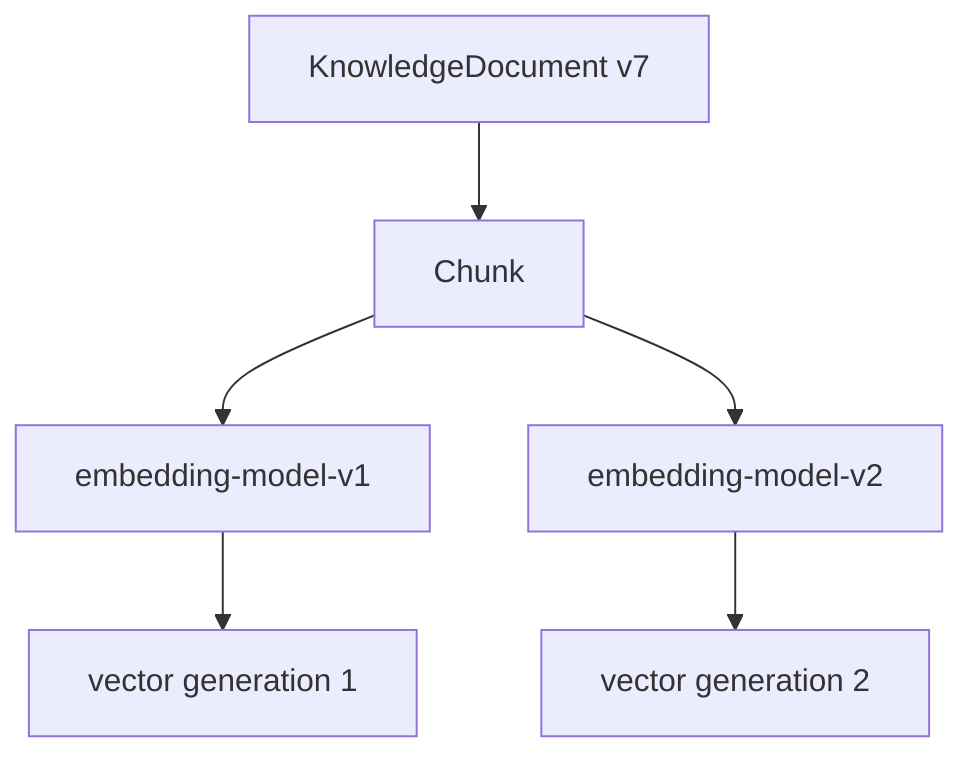

### Migration shape

```text
current index = embedding-v1
        ↓
backfill embedding-v2 in parallel
        ↓
run same evaluation corpus against v1 and v2
        ↓
cut traffic when v2 is acceptable
        ↓
retire v1 later
```

This is an example of **processing lineage** being separate from **content lineage**.

---

# 12. Retrieval evaluation: “working” is not the same as “good”

## Production scenario

The search endpoint returns Hypertext Transfer Protocol (HTTP) status 200 and five results. None of the five answers the user’s question.

Software correctness passed. Product quality failed.

### Interviewer

**“How do you know your retrieval system is actually good?”**

### Candidate

> “I maintain a versioned labeled dataset containing queries and the knowledge items expected to be relevant. I run the real ingestion and retrieval pipeline against it and compute ranking metrics such as Recall@K (recall within the first K ranked results) and Mean Reciprocal Rank (MRR). I also include explicit no-answer and access-control cases.
>
> “That lets me compare retrieval strategies on the same corpus—for example BM25 versus vector—rather than relying on a few hand-picked demos.”

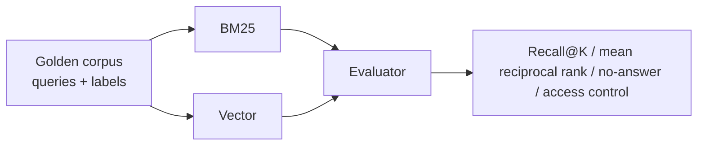

Tropos V1 deliberately includes semantic/paraphrase misses so that the baseline reveals a real reason to test semantic retrieval.

### Important distinction

```text
CODE QUALITY
unit tests / integration tests / typing / linting

SYSTEM CORRECTNESS
tenant leakage / stale leakage / idempotency / failure behavior

RETRIEVAL QUALITY
Recall@K / MRR / semantic misses / no-answer behavior
```

High code coverage does not imply high retrieval recall, and high average recall cannot excuse an authorization leak.

---

# 13. Observability: how do you debug “this document cannot be found”?

### Interviewer

**“A user says a document exists in SharePoint but Tropos cannot retrieve it. How would you debug it?”**

### Candidate

> “I trace the item through each persisted boundary rather than jump directly to search. First, was the source item captured? Did parsing succeed? What normalized fingerprint was produced? Was a version created or no-op’d? Were chunks persisted? Is the expected version current? Is the user authorized? Is the chunk present in the retrieval index? Finally, how did the query rank it?”

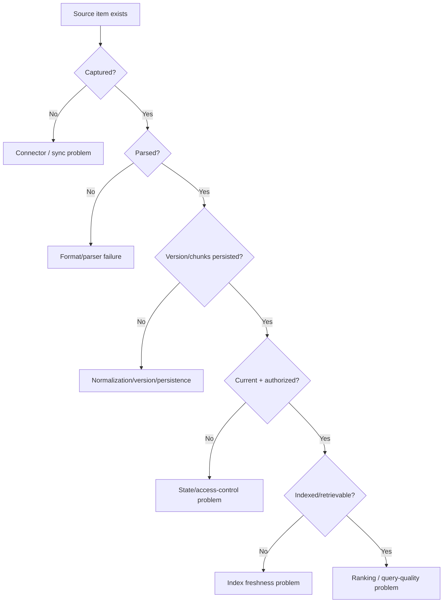

Useful operational metrics eventually include:

- source sync lag
- ingestion throughput and failures
- retry count
- parsing failures by content type
- version-create vs no-op ratio
- stale/current-state inconsistencies
- indexing lag
- retrieval 50th-percentile (p50) and 95th-percentile (p95) latency
- Recall@K / MRR regression
- access-control violations: zero tolerance
- embedding cost and throughput

---

# 14. Source connector vs sync engine

A connector that can fetch one record is not yet an enterprise synchronization system.

```text
CONNECTOR
fetch one source record
translate source metadata + ACL
produce SourceCapture

SYNC ENGINE
discover records
paginate
track deltas
persist checkpoints
retry
rate-limit
handle deletions/tombstones
resume after failure
backfill millions of records
```

### Interviewer

**“How would you ingest 10 million SharePoint documents without scanning all 10 million every hour?”**

### Candidate

> “I would separate initial backfill from incremental synchronization. The initial pass enumerates the corpus in pages and persists checkpoints so it can resume. After baseline synchronization, I use the source’s change-tracking capability—such as Microsoft Graph delta tokens—to fetch only incremental changes. Each item is applied idempotently, and deletions are modeled explicitly as tombstones or state transitions rather than silently disappearing.”

---

# 15. Retrieval-augmented generation (RAG) comes after governed retrieval

A knowledge platform becomes RAG only when retrieved evidence is fed to a model for generation.

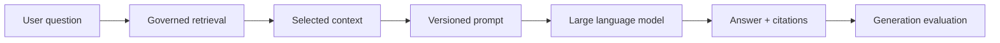

New failure modes now appear:

- retrieval found the wrong evidence;
- evidence was correct but the answer was unfaithful;
- retrieved content contained prompt injection;
- context exceeded the model window;
- conflicting evidence was not surfaced;
- the model answered despite insufficient evidence;
- citations did not support the answer.

### Interviewer

**“How would you evaluate the generated answer separately from retrieval?”**

### Candidate

> “I keep retrieval evaluation and generation evaluation separate. Retrieval asks whether the right authorized evidence was found and ranked. Generation then measures whether the model used that evidence faithfully, answered the question, abstained when appropriate, and produced valid citations. Otherwise a strong large language model can hide a weak retriever, or a strong retriever can be blamed for an ungrounded generator.”

---

# 16. Code map: where these concepts exist in Tropos

| Concept | Current implementation |
| --- | --- |
| source capture / ingestion orchestration | `core/application/ingestion/ingest_knowledge.py` |
| raw record identity / fingerprints | `core/application/ingestion/raw_record.py` |
| parsing contract | `core/application/ingestion/parsing.py` |
| plain text / Markdown / HTML / DOCX parsing | `core/adapters/parsing/deterministic.py` |
| normalized structure model | `core/application/ingestion/normalization.py` |
| deterministic normalization + SHA-256 | `core/adapters/normalization/deterministic.py` |
| version decision | `core/application/ingestion/versioning.py` |
| optimistic concurrency + transactions | `core/adapters/persistence/sqlite.py` |
| deterministic chunking | `core/adapters/chunking/deterministic.py` |
| lexical retrieval | `core/adapters/retrieval/sqlite_fts.py` |
| retrieval evaluation | `evals/retrieval.py` + `evals/retrieval/golden_v1.json` |

---

# 17. Interview drill set

The goal of these questions is to derive the mechanism, not recite a term.

## Identity and ingestion

1. A webhook delivers the same document update three times. What breaks if the consumer is not idempotent?
2. What is the difference between source identity and content identity?
3. What should go into an ingestion fingerprint?
4. If the source system changes its record ID after a move, how would you preserve identity?
5. When would content-based deduplication be dangerous?

## Parsing and normalization

6. What is parsing responsible for, and what must it not decide?
7. How would you parse DOCX without an LLM?
8. How would you support PDF and OCR later without rewriting versioning?
9. Why is Unicode normalization relevant to deterministic fingerprints?
10. What could go wrong if normalization is too aggressive?
11. Why version the normalization strategy?

## Hashing and versioning

12. What is a cryptographic hash doing for us here?
13. Why not hash raw DOCX bytes for knowledge identity?
14. What is a hash collision, and how material is that risk compared with bad canonicalization?
15. Source version changed but canonical fingerprint did not. What do you do?
16. Content stayed the same but the Access Control List (ACL) changed. What do you do?
17. Embedding model changed. Is that a knowledge version?
18. Chunking strategy changed. Is that a knowledge version?

## Concurrency and consistency

19. Two workers read state A and derive B and C. Show the race.
20. How does expected-state validation prevent a lost update?
21. Why is this optimistic concurrency control?
22. When would pessimistic locking be preferable?
23. What happens after a concurrency conflict is detected?
24. Why is automatic text merge not necessarily business conflict resolution?
25. What exactly belongs inside the database transaction?
26. How would you keep an external vector index consistent with the source-of-truth database?

## Ordering and synchronization

27. Revision 19 arrives after 20. Why does optimistic concurrency not fully solve this?
28. What is a delta token or checkpoint?
29. Why can the same source item legitimately appear multiple times in a delta feed?
30. How do you resume a multi-million-record sync after a crash?
31. How do you model source deletions?
32. What happens when a checkpoint expires or becomes invalid?

## Retrieval

33. Why is BM25 useful even in an embedding-heavy retrieval-augmented generation system?
34. Where does BM25 fail?
35. What exactly is an embedding?
36. Why must query and document embeddings be compatible?
37. Why test exact vector similarity before HNSW on a small corpus?
38. What trade-off does approximate nearest-neighbor (ANN) search introduce?
39. Why might hybrid retrieval outperform either lexical or semantic alone?
40. Where should authorization filtering happen relative to ranking?

## Evaluation and operations

41. What is Recall@K measuring?
42. What is MRR measuring?
43. Why keep no-answer cases separate?
44. Why is code coverage not an AI-quality metric?
45. What must remain zero-tolerance even if average recall improves?
46. A document is in the database but not searchable. Walk the failure tree.
47. Which metrics tell you the connector is healthy versus the retriever being healthy?
48. How would you compare two embedding models without fooling yourself?

---

# 18. One end-to-end answer to rehearse

### Interviewer

**“Walk me through what happens when an enterprise document changes, including how you handle duplicates and conflicts.”**

### Candidate

> “I start with source identity rather than assuming every source revision is a new knowledge version. The connector captures the source-system namespace, stable source-record ID, source version, payload, permissions, and timestamps. I derive an ingestion fingerprint so replaying the exact capture is idempotent.
>
> “If it is new, I parse the source format into a common extracted representation. For DOCX that means reading the ZIP/XML structure; for HTML I walk semantic tags; for Markdown and text the path is simpler. I then deterministically normalize the result—Unicode NFC, line endings, whitespace, structural blocks—and serialize that canonical structure. SHA-256 of the canonical serialization becomes the content fingerprint.
>
> “I compare the candidate fingerprint, access fingerprint, and normalization-strategy version with the persisted current state. Same content and same access is a no-op. ACL-only change refreshes governance. Content change creates a new immutable version and chunks. A normalization-strategy change requires a controlled rebaseline because the equality rules changed.
>
> “For concurrent writers, the version decision is tied to the state it was derived from. At commit time the repository re-reads current state inside the transaction and only commits if it still equals the expected previous state. If another worker already advanced it, we reject the stale write and reconcile again. That prevents lost updates through optimistic concurrency.
>
> “I keep historical versions for lineage, but retrieval joins against current state and enforces tenant/group authorization so stale or unauthorized chunks are not served. On top of that I have a lexical BM25 baseline and a labeled retrieval-evaluation set. Semantic retrieval is added only when measured paraphrase misses justify it.”

### If the interviewer says “go deeper”

Choose the requested branch rather than repeat the summary:

```text
“How do you parse DOCX?”
→ ZIP / document.xml / XML tree / headings / lists / tables

“How do you normalize?”
→ Unicode NFC / line endings / whitespace / structural blocks / canonical JSON

“How do you detect a change?”
→ SHA-256 of canonical serialization vs current fingerprint

“How do you resolve two writers?”
→ expected_previous + transaction + re-read + reject stale write

“What if old revision arrives late?”
→ source ordering + delta/checkpoint state

“What if permissions changed?”
→ separate access fingerprint + governance refresh

“What if embeddings change?”
→ processing lineage + re-embedding, not content version
```

---

# 19. External reading tied to the problems above

These are useful because each one demonstrates a production mechanism rather than just a definition.

| Topic | Reference | Why it matters |
| --- | --- | --- |
| incremental source sync | Microsoft Graph DriveItem delta | pagination, delta links, duplicate items, stable IDs |
| duplicate delivery | Amazon SQS at-least-once delivery | why idempotent consumers are required |
| multi-format extraction | Apache Tika | production-scale parsing abstraction |
| lexical ranking | SQLite FTS5 | concrete BM25 implementation used by Tropos |
| Approximate nearest-neighbor (ANN) vector indexing | pgvector | HNSW / IVFFlat speed-memory-recall trade-offs |

Links:

- <https://learn.microsoft.com/en-us/graph/api/driveitem-delta?view=graph-rest-1.0>
- <https://docs.aws.amazon.com/AWSSimpleQueueService/latest/SQSDeveloperGuide/standard-queues-at-least-once-delivery.html>
- <https://tika.apache.org/docs/>
- <https://www.sqlite.org/fts5.html>
- <https://github.com/pgvector/pgvector>

---

# 20. The recurring design pattern

When you meet an unfamiliar architecture question, reduce it to this chain:

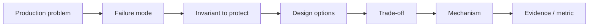

Example:

```text
Problem:
two workers update one document

Failure mode:
lost update

Invariant:
commit only if the state used to make the decision is still current

Options:
long-lived lock vs optimistic validation

Trade-off:
contention vs lock duration / retry cost

Mechanism:
expected_previous + transactional re-read

Evidence:
concurrency tests prove stale writes are rejected
```

That is the level at which Tropos becomes reusable engineering knowledge rather than something to memorize.