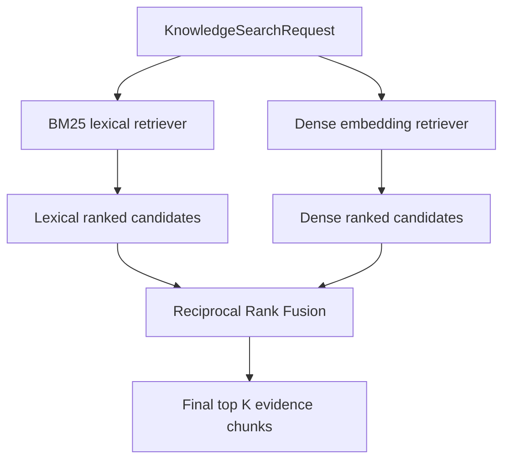

# Hybrid Retrieval V1 — Reciprocal Rank Fusion

> **Terminology note:** Sparse retrieval here means lexical retrieval with BM25. Dense retrieval means semantic retrieval with embeddings. See the [Technical glossary](../GLOSSARY.md).

## Why this slice exists

The same golden corpus has now produced two measured facts:

1. BM25 preserves no-answer behavior but misses two semantic/paraphrase cases.
2. Dense retrieval recovers those semantic cases but returns irrelevant nearest neighbors for several no-answer queries.

That creates a concrete experiment:

> Can the lexical and dense rankers be combined without pretending their raw scores mean the same thing?

## Decision

Tropos will test **retrieval-level hybrid search** using Reciprocal Rank Fusion (RRF).

This is not SPLADE or another learned sparse representation. It combines the ranked outputs of two already-existing retrievers:

```text
Query
  ├── BM25 lexical retriever
  └── Dense bi-encoder retriever
             ↓
      ranked candidate lists
             ↓
             RRF
             ↓
      final hybrid ranking
```

## Why not add the raw scores?

BM25 scores and cosine-similarity scores are on different scales and have different meanings. Adding or averaging them would require calibration.

RRF deliberately uses **rank position**, not raw score:

```text
RRF contribution = 1 / (k + rank)
```

Tropos V1 uses `k = 60`.

A chunk that appears high in both lists receives two contributions and is naturally promoted.

## Candidate depth

The final answer may request only five chunks, but fusing only each retriever's top five can hide useful overlap just below the cutoff.

Therefore the hybrid adapter asks each child retriever for a bounded larger pool:

```text
candidate_limit = min(100, final_limit × 4)
```

Fusion happens over that pool, then the hybrid result is trimmed to the requested final limit.

This is a tunable retrieval parameter, not a universal constant.

## Governance invariant

> Only current, ACTIVE, authorized knowledge may cross the governed retrieval boundary.

Hybrid V1 does not implement a second authorization system. It composes retrievers that already implement the shared `KnowledgeChunkRetriever` contract and enforce the canonical lifecycle/access rules.

The request's tenant and group context is passed unchanged into both retrievers.

## Architecture boundary



The adapter owns only fusion. It does not own:

- canonical identity;
- lifecycle state;
- access control;
- embedding generation;
- vector persistence;
- abstention thresholds;
- reranking.

## Alternatives considered

| Option | Benefit | Why not V1 |
| --- | --- | --- |
| Dense replaces BM25 | simple query path | measured no-answer regression |
| Weighted raw-score sum | flexible | BM25 and cosine scores are not calibrated |
| RRF | simple, rank-based, deterministic | selected for experiment |
| Cross-encoder reranking | stronger pairwise relevance judgment | adds model cost before proving fusion is insufficient |
| SPLADE | learned sparse semantic expansion | introduces another model/index representation before testing existing complementary retrievers |

## Prediction before measurement

The hypothesis is:

- lexical identifier/exact-term cases should remain strong;
- semantic paraphrase cases should remain recoverable through dense candidates;
- overlap between the two rankers should be promoted;
- no-answer behavior may still remain poor because RRF ranks candidates but does not itself decide whether evidence is relevant enough to return.

That last point is important: **hybrid ranking is not an abstention policy**.

## Evidence required

Run BM25, dense, and hybrid on the same versioned corpus and compare:

- Recall@1 / Recall@3 / Recall@5;
- Precision@5;
- Mean Reciprocal Rank (MRR);
- no-answer accuracy;
- case-level ranking changes.

Only then decide whether the next problem is:

1. candidate generation;
2. abstention/thresholding;
3. reranking;
4. or no further retrieval complexity.

## Interview translation

A concise explanation:

> We had complementary measured failure modes: BM25 missed semantic paraphrases, while dense retrieval fixed recall but regressed abstention. We therefore tested rank-level hybrid fusion with RRF rather than averaging incompatible BM25 and cosine scores. The fusion layer kept governance in the underlying retrievers and was evaluated on the same versioned corpus before any production promotion.
