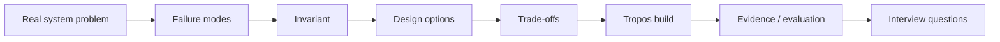

# Tropos learning track

This folder turns Tropos implementation work into reusable engineering understanding.

The learning track is **not** product documentation and does not replace architecture docs or ADRs. Product docs explain what Tropos is; ADRs explain durable decisions; this folder teaches the engineering concepts behind those decisions and translates them into interview-ready reasoning.

## Current guide

### [Enterprise Knowledge Systems — First-Principles Interview Guide](ENTERPRISE_KNOWLEDGE_SYSTEMS_INTERVIEW_GUIDE.md)

Use this for:

- hashing, fingerprints, canonicalization, and versioning;
- idempotency, concurrency, ordering, transactions, and consistency;
- parsing, chunking, lexical retrieval, embeddings, and vector indexing;
- access control, enterprise synchronization, retries, checkpoints, and observability;
- retrieval evaluation, migration, scale, and RAG failure modes;
- interview-style questions and sample answers grounded in the Tropos architecture.

## Working rule for future feature PRs

When a feature introduces a meaningful reusable engineering concept, the same PR should update the relevant learning material with:

1. the concept and vocabulary;
2. the real-world failure mode it solves;
3. the first-principles derivation;
4. alternatives and trade-offs;
5. the Tropos implementation;
6. test/evaluation evidence;
7. interview probes;
8. scale, release, or migration implications.

Do not duplicate implementation reference material here. Link back to architecture docs and ADRs for the authoritative system state.
