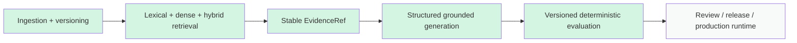

# Tropos build history

This document is the chronological implementation record for Tropos. It answers four questions for each build phase:

1. what problem was addressed;
2. what capability was delivered;
3. what important design trade-off was made;
4. where the implementation/evaluation evidence lives.

It complements the living architecture. Architecture documents describe **current state**; ADRs describe **durable decisions**; this page describes **how the system evolved**.

## Phase 1 — Engineering and governed evidence foundation

| Build | Outcome | Key decision / trade-off | Evidence |
| --- | --- | --- | --- |
| PR #1 — deterministic chunking | Introduced governed deterministic knowledge chunks | Prefer reproducible/lossless chunks before semantic chunking; semantic quality optimization deferred until evaluation exists | `KNOWLEDGE_MODEL.md`, ADR-002, tests |
| PR #3 — engineering operating model | Established repository structure, test/lint/type/build conventions and project working model | Treat engineering controls as product infrastructure rather than ad-hoc local commands | delivery docs |
| PR #5 — CI on every PR | Automated quality checks on pull requests | Fast deterministic gates first; expensive model/eval runs remain separate | `.github/workflows/ci.yml`, ADR-003 |
| PR #6 / #11 — living documentation | Introduced architecture/reference/ADR/learning separation | Current-state docs and teaching notes must not compete as sources of truth | `docs/README.md` |
| PR #8 — core/capability separation | Split reusable Core from Resolve business semantics | Modular monolith + Ports-and-Adapters rather than framework/service fragmentation | ADR-001 |

## Phase 2 — Canonicalization, versioning and ingestion

| Build | Outcome | Key decision / trade-off | Evidence |
| --- | --- | --- | --- |
| PR #9 | Deterministic normalization and canonical content versioning | Canonical equality must be reproducible; LLM normalization is not used for version identity | ADR-004, `INGESTION_NORMALIZATION.md` |
| PR #10 | Governance refresh across concurrent version changes | Access/governance evolution is separate from content version identity | ADR-005 |
| PR #12 | Deterministic parser layer | Format parsing is reusable infrastructure, not connector-specific behavior | ADR-006 |
| PR #13 | Durable SQLite ingestion state | Use local transactional persistence before operating a hosted distributed stack | ADR-007 |
| PR #14 | Source connector boundary | Acquisition and parsing remain separate | ADR-008, `SOURCE_INTEGRATION.md` |
| PR #15 | Bounded connector reliability | Explicit failure taxonomy and retry only transient failures | ADR-009, `CONNECTOR_RELIABILITY.md` |

## Phase 3 — Governed lexical retrieval and evaluation

| Build | Outcome | Key decision / trade-off | Evidence |
| --- | --- | --- | --- |
| PR #16 | SQLite FTS5/BM25 retriever | Establish an exact-term, low-complexity baseline with authorization inside retrieval | ADR-010, `RAG_ARCHITECTURE.md` |
| PR #17 | Retrieval golden set and metrics | Measure retrieval before adding semantic infrastructure | ADR-011, `EVAL_STRATEGY.md` |
| PR #23 | Versioned eval catalogue and saved runs | Dataset identity, expected behavior and observations are persisted independently of runtime UI | ADR-012, `EVALUATION_RUNS.md` |
| PR #24 | Knowledge tombstone lifecycle | Deletion/current-state behavior is explicit rather than relying on destructive history loss | ingestion/lifecycle tests |

## Phase 4 — Dense and hybrid retrieval

| Build | Outcome | Key decision / trade-off | Evidence |
| --- | --- | --- | --- |
| PR #25 | Dense retrieval V1 | Embeddings are derived state; exact cosine is used before ANN to isolate representation quality from index approximation | `DENSE_RETRIEVAL_V1.md`, decision matrix |
| PR #26 | Dense retrieval evidence | Captured implementation/evaluation evidence separately from architectural claims | learning evidence |
| PR #29 | Hybrid retrieval with Reciprocal Rank Fusion (RRF) | Fuse rankings rather than raw BM25/cosine scores because their score scales are not directly comparable | `HYBRID_RETRIEVAL_V1.md` |
| PR #30 | BM25/dense/hybrid comparison | Retrieval strategies are compared on common cases instead of selecting by framework convention | eval evidence |

### Retrieval trade-off summary

```text
BM25
  strong exact terms / identifiers
        +
Dense
  semantic paraphrase recovery
        ↓
RRF hybrid
  combine rank positions without pretending scores share one scale
```

Approximate Nearest Neighbor (ANN) structures such as HNSW remain deferred until corpus size/latency justifies the added index and approximation complexity.

## Phase 5 — Grounded model generation through Training

| Build | Outcome | Key decision / trade-off | Evidence |
| --- | --- | --- | --- |
| PR #32 | First LangChain structured extraction | Use LangChain for model/schema execution behind a Tropos-owned port; do not make it architecture owner | Training adapter/tests |
| PR #33 | Grounded procedure evaluation V1 | Deterministic golden-case grading before live-model/LLM-judge complexity | `tropos.evals.training`, Training eval dataset |
| PR #34 | Stable grounded artifact contract | Temporary prompt aliases resolve to durable `EvidenceRef`; steps/exceptions/gaps all become evidence-backed | Training domain/tests |

### Grounding trade-off summary

The resolver answers **"is this citation a valid supplied reference?"**. It does not answer **"does the evidence semantically support the claim?"**. Semantic entailment remains a separate evaluation concern.

## Phase 6 — Product/program operating model

| Build | Outcome | Key decision / trade-off | Evidence |
| --- | --- | --- | --- |
| PR #46 | Prioritized master backlog, sprint planning and delivery metrics automation | Separate relatively stable product/program governance from automatically generated changing metrics | `master-backlog.md`, delivery metrics workflow |

The backlog uses P0/P1/P2/deferred priority, sprint-ready user stories, estimates, acceptance criteria, test strategy and Definition of Done. Delivery reporting includes sprint/flow metrics and DORA-compatible signals when real production data exists.

## Phase 7 — Resolve Knowledge Articles

| Build | Outcome | Key decision / trade-off | Evidence |
| --- | --- | --- | --- |
| PR #64 | Canonical grounded Knowledge Article domain | Fixed troubleshooting/how-to/FAQ contracts instead of arbitrary free-form article shape | ADR-013, `KNOWLEDGE_ARTICLE.md` |
| PR #65 | Bounded business intake | Business users may shape subject/context/presentation but cannot override evidence/security/governance policy | intake tests, `KNOWLEDGE_ARTICLE.md` |
| PR #66 | Grounded Knowledge Article runtime | Governed retrieval → stable evidence → temporary aliases → structured model output → stable evidence artifact | generator/application tests |
| PR #67 | Reusable vendor-neutral eval contracts | Tropos owns dataset/case/run/score semantics; hosted eval tools remain replaceable adapters | ADR-014, `EVALUATION_CONTRACTS.md` |

## Current architecture maturity



Implemented does not mean production-complete. The platform still lacks a hosted API/UI, production persistence, full source sync, production observability, and human approval workflow.

## Decision-evidence rule for future builds

A material future build is not considered fully documented until these are captured:

- problem/failure mode;
- invariant or product outcome;
- alternatives considered;
- selected option;
- downside/cost;
- revisit trigger;
- implementation location;
- test/evaluation evidence;
- product/architecture status update.

Durable architecture choices belong in an ADR. Capability-specific mechanics belong in the relevant architecture document. Learning/interview translation belongs under `docs/learning/`.

## Related documents

- [Tropos platform](TROPOS_PLATFORM.md)
- [Resolve](RESOLVE.md)
- [Training](TRAINING.md)
- [Architecture overview](../architecture/ARCHITECTURE_OVERVIEW.md)
- [Decision register](../decisions/README.md)
- [Decision & trade-off matrix](../learning/DECISION_TRADEOFFS.md)
- [Evaluation strategy](../quality/EVAL_STRATEGY.md)
