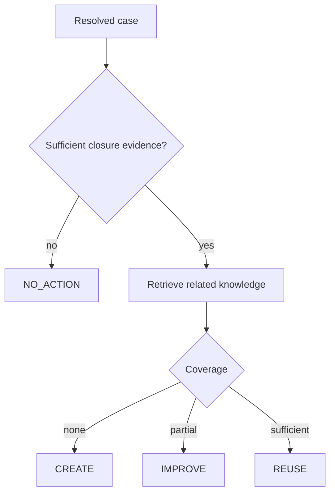

# Product model — Tropos Resolve

Tropos Resolve turns a resolved support case into a governed decision about the knowledge base. Its first responsibility is deciding whether knowledge should be reused, improved, created, or left unchanged.

## Problem

Support teams resolve incidents continuously, but useful resolution knowledge is often lost, duplicated, incomplete, or difficult to find. Tropos Resolve creates a repeatable decision process from closure evidence and existing knowledge coverage.

## Decision model

| Action | Meaning | Deterministic trigger |
| --- | --- | --- |
| `NO_ACTION` | Do not change knowledge from this case | Closure evidence is insufficient |
| `CREATE` | New knowledge is required | Coverage is `NONE` |
| `IMPROVE` | Existing knowledge is incomplete | Coverage is `PARTIAL` |
| `REUSE` | Existing knowledge is sufficient | Coverage is `SUFFICIENT` |

The action policy is implemented in `capabilities/resolve/domain/knowledge_action.py`.

## Current workflow

`EvaluateCaseClosure` coordinates the decision flow:

1. Evaluate closure evidence.
2. Stop with `NO_ACTION` when evidence is insufficient.
3. Retrieve related knowledge when evidence is sufficient.
4. Evaluate coverage of the retrieved evidence.
5. Apply the deterministic action policy.
6. Persist the decision through the decision-store contract.

The closure-evidence baseline and action policy are implemented. Production retrieval, coverage, and decision-store adapters are not.

| Component | Status |
| --- | --- |
| `RuleBasedClosureEvidenceEvaluator` | Implemented |
| `KnowledgeRetriever` | Contract only |
| `KnowledgeCoverageEvaluator` | Contract only |
| `KnowledgeDecisionStore` | Contract only |
| Knowledge-action policy | Implemented |

## Users

| Role | Responsibility |
| --- | --- |
| Support agent | Produces problem and resolution evidence in the source case |
| Knowledge reviewer | Reviews future knowledge changes before publication |
| Knowledge/support manager | Monitors knowledge quality and process outcomes |

Human review remains part of the product boundary for knowledge publication. Tropos Resolve does not automatically publish customer-facing knowledge.

## Product principles

**Evidence before generation.** A knowledge action must be explainable from case evidence and retrieved knowledge before any future draft is generated.

**Explicit abstention.** `NO_ACTION` is a valid result when closure evidence is inadequate.

**Retrieval quality affects product decisions.** Missing relevant knowledge can turn a correct `REUSE` or `IMPROVE` decision into an incorrect `CREATE` decision.

**Governance travels with evidence.** Access policy and provenance remain attached to knowledge throughout ingestion and retrieval.

## Capability roadmap

| Capability | Status |
| --- | --- |
| Deterministic decision core | Implemented |
| Governed ingestion, normalization, versioning, and chunks | Implemented |
| Persistent searchable corpus | Planned |
| Measured retrieval and coverage | Planned |
| Human review workflow | Planned |
| Model-assisted reasoning or drafting | Deferred until retrieval and evaluation baselines exist |
| Production learning loop | Planned |

## Success measures

When the end-to-end product loop exists, useful measures include:

- share of resolved cases with sufficient closure evidence;
- distribution of `REUSE / IMPROVE / CREATE / NO_ACTION` decisions;
- reviewer acceptance, edit, and rejection rates;
- retrieval recall on labeled cases;
- duplicate knowledge avoided;
- time from case resolution to reviewed knowledge action;
- regression rates after retrieval or model changes.

These are target measures, not claims about current performance.

## Non-goals

Tropos Resolve is not intended to be:

- an autonomous publishing system;
- a generic enterprise-search product;
- a vector-database demonstration;
- a replacement for source-system permissions;
- a system that moves business policy into prompts;
- a universal connector platform in its first release.
