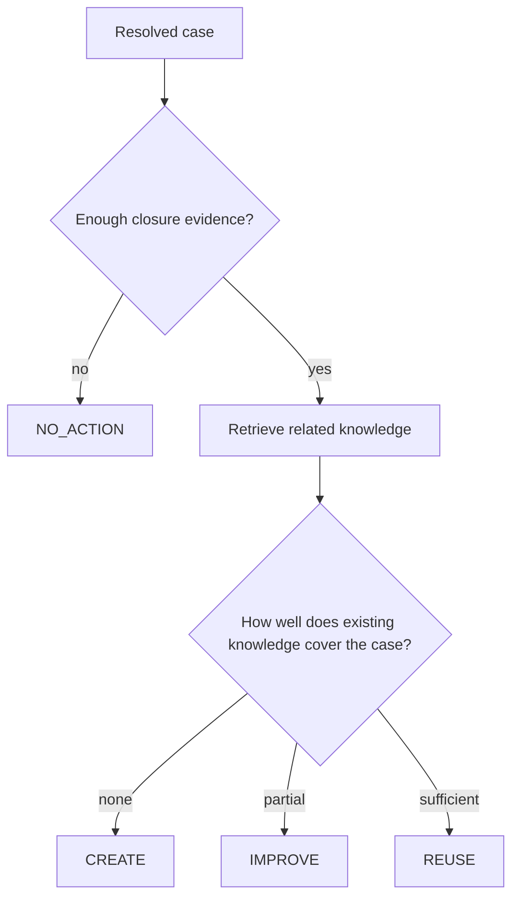
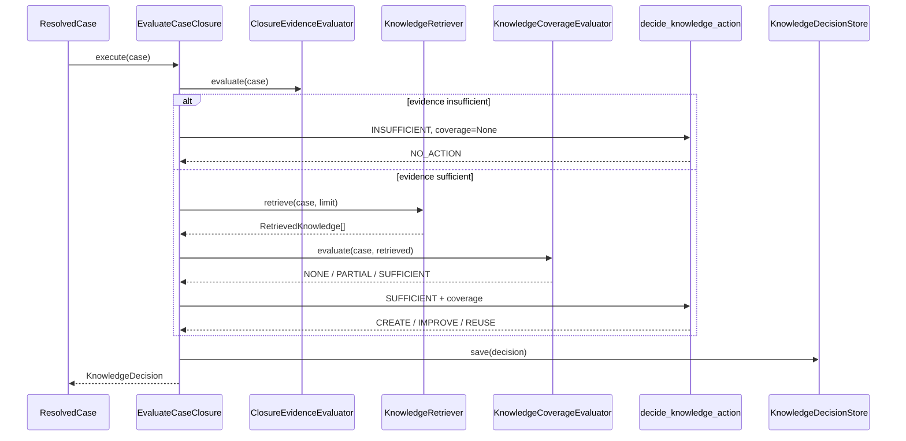
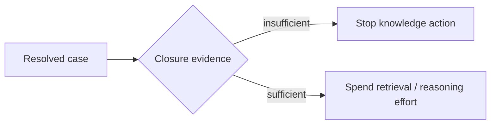
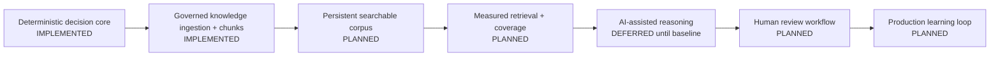

# Product Model — Tropos Resolve

## Product intent

Support teams solve problems every day, but the useful knowledge produced during resolution is often lost, duplicated, incomplete, inaccessible, or difficult to reuse. Tropos Resolve turns a resolved support case into a governed decision about the knowledge base.

The product does **not** start by asking an LLM to write an article. It first asks a more important sequence of questions:

This gives Tropos a stable decision vocabulary before introducing probabilistic AI behavior.

## The four governed outcomes

| Action | Meaning | Current domain trigger |
| --- | --- | --- |
| `NO_ACTION` | Do not change knowledge from this case | Closure evidence is `INSUFFICIENT` |
| `CREATE` | New knowledge is required | Closure evidence is sufficient and coverage is `NONE` |
| `IMPROVE` | Existing knowledge needs correction/completion | Closure evidence is sufficient and coverage is `PARTIAL` |
| `REUSE` | Existing knowledge already covers the case | Closure evidence is sufficient and coverage is `SUFFICIENT` |

The decision table itself is **IMPLEMENTED** in `domain/knowledge_action.py`.

## Current product loop

### Important implementation boundary

The orchestration above is implemented, but not every production adapter exists.

- `RuleBasedClosureEvidenceEvaluator` — **IMPLEMENTED**
- `KnowledgeRetriever` — **CONTRACT ONLY**
- `KnowledgeCoverageEvaluator` — **CONTRACT ONLY**
- `KnowledgeDecisionStore` — **CONTRACT ONLY**
- decision policy — **IMPLEMENTED**

That means the product policy and orchestration can be tested today, but there is not yet a fully wired production flow from source system to persistent decision.

## Why closure evidence comes first

A resolved ticket is not automatically useful knowledge. A case can be technically closed while still having a vague problem statement or poor resolution notes.

Tropos therefore treats closure quality as a gate:

The current baseline deliberately uses deterministic minimum-length rules. This is not intended to be the final semantic evaluator. It gives the system an observable baseline before adding AI judgment.

## Current users and responsibilities

| Role | Product responsibility |
| --- | --- |
| Support agent | Produces the resolution evidence in the source case |
| Knowledge reviewer | Reviews or edits future knowledge changes before publication |
| Knowledge/support manager | Monitors knowledge health, outcomes and process quality |

Human approval of actual knowledge publication remains a product boundary. Tropos is being designed to assist governed decisions, not silently publish customer-facing knowledge.

## Product principles

### 1. Evidence before generation

Tropos should know *why* an action is justified before it drafts anything.

### 2. Explicit abstention

`NO_ACTION` is a first-class outcome, not a failure. A system that always produces a knowledge change will manufacture low-quality knowledge.

### 3. Retrieval quality is product quality

If the system misses relevant knowledge, it may recommend `CREATE` when `REUSE` or `IMPROVE` was correct. Retrieval is therefore part of the decision product, not background plumbing.

### 4. Human governance is intentional

Future model-generated recommendations or drafts must remain traceable to source evidence and reviewable before governed publication.

## Product roadmap by capability, not technology

The roadmap intentionally delays embeddings and LLM generation until the system has measurable evidence, retrieval, and governance boundaries.

## Product success model

When Tropos reaches an executable end-to-end loop, useful outcome measures will include:

- proportion of resolved cases with sufficient closure evidence;
- `REUSE / IMPROVE / CREATE / NO_ACTION` distribution;
- reviewer acceptance / edit / rejection rates;
- duplicate knowledge avoided;
- retrieval recall on known-answer cases;
- time from resolved case to reviewed knowledge action;
- regression rate after retrieval, prompt, or model changes.

These are **future product metrics**, not claims about current performance.

## What Tropos is not currently trying to be

- an autonomous publication bot;
- a generic enterprise search product;
- a vector-database demo;
- an LLM wrapper where prompts contain hidden business policy;
- a replacement for source-system permissions;
- a system that supports every case/knowledge connector from day one.

The current objective is narrower: establish a trustworthy decision and evidence architecture that later AI capabilities can safely inhabit.
