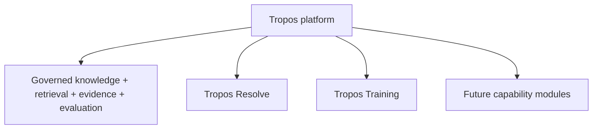

# Tropos product model

This page is the product-documentation entry point. Tropos is a platform with reusable governed-knowledge infrastructure and capability-specific products.

## Product hierarchy

```mermaid
flowchart TB
    Platform[Tropos platform]
    Platform --> Core[Governed knowledge + retrieval + evidence + evaluation]
    Platform --> Resolve[Tropos Resolve]
    Platform --> Training[Tropos Training]
    Platform --> Future[Future capability modules]
```

Use the capability documents below as the authoritative product descriptions:

| Document | Purpose |
| --- | --- |
| [Tropos platform](TROPOS_PLATFORM.md) | Overall product problem, shared platform capabilities, product principles and platform maturity |
| [Resolve](RESOLVE.md) | Service-resolution / Knowledge Article product, current implementation and roadmap |
| [Training](TRAINING.md) | Grounded procedure-generation capability and its product boundary |
| [Build history](BUILD_HISTORY.md) | Chronological record of implemented slices, design trade-offs and evidence |
| [Master backlog](master-backlog.md) | Prioritized delivery backlog, sprint scope and product/program sequencing |
| [Delivery governance](delivery-governance.md) | Sprint controls and delivery-management operating rules |
| [Delivery metrics](delivery-metrics.md) | Automatically generated delivery/DORA-compatible metrics surface |

## Source-of-truth rule

- **Product docs** define user problem, capability boundary, product status and roadmap.
- **Architecture docs** define current technical structure and runtime boundaries.
- **ADRs** define durable architectural decisions and trade-offs.
- **Quality docs** define evaluation/test strategy and release evidence.
- **Learning docs** explain concepts and interview translation; they are not authoritative implementation status.
- **Backlog/issues** define future work and priority; planned work must not be presented as implemented.

For technical state, start at [Architecture overview](../architecture/ARCHITECTURE_OVERVIEW.md).
