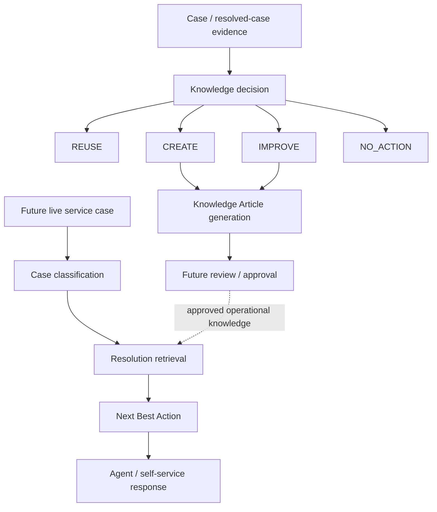

# Tropos Resolve

Tropos Resolve is the service-resolution capability of the Tropos platform. It turns service evidence into governed operational knowledge and, over time, into controlled resolution guidance.

Resolve is not one model call. It is a sequence of business decisions and evidence checks built on the shared Tropos knowledge platform.

## Product problem

Support teams continuously resolve incidents, but resolution knowledge is often lost, duplicated, incomplete, stale, difficult to retrieve, or disconnected from the source evidence that justified it.

Resolve addresses two connected problems:

1. **Knowledge maintenance:** should an existing knowledge item be reused, improved, newly created, or left unchanged?
2. **Resolution guidance:** given a live case, what evidence and action should be presented to an agent or self-service user?

The first problem has an implemented deterministic baseline. The second is the next product expansion.

## Capability model



## 1. Knowledge decision baseline

`EvaluateCaseClosure` coordinates the deterministic closure-decision flow:

1. evaluate closure evidence;
2. return `NO_ACTION` when evidence is insufficient;
3. retrieve related knowledge through a capability port;
4. evaluate coverage;
5. apply the deterministic `REUSE / IMPROVE / CREATE / NO_ACTION` policy;
6. persist the decision through a replaceable decision-store boundary.

| Action | Meaning |
| --- | --- |
| `NO_ACTION` | Closure evidence is insufficient to justify knowledge work |
| `CREATE` | No adequate existing knowledge covers the resolved case |
| `IMPROVE` | Existing knowledge is relevant but incomplete |
| `REUSE` | Existing knowledge is sufficient |

The action vocabulary is capability policy; it is not delegated to an LLM.

## 2. Knowledge Article model

Resolve now has a grounded Knowledge Article runtime built above the shared evidence layer.

Supported article contracts:

| Article type | Fixed operational structure |
| --- | --- |
| Troubleshooting | issue, symptoms, prerequisites, diagnostics, resolution, expected result, exceptions/escalation/gaps |
| How-to | purpose, prerequisites, steps, expected result, next steps/exceptions/gaps |
| FAQ | introduction, structured Q&A, additional information/gaps |

Every evidence-bearing factual claim or action uses stable `EvidenceRef` objects.

### Business control versus system control

Business users can influence a bounded generation request:

- subject/problem;
- article type;
- product and optional module;
- bounded business context;
- retrieval keywords;
- detail level;
- focus areas;
- preferred terminology.

They cannot override:

- evidence requirements;
- access control;
- fixed article structure;
- missing-information handling;
- conflict handling;
- unsupported-claim policy.

This keeps business configurability separate from governance.

## 3. Article-generation runtime

```mermaid
flowchart LR
    Intake[KnowledgeArticleGenerationRequest]
    --> Intent[Deterministic retrieval intent]
    --> Retriever[Governed KnowledgeChunkRetriever]
    --> Evidence[EvidenceExcerpt + stable EvidenceRef]
    --> Alias[Temporary E1..EN aliases]
    --> Model[Structured model call]
    --> ResolveAlias[Deterministic alias resolution]
    --> Draft[KnowledgeArticleDraft]
```



Key invariants:

- retrieval receives tenant/group access context;
- no authorized evidence means generation stops;
- the model sees temporary evidence aliases, not durable identity;
- unknown/duplicate aliases are rejected;
- final article content carries stable evidence references;
- alias validity does not prove semantic entailment.

## Current implementation status

| Resolve capability | Status |
| --- | --- |
| Resolved-case domain | Implemented |
| Closure-evidence rule evaluator | Implemented |
| Knowledge-action policy | Implemented |
| Closure orchestration | Implemented |
| Knowledge retrieval/coverage/store ports | Implemented contracts |
| Fixed Knowledge Article domain | Implemented |
| Bounded article-generation intake | Implemented |
| Deterministic article retrieval query | Implemented |
| Governed retrieval → article evidence mapping | Implemented |
| Provider-neutral article generator port | Implemented |
| LangChain structured article adapter | Implemented |
| Stable EvidenceRef alias resolution | Implemented |
| Knowledge Article deterministic eval dataset | Active backlog / not yet merged into main |
| Article review/approval/publish lifecycle | Planned |
| Case taxonomy/classification | Planned |
| Workflow-specific resolution retrieval | Planned |
| Next Best Action | Planned |
| Agent/self-service API and UI | Planned |

## Decisions and trade-offs

### Fixed article structure rather than free-form documents

**Chosen:** typed troubleshooting, how-to and FAQ structures.

**Why:** stable downstream consumption, easier evaluation, consistent operational quality.

**Cost:** less authoring freedom; new article types require explicit schema work.

**Revisit when:** real operational use cases require a distinct repeatable document type.

### Business preferences are bounded

**Chosen:** typed output controls rather than raw user-editable system prompts.

**Why:** product users should influence useful presentation choices without weakening grounding/security/policy.

**Cost:** advanced users cannot arbitrarily reshape the generation prompt.

**Revisit when:** a controlled prompt-template administration product is designed with validation, versioning, approval and regression testing.

### LangChain is an adapter

**Chosen:** domain/application code depends on Tropos-owned ports; LangChain handles structured model execution at the edge.

**Why:** retain model/provider/framework portability and keep domain semantics explicit.

**Cost:** Tropos maintains adapter/orchestration code instead of delegating the whole architecture to a framework.

**Revisit when:** a framework offers material integration value without taking ownership of governance, identity, lifecycle, or evaluation semantics.

### Stable evidence outside model context

**Chosen:** temporary `E1`/`E2` aliases inside prompts, exact resolution to stable `EvidenceRef` afterward.

**Why:** simple model copy behavior plus durable provenance.

**Cost:** requires an explicit mapping/resolver step.

**Revisit when:** model/tool interfaces can reliably consume stable references directly without reducing output reliability.

## Quality strategy for Resolve

Resolve quality is evaluated at several boundaries:

```text
software correctness
        ↓
retrieval correctness
        ↓
artifact grounding / structure
        ↓
case classification
        ↓
NBA correctness
        ↓
end-to-end resolution outcome
```

Component tests diagnose failure location. End-to-end tests judge whether the user outcome is acceptable.

## Next product slices

The prioritized sequence is maintained in [master backlog](master-backlog.md). The next major Resolve milestones are:

- Knowledge Article regression baseline;
- experiment/regression runtime;
- case taxonomy and classification;
- workflow-specific retrieval;
- Next Best Action;
- human review/publish lifecycle;
- API and product UI.

## Related documents

- [Tropos platform](TROPOS_PLATFORM.md)
- [Knowledge Article architecture](../architecture/KNOWLEDGE_ARTICLE.md)
- [Architecture overview](../architecture/ARCHITECTURE_OVERVIEW.md)
- [Evaluation contracts](../architecture/EVALUATION_CONTRACTS.md)
- [Evaluation strategy](../quality/EVAL_STRATEGY.md)
- [Build history](BUILD_HISTORY.md)
