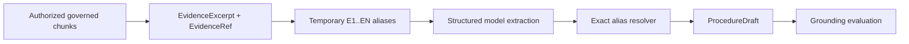

# Tropos Training

Tropos Training is the first grounded-generation capability built on the Tropos knowledge platform. Its purpose is to transform governed evidence into a structured procedure draft while preserving evidence lineage and explicitly surfacing exceptions and gaps.

Training was used as the proving ground for the generation architecture before the same pattern was applied to Resolve Knowledge Articles.

## Product boundary



Training does not own ingestion, retrieval, evidence identity, or authorization. Those are shared platform concerns.

## Procedure artifact

A `ProcedureDraft` contains:

- ordered procedure steps;
- structured exceptions;
- typed gaps;
- stable evidence references for every generated claim.

Gap kinds currently include:

- missing information;
- conflict;
- ambiguity.

## Current implementation status

| Capability | Status |
| --- | --- |
| Procedure domain contract | Implemented |
| Provider-neutral procedure extractor port | Implemented |
| LangChain structured-output adapter | Implemented |
| Governed retrieval before generation | Implemented |
| Temporary evidence aliases | Implemented |
| Stable EvidenceRef resolution | Implemented |
| Unknown alias rejection | Implemented |
| Evidence-backed exceptions and gaps | Implemented |
| Deterministic synthetic grounding eval | Implemented |
| Live provider benchmark | Planned |
| Training-specific artifact lifecycle | Planned |
| Audience-specific training document generation from approved Knowledge Articles | Planned |

## Decisions and trade-offs

### Structured extraction before free-form training content

**Chosen:** a strongly typed procedure artifact.

**Why:** procedural correctness, evidence alignment, and gap handling can be evaluated deterministically before investing in richer presentation.

**Cost:** the artifact is less expressive than a finished training experience.

**Revisit when:** approved operational knowledge and training personas require richer instructional formats.

### Stable evidence references outside the LLM

**Chosen:** prompt-local aliases resolve deterministically to shared `EvidenceRef`.

**Why:** prompt ordinals are convenient for model output but are not durable provenance identifiers.

**Cost:** explicit projection and resolution logic is required.

**Revisit when:** model interfaces can reliably carry stable structured references directly.

### Deterministic evaluation first

**Chosen:** golden synthetic cases check step coverage, citation alignment, exception separation, and gap coverage.

**Why:** deterministic failures are easier to diagnose and regression-test than starting with an opaque LLM judge.

**Cost:** semantic entailment, clarity, pedagogy, and broader quality are not fully measured.

**Revisit when:** real-model runs and human-reviewed examples exist for calibrating semantic or pedagogical evaluators.

## Relationship to Resolve

The long-term direction is for Training to consume approved operational knowledge rather than independently recreate procedures from raw source evidence whenever possible.

```text
governed source knowledge
        ↓
approved Knowledge Article
        ↓
audience-specific Training artifact
```

That keeps operational truth centralized while allowing Training to vary audience, explanation depth, examples, and pedagogy.

## Related documents

- [Tropos platform](TROPOS_PLATFORM.md)
- [Resolve](RESOLVE.md)
- [Evaluation strategy](../quality/EVAL_STRATEGY.md)
- [Evaluation contracts](../architecture/EVALUATION_CONTRACTS.md)
- [Build history](BUILD_HISTORY.md)
