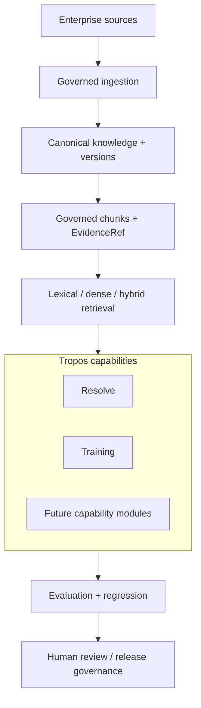

# Tropos platform

Tropos is a governed enterprise knowledge and AI platform for turning source information into reusable, evidence-backed operational artifacts and decisions.

The platform separates **shared knowledge mechanics** from **business capabilities**. Shared mechanics include source capture, normalization, versioning, chunking, access-aware retrieval, evidence identity, evaluation, and model integration boundaries. Capabilities such as Resolve and Training reuse those mechanics while owning their own business semantics.

## Product problem

Enterprise knowledge systems fail when useful information is difficult to trust, difficult to find, duplicated, stale, permission-blind, or generated without evidence. Tropos addresses that problem by making provenance, current-state resolution, authorization, retrieval quality, generation grounding, and evaluation explicit parts of the product architecture.

## Product shape

## Shared platform capabilities

| Capability | Current state | Notes |
| --- | --- | --- |
| Source capture boundary | Implemented | Local-file connector plus replaceable source contract |
| Parser boundary | Implemented | TXT, Markdown, HTML and DOCX deterministic parsing |
| Deterministic normalization | Implemented | Canonical representation before version comparison |
| Content/version lifecycle | Implemented | Immutable versions plus current-state projection |
| Governance refresh | Implemented | Access changes can refresh independently of content versions |
| Deterministic chunking | Implemented | Governed evidence units with lineage |
| SQLite persistence | Implemented baseline | Local durable source, version, chunk and evaluation state |
| Lexical retrieval | Implemented | SQLite FTS5/BM25 with current-version and access filtering |
| Dense retrieval | Implemented V1 | Exact cosine over versioned embeddings |
| Hybrid retrieval | Implemented V1 | Reciprocal Rank Fusion across lexical and dense results |
| Retrieval evaluation | Implemented | Golden sets, ranking metrics, saved runs and reports |
| Stable evidence reference | Implemented | Durable `EvidenceRef` outside model prompts |
| Structured model generation | Implemented baseline | LangChain is used as an adapter, not a domain owner |
| Generic eval contracts | Implemented | Vendor-neutral dataset/case/run/score vocabulary |
| Hosted API/UI | Planned | No production product surface yet |
| Postgres production persistence | Planned | SQLite remains the local/test baseline |
| Hosted observability backend | Planned | LangSmith/Langfuse/Phoenix remain adapter choices |

## Capability portfolio

### Resolve

Resolve owns service-resolution and operational-knowledge use cases. Its implemented scope currently includes:

- deterministic case-closure evidence assessment and `REUSE / IMPROVE / CREATE / NO_ACTION` policy;
- fixed grounded Knowledge Article contracts;
- bounded business intake and prompt-control contracts;
- governed retrieval trigger for article generation;
- provider-neutral Knowledge Article generation port;
- LangChain structured-output adapter;
- stable evidence resolution from prompt-local aliases back to `EvidenceRef`.

Case classification, workflow routing, Next Best Action, article lifecycle, and service-agent/self-service UI remain backlog work.

See [Resolve](RESOLVE.md).

### Training

Training is the first model-generation capability used to prove structured generation, stable evidence references, and deterministic grounding evaluation.

Implemented scope includes:

- `ProcedureDraft` contracts;
- provider-neutral extraction boundary;
- LangChain structured extraction;
- prompt-local evidence aliases resolved to stable `EvidenceRef`;
- typed exceptions and gaps;
- deterministic synthetic grounding evaluation.

See [Training](TRAINING.md).

## Product principles

**Evidence before generation.** Generated operational artifacts must originate from authorized governed evidence.

**Stable identity outside the model.** Prompt-local aliases are temporary convenience identifiers; persisted artifacts carry stable evidence references.

**Deterministic where policy is deterministic.** Identity, authorization, versioning, lifecycle rules, schema validation, and explicit business policy should not be delegated to an LLM.

**Models behind replaceable boundaries.** LangChain, model providers, observability vendors, search engines, and databases remain adapters where practical.

**Quality is layered.** Software correctness, retrieval quality, model behavior, product outcomes, and release governance are evaluated separately.

**Complexity must be earned.** ANN/HNSW, durable workflow orchestration, extra hosted infrastructure, rerankers, and agent frameworks are introduced only when measured needs justify them.

## Current non-goals

Tropos is not currently:

- a generic enterprise-search product;
- an autonomous publishing system;
- a vector-database demonstration;
- a full enterprise connector/synchronization platform;
- a production multi-tenant SaaS service;
- a multi-agent orchestration framework.

## Success measures

Platform-level success should eventually be measured through a combination of:

- evidence freshness and access correctness;
- retrieval recall/ranking quality;
- grounded-generation quality and unsupported-claim rate;
- reviewer acceptance/edit/rejection rates;
- time to create or improve operational knowledge;
- resolution/NBA quality for Resolve;
- regression rate after model, prompt, retrieval, or policy changes;
- operational latency, cost, reliability, and release quality.

These are target measures unless backed by an implemented evaluation or production signal.

## Related documents

- [Resolve](RESOLVE.md)
- [Training](TRAINING.md)
- [Build history](BUILD_HISTORY.md)
- [Architecture overview](../architecture/ARCHITECTURE_OVERVIEW.md)
- [Knowledge model](../architecture/KNOWLEDGE_MODEL.md)
- [RAG architecture](../architecture/RAG_ARCHITECTURE.md)
- [Evaluation strategy](../quality/EVAL_STRATEGY.md)
- [Architecture decisions](../decisions/README.md)
