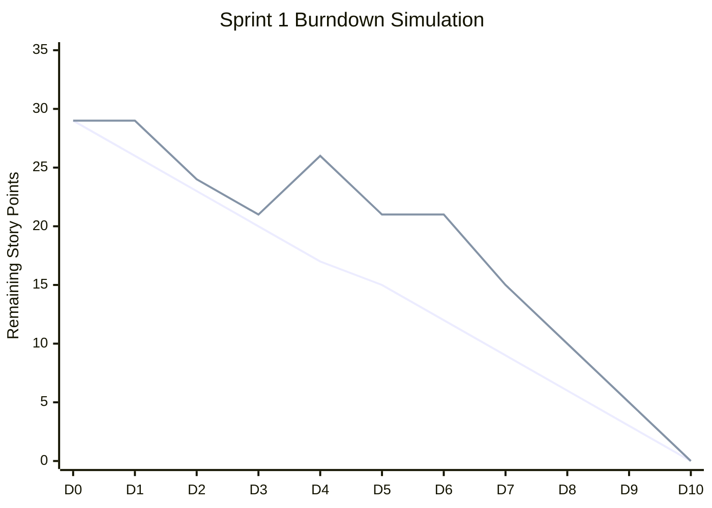
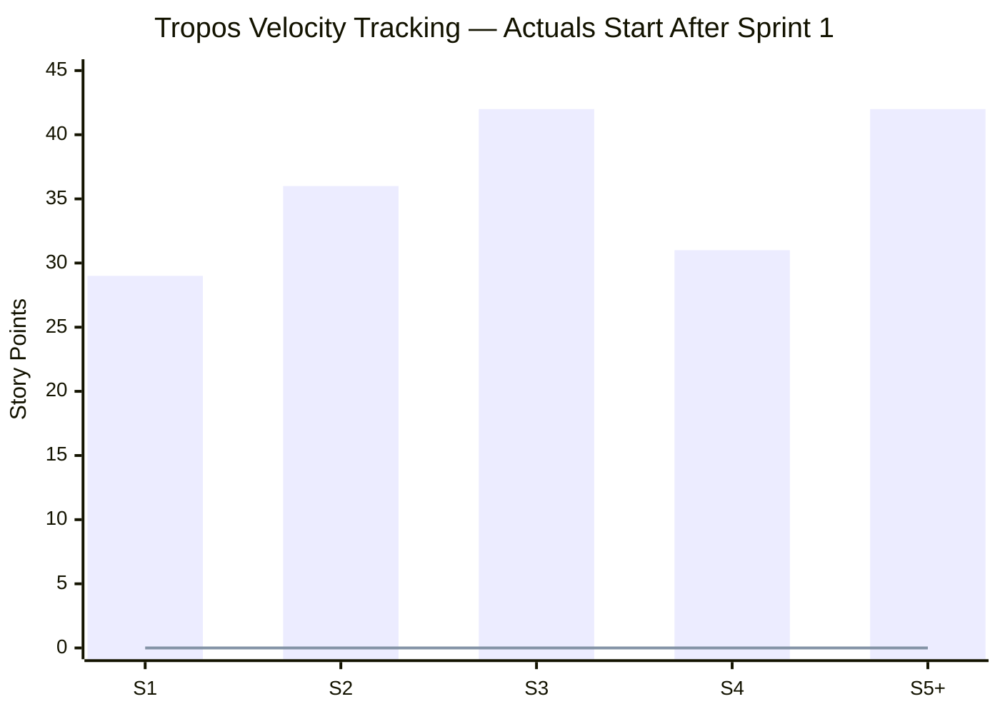

# Tropos Master Product & Quality Backlog

Status: Baseline v1  
Purpose: Single source of truth for sequencing Tropos platform and capability work.  
Delivery model: small verifiable PRs, explicit architecture boundaries, automated quality gates, evidence captured with each slice.

## Prioritization model

- **P0** — required to prove the current Resolve product thesis or quality foundation.
- **P1** — required next for production-like operation, scale, or broader capability coverage.
- **P2** — valuable extension after the core flow is proven.
- **Deferred** — intentionally postponed until evidence shows the need.

Sprint estimates below are deliberately coarse and should be refined during planning. Story Points (SP) use relative complexity: 1, 2, 3, 5, 8.

## Already delivered / baseline

The repository already includes the engineering operating model and CI quality gates; governed knowledge chunking, normalization/versioning, SQLite persistence, source connector boundary/reliability, deterministic parsing, ingestion orchestration, governed lexical retrieval, dense retrieval, hybrid retrieval, retrieval evaluations, knowledge tombstones, living architecture/learning documentation, Training structured extraction, grounded generation evaluation, and stable EvidenceRef-based artifact grounding.

Relevant merged PR sequence includes #1, #3, #5, #7-10, #12-17, #23-26, #29-34.

## Product architecture direction

```text
Tropos Core
├── governed knowledge
├── retrieval
├── evidence / provenance
├── persistence adapters
├── eval contracts
└── observability contracts

Resolve
├── knowledge article generation
├── case intake / classification
├── workflow selection
├── resolution retrieval
├── next best action
└── agent / self-service presentation

Training
└── approved operational knowledge → audience-specific training
```

## Sprint 1 — Grounded Knowledge Article MVP

**Sprint Goal:** Generate a fixed-format, evidence-backed Knowledge Article and measure its quality.

| ID | Priority | Story | SP | Dependencies |
|---|---|---|---:|---|
| RES-101 | P0 | Define canonical KnowledgeArticle domain model and templates | 5 | EvidenceRef |
| RES-102 | P0 | Define business intake and article-generation request contract | 3 | RES-101 |
| RES-103 | P0 | Generate grounded KnowledgeArticleDraft through provider-neutral port | 8 | RES-101, RES-102 |
| QE-101 | P0 | Define reusable eval dataset/run/score contracts | 5 | existing eval framework |
| QE-102 | P0 | Build Knowledge Article golden dataset and deterministic graders v1 | 8 | RES-103, QE-101 |

### Sprint 1 acceptance outcome

Given governed evidence and a typed article request, Tropos can create a troubleshooting/how-to/FAQ draft with stable EvidenceRefs, fixed structure, explicit gaps/conflicts, and an automated quality scorecard.

## Sprint 2 — Experimentation, regression and case classification

**Sprint Goal:** Compare candidate changes safely and turn raw cases into controlled resolution workflows.

| ID | Priority | Story | SP | Dependencies |
|---|---|---|---:|---|
| QE-103 | P0 | Build experiment runner and baseline-vs-candidate regression comparison | 8 | QE-101, QE-102 |
| OBS-101 | P1 | Add vendor-neutral trace/eval sink contracts and OpenTelemetry instrumentation boundary | 5 | QE-101 |
| OBS-102 | P1 | Add LangSmith adapter for experiments/traces without domain coupling | 5 | OBS-101, QE-103 |
| RES-104 | P0 | Define case taxonomy and CaseClassification contract | 5 | Resolve domain |
| RES-105 | P0 | Implement hybrid case classification: rules + structured model output | 8 | RES-104 |
| QE-104 | P0 | Build classification golden dataset and field/workflow graders | 5 | RES-104, RES-105 |

### Sprint 2 acceptance outcome

A candidate prompt/model/config can be compared against a baseline with regressions visible, and raw case text can be mapped into a validated classification/workflow contract with measurable accuracy.

## Sprint 3 — Resolve retrieval and Next Best Action

**Sprint Goal:** Turn classified cases into grounded, eligible recommendations.

| ID | Priority | Story | SP | Dependencies |
|---|---|---|---:|---|
| RES-106 | P0 | Build ResolutionRetrievalIntent and deterministic query builder | 5 | RES-104 |
| RES-107 | P0 | Retrieve workflow-specific governed evidence and measure Recall@K/MRR | 8 | RES-106 |
| RES-108 | P0 | Define RecommendedAction contract, eligibility and policy hooks | 5 | RES-104 |
| RES-109 | P0 | Generate/rank grounded candidate actions and escalation conditions | 8 | RES-107, RES-108 |
| QE-105 | P0 | Build NBA golden dataset and graders | 8 | RES-109 |
| QE-106 | P1 | Build end-to-end Resolve eval: case → classification → retrieval → NBA | 8 | QE-104, QE-105 |

## Sprint 4 — Production-like persistence and lifecycle

| ID | Priority | Story | SP | Dependencies |
|---|---|---|---:|---|
| PLAT-101 | P1 | Add Postgres repository adapters while retaining SQLite for local/test | 8 | repository ports |
| PLAT-102 | P1 | Provision Supabase staging and run shared repository contract tests | 5 | PLAT-101 |
| GOV-101 | P1 | Add Knowledge Article draft → review → approved/published lifecycle | 8 | RES-103 |
| GOV-102 | P1 | Capture generation provenance separately from content evidence | 5 | RES-103, QE-101 |
| QE-107 | P1 | Define release gates and CI/nightly/release eval cadence | 5 | QE-103, QE-106 |

## Sprint 5+ — Training and broader platform

| ID | Priority | Story | SP | Dependencies |
|---|---|---|---:|---|
| TRN-101 | P1 | Transform approved KnowledgeArticle into audience-specific TrainingDocument | 8 | GOV-101 |
| TRN-102 | P1 | Add training-specific golden dataset and evaluators | 5 | TRN-101 |
| API-101 | P1 | Expose Resolve capability APIs | 5 | RES-109 |
| UI-101 | P2 | Build agent/self-service Resolve UI | 8 | API-101 |
| UI-102 | P2 | Build Knowledge Article review/publish UI | 8 | GOV-101 |
| PLAT-103 | P2 | Add production deployment and operational dashboards | 8 | PLAT-102, OBS-102 |

## Delivery metrics and sprint-control simulation

The charts below are deliberately **planning/simulation artifacts** until Tropos closes real sprints. They show how the team will manage scope, blockers, burndown and velocity without pretending forecast data is actual delivery history.

### Sprint 1 burndown simulation

Sprint 1 starts with **29 SP** committed. The ideal line burns evenly to zero over ten working days. The simulated actual line demonstrates two real delivery events:

- **Day 4:** a new urgent 5-SP story is accepted into the sprint after trade-off review, so remaining scope increases.
- **Day 6:** a blocker prevents progress for one day, so the remaining-work line is flat.
- The team recovers by completing/de-scoping lower-value work and still reaches zero by Day 10.



| Day | Event | Remaining SP | Program-management response |
|---|---|---:|---|
| D0 | Sprint starts | 29 | Baseline committed scope |
| D1 | No story closed | 29 | Normal; inspect task-level progress, do not panic on one day |
| D2 | 5 SP completed | 24 | Burndown starts |
| D3 | 3 SP completed | 21 | On track |
| D4 | New urgent 5-SP story accepted | 26 | Scope change logged; Product Owner approves; equivalent lower-value work identified for possible de-scope |
| D5 | 5 SP completed | 21 | Team absorbs part of added scope |
| D6 | External dependency blocks work | 21 | Blocker owner assigned; escalation SLA starts; swarm on unblocked work |
| D7 | Blocker removed; 6 SP completed | 15 | Recovery visible |
| D8 | 5 SP completed | 10 | Reforecast sprint outcome |
| D9 | 5 SP completed | 5 | Final story in progress |
| D10 | 5 SP completed | 0 | Sprint closes; actual velocity recorded |

### How new stories are handled during a sprint

A new story does **not** automatically enter committed sprint scope.

```text
New requirement appears
        ↓
Triage: defect / compliance / urgent business need / normal enhancement?
        ↓
Estimate + dependency/risk check
        ↓
Does it need to enter this sprint?
   ┌───────────────┴───────────────┐
   │                               │
  No                              Yes
   │                               │
Backlog + reprioritize       Product Owner approves
for next planning                  ↓
                             Scope trade-off
                             ├── add + remove similar SP, OR
                             ├── explicitly increase sprint scope, OR
                             └── split/minimum slice
                                   ↓
                             Burndown baseline/change log updated
```

**Rule:** sprint scope is protected by default. Urgent work may enter, but the change is visible and has an explicit decision owner. Velocity is based on **completed work**, not on how much scope was added.

### How blockers are handled

A blocker changes execution, not story-point estimates merely because time has passed.

```text
Blocker identified
      ↓
Link blocker to affected story
      ↓
Name owner + source of dependency
      ↓
Can team unblock internally?
   ┌──────────┴──────────┐
  Yes                   No
   │                     │
Swarm/fix          External escalation
                         ↓
                  track age / SLA
                         ↓
                 work unblocked items
                         ↓
               reforecast sprint risk
```

For planning simulations, use these operating rules:

- Blocker is surfaced the same working day.
- Story remains in sprint while recovery is credible.
- If the blocker threatens the Sprint Goal, escalate and re-plan immediately rather than waiting for sprint end.
- If the story can no longer complete, move the unfinished points back to backlog; **do not count partial points as velocity**.
- Root cause and a preventive action are captured for material blockers.

### Velocity tracking

Velocity means **story points actually completed and accepted in a closed sprint**. Planned scope is not velocity. Because Tropos has not yet closed this new sprint sequence, actual velocity is not available. The table establishes the tracking baseline and the chart should be updated after each sprint review.

| Sprint | Planned scope | Actual completed velocity | Notes |
|---|---:|---:|---|
| Sprint 1 | 29 | TBD | First calibration sprint |
| Sprint 2 | 36 | TBD | Commitment will be adjusted using Sprint 1 actual velocity |
| Sprint 3 | 42 | TBD | Backlog estimate, not commitment yet |
| Sprint 4 | 31 | TBD | Backlog estimate, not commitment yet |
| Sprint 5+ | 42 | TBD | Candidate scope only |



In this initial chart, the **bars are planned backlog scope** and the zero line is intentionally not presented as delivery performance; it marks that no sprint in this new sequence has closed yet. After Sprint 1, replace the first zero with actual accepted points. After three completed sprints, use the rolling average as the initial capacity reference for future commitment.

### Velocity interpretation and planning policy

Do not use velocity as an individual productivity measure. Use it for team-level forecasting under broadly stable conditions.

Example after three real sprints:

```text
S1 actual = 24 SP
S2 actual = 27 SP
S3 actual = 25 SP

Rolling velocity ≈ 25 SP

Next sprint:
Backlog may contain 40+ SP of ready work,
but planned commitment should be near demonstrated capacity,
then adjusted for leave, risk, dependencies and Sprint Goal.
```

A rising velocity is not automatically good, and a falling velocity is not automatically bad. Changes can come from story sizing, team composition, technical debt, incident load, discovery work, or dependencies. Sprint review should examine causes, not chase the number.

### Blocker and scope-change simulation for Sprint Review

At Sprint Review / Retrospective the delivery record should answer:

| Question | Simulation answer |
|---|---|
| What was original commitment? | 29 SP |
| What scope was added? | +5 SP on D4 |
| Why was it added? | Urgent P0 business requirement |
| Who approved it? | Product Owner / accountable product lead |
| What was blocked? | One delivery path on D6 |
| Blocker duration | 1 working day |
| Was Sprint Goal endangered? | Temporarily at risk; recovered |
| What was completed? | 34 SP total after approved scope addition |
| What counts as velocity? | 34 SP only if all 34 SP met DoD and were accepted; otherwise only accepted completed SP |
| What becomes regression/process learning? | Add dependency readiness check if blocker root cause was preventable |

This simulation exists to teach the operating model. Once real Sprint 1 execution starts, simulated values must not be mixed with actual delivery reporting.

## Deferred until evidence justifies them

- ANN/HNSW migration or dedicated vector database
- heavy reranking pipelines beyond measured retrieval need
- LangGraph workflow orchestration before durable branching/HITL is required
- autonomous multi-agent orchestration
- full claim graph shared across capabilities
- direct provider coupling in domain/application layers
- replacing SQLite for local deterministic tests

## Jira-ready story template

Every implementation story should contain:

**User story**  
As a <persona/system role>, I want <capability>, so that <business outcome>.

**Business value**  
Why this matters and which risk/outcome it addresses.

**Scope**  
Explicit in-scope and out-of-scope boundaries.

**Acceptance criteria**  
Testable Given/When/Then or equivalent objective checks.

**Tasks**  
Architecture/domain work, implementation, automated tests/evals, documentation/evidence.

**Test strategy**  
Unit / contract / integration / AI eval / E2E requirements as applicable.

**Definition of Done**
- code and contracts merged
- CI green
- architecture/docs updated where impacted
- automated evidence captured
- no unsupported capability claims
- learning/decision record updated for meaningful trade-offs

## Quality engineering cadence

```text
Every PR
  formatting → lint → typing → unit → contract → fast integration → smoke eval

Nightly
  full development golden set → regression comparison → expensive judge evals → retrieval benchmark

Release candidate
  holdout set → E2E → security → performance → critical scenario gates

Production
  traces → runtime metrics → sampled online evals → failures harvested into regression dataset
```

## Backlog governance

1. P0 work must trace to the current product hypothesis or a release-blocking quality risk.
2. No new framework is introduced without an explicit problem, alternatives, downside and revisit trigger.
3. Each production defect should become a regression case when reproducible.
4. Golden cases are approved/versioned product specifications; synthetic LLM output is candidate data until validated.
5. Component evals diagnose failures; end-to-end evals determine product outcome quality.
6. Observability vendors remain adapters. Tropos owns correctness semantics, golden data and release gates.
7. New in-sprint scope requires explicit triage, estimate, owner and trade-off decision; it is never silently added.
8. Blocked work is visible, owned and escalated; unfinished points are never counted as completed velocity.
