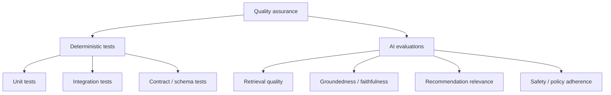
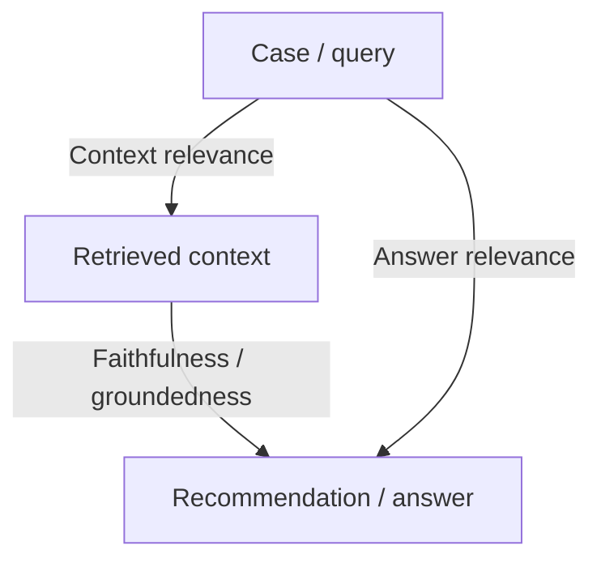
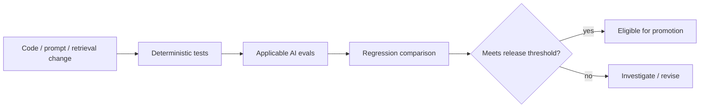

# Evaluation Strategy

## Purpose

Tropos separates **software correctness** from **AI-system quality**. Deterministic tests answer whether code behaves as specified. Evaluations answer whether retrieval and reasoning are good enough for the product.

## Theory foundation

This distinction follows software quality engineering and modern AI evaluation practice:

## What exists today

The current repository contains deterministic tests for implemented domain/application/chunking behavior. Full RAG evaluation is planned for the stage where retrieval and model reasoning exist.

## Quality model

| Layer | Example question | Mechanism |
| --- | --- | --- |
| Domain | Can an invalid chunk exist? | Unit test / invariant |
| Application | Does a use case orchestrate the correct ports? | Unit/integration test |
| Adapter | Does chunking cover the source exactly? | Unit/property-style checks |
| Retrieval | Did we retrieve the expected evidence? | Retrieval eval |
| Generation | Is the recommendation supported by evidence? | Groundedness eval |
| Product | Did the system choose an appropriate knowledge action? | Golden dataset / reviewer outcome |

## RAG evaluation model

Tropos will use the RAG triad as one organizing model, but not as the only metric set.

In addition, retrieval should be measured with information-retrieval metrics such as recall, precision, and ranking-sensitive measures where the evaluation dataset supports them.

## Release-gate philosophy

Not every change requires every eval. The changed behavior determines the applicable suite.

## Dataset principles

Evaluation datasets should be:

- version controlled;
- representative of actual product decisions;
- small enough initially to inspect manually;
- expanded when new failure modes are discovered;
- separated into development/tuning examples and held-out release-gate examples when dataset size permits;
- linked to expected evidence and/or expected action where that can be established reliably.

## Regression discipline

A new prompt, chunking strategy, retriever, embedding model, or ranking algorithm should not be accepted merely because aggregate quality improved. Inspect regressions on individual examples, especially high-risk cases.

## Human review

Human review remains part of the product loop. Automated scores support release decisions; they do not replace governed reviewer judgment about publication or knowledge correctness.

## Failure modes to avoid

- using one LLM judge as unquestioned truth;
- optimizing against the same examples used to design prompts;
- reporting only an average score and hiding severe regressions;
- mixing retrieval and generation changes in one experiment without attribution;
- treating passing unit tests as evidence that an AI workflow is good;
- treating high answer quality as proof that retrieval is correct.
