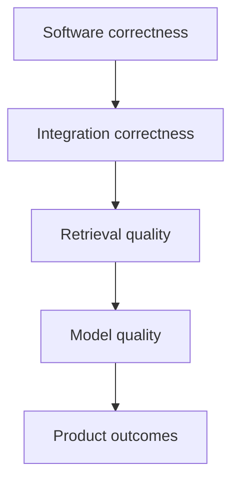
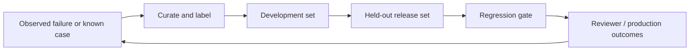

# Evaluation strategy

Tropos evaluates software correctness, integration correctness, retrieval quality, model behavior, and product outcomes as separate layers. Each layer needs different evidence and release gates.

## Quality layers



Software and integration correctness are implemented. Retrieval now has a first executable quality baseline. Model and product-outcome evaluation remain future layers.

## Current software gates

Every pull request and push to `main` runs:

```text
uv sync --dev --locked
uv run ruff format --check .
uv run ruff check .
uv run mypy src tests
uv run pytest
uv build
```

Tests cover access-policy validation, source identity, parsing, normalization, version resolution, lossless chunking, persistence/orchestration, source reliability, governed lexical retrieval, and Resolve policy/orchestration.

Code coverage percentage is not currently measured or gated. That is separate from behavioral quality: a high line-coverage number would not prove retrieval relevance, access isolation, or freshness correctness.

## Retrieval evaluation V1

The first retrieval baseline is evaluated against the versioned synthetic corpus at `apps/api/evals/retrieval/golden_v1.json`.

The corpus deliberately contains:

- lexical/exact-term cases that BM25 should handle well;
- semantic/paraphrase cases designed to expose lexical recall gaps;
- no-answer cases;
- cross-tenant and restricted-group access-boundary cases.

The V1 labels are at `knowledge_id` level rather than exact chunk ID. This keeps labels stable while chunking strategy evolves and is sufficient for the current one-chunk-per-document synthetic corpus. It is less precise than chunk-level relevance labeling and must be revisited for larger documents, graded relevance, or reranking work.

### V1 metrics

| Metric | Purpose |
| --- | --- |
| Recall@1 / @3 / @5 | Whether expected knowledge appears in the retrieved set |
| Precision@5 | How much of the five-result window is labeled relevant |
| MRR | Rank of the first relevant result |
| No-answer accuracy | Whether expected-empty cases return no evidence |

For single-relevant-document cases, `Precision@5` has a maximum of `0.2`; it should not be interpreted like a percentage of answer correctness. Recall and MRR are the more useful V1 ranking indicators.

The evaluator deduplicates repeated chunks from the same `knowledge_id` before computing knowledge-level metrics. Retrieval itself still returns chunks; this is an evaluation choice, not a runtime retrieval behavior change.

### Current lexical baseline

`sqlite-fts5-bm25-v1` is expected to establish the following V1 regression baseline on the synthetic corpus:

```text
Answerable cases       10
Expected-empty cases    4
Recall@1              0.80
Recall@3              0.80
Recall@5              0.80
MRR                   0.80
Precision@5           0.16
No-answer accuracy    1.00
```

The two deliberately semantic cases are expected misses for the lexical baseline. This is evidence of a semantic-recall gap, not evidence by itself that vector retrieval should ship. A vector or hybrid strategy should be added as a separate versioned retriever and compared on the same corpus plus a larger production-like set.

## Retrieval-design implications

The core retrieval contract remains strategy-neutral. `KnowledgeSearchRequest` carries query, access context, and limit; the concrete adapter owns lexical, vector, or hybrid behavior.

Do not add a generic score threshold to the core contract yet. BM25 scores are strategy-native and are not normalized probabilities; future vector and reranker scores will have different semantics. Thresholding, if introduced, should be strategy-specific and justified by evaluation.

Do not replace BM25 with vector search by default. Exact identifiers, policy names, codes, and product terms are strong lexical use cases. The likely future shape is hybrid retrieval if evaluation shows that semantic recall improves without damaging exact-match behavior, access guarantees, latency, or operational simplicity.

## Product-decision evaluation

Retrieval quality matters because it changes the four-way knowledge decision. A product evaluation record should eventually contain:

```text
EvalCase
├── resolved-case input
├── expected relevant evidence IDs
├── expected or acceptable coverage state
├── expected or acceptable knowledge action
├── reviewer notes
└── risk / criticality tag
```

This supports regression analysis at the decision level rather than only at the wording level.

## Model evaluation

Model-assisted behavior remains deferred. When introduced, evaluation should distinguish context relevance, faithfulness/groundedness, answer relevance, and task correctness. LLM-based judges may supplement deterministic checks and human review, but judge prompts/models must be versioned and calibrated against manually reviewed examples.

## Regression dataset lifecycle



The V1 corpus is a development/regression seed, not a held-out enterprise benchmark. Pilot data should later create a separate held-out release set.

Critical security or decision failures remain case-level blockers even when aggregate scores improve. Cross-tenant evidence leakage, restricted-group leakage, or stale historical evidence are zero-tolerance failures.

## Release gates by capability

| Capability | Required evaluation |
| --- | --- |
| Deterministic core behavior | Unit tests, type checks, lint, build |
| Persistence | Integration and migration tests |
| Retrieval | Integration tests plus labeled retrieval metrics and access-boundary cases |
| Coverage evaluation | Decision-level regression cases |
| LLM assistance | Schema validation, groundedness/task evals, critical-case checks |
| Production workflow | Reviewer outcomes, latency/error telemetry, operational regressions |

See [CI/CD](../delivery/CI_CD.md) and [RAG architecture](../architecture/RAG_ARCHITECTURE.md).
