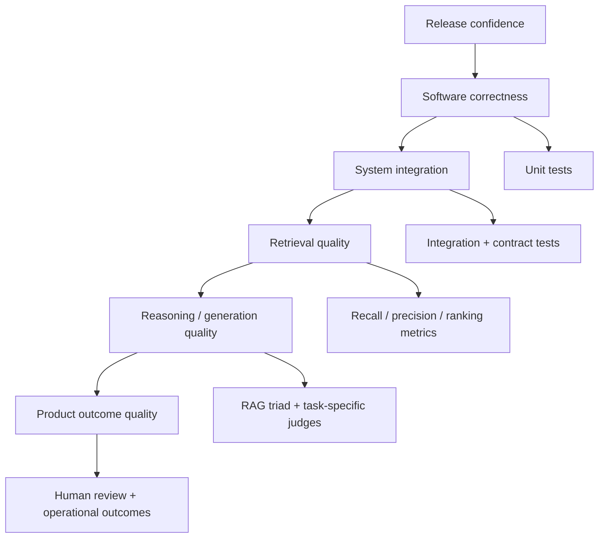
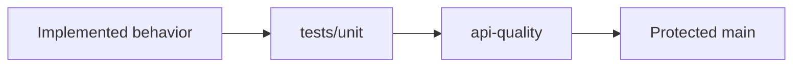
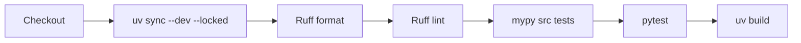
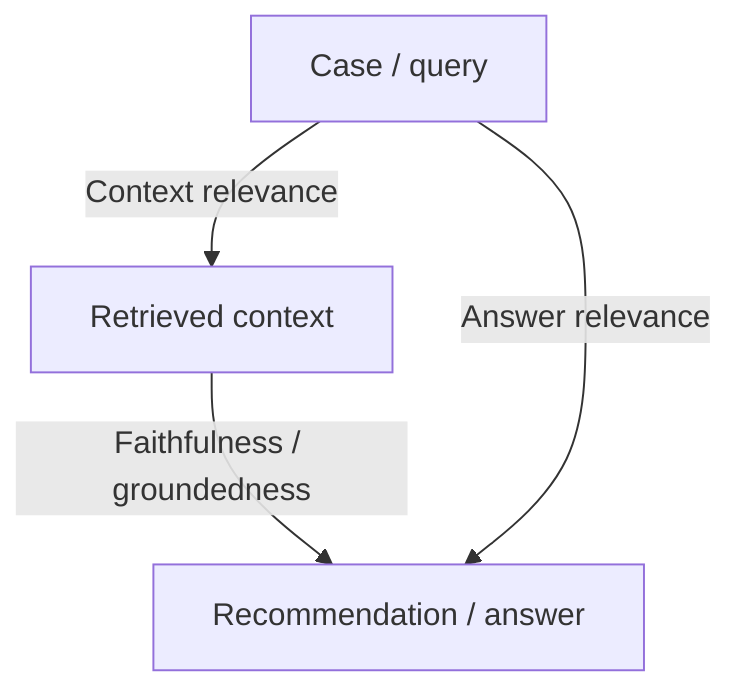
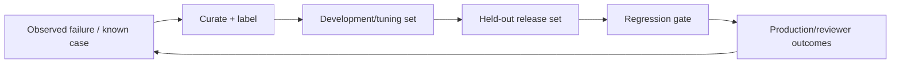
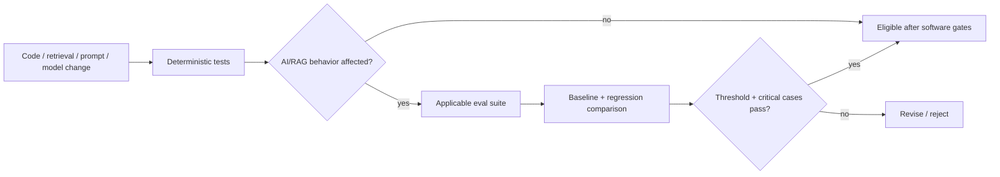

# Evaluation Strategy

Tropos separates **software correctness** from **AI-system quality**. A unit test can prove that a decision table behaves as specified; it cannot prove that a future retriever finds the right evidence or that a model recommendation is well grounded.

## Quality stack



Only the first layer is substantially implemented today. The later layers should be introduced when their corresponding capabilities exist.

## Current executable quality evidence

### Domain tests

Current unit tests cover:

- access-policy normalization and invalid states;
- knowledge-document validation and retrieval-score bounds;
- deterministic knowledge-action policy;
- resolved-case identity and timezone requirements.

### Application tests

Current application tests cover the `EvaluateCaseClosure` orchestration boundary and raw-ingestion identity behavior.

### Adapter tests

Current adapter tests cover deterministic closure-evidence evaluation and deterministic chunking behavior.



The repository currently has no persistence/retrieval integration tests because those production adapters do not yet exist.

## Current CI gate

Every pull request and every push to `main` runs:



`api-quality` is a required status check on protected `main`.

## Future RAG evaluation model

The RAG triad is useful as a conceptual map, but Tropos should not reduce system quality to three opaque judge scores.



These relationships answer different questions:

- **Context relevance** — was the retrieved evidence useful for the case?
- **Faithfulness / groundedness** — is the recommendation supported by that evidence?
- **Answer relevance** — does the output actually address the requested task?

## Retrieval metrics should remain explicit

For retrieval, conventional information-retrieval measures are often more diagnostic than a single LLM judge.

| Metric | Question |
| --- | --- |
| Recall@k | Did the expected relevant evidence appear in the retrieved set? |
| Precision@k | How much of the returned set was actually relevant? |
| MRR | How early did the first relevant result appear? |
| nDCG | Were more relevant results ranked appropriately when graded relevance exists? |

The exact metric set depends on what labels the evaluation dataset can support.

## Product-decision evaluation

Tropos ultimately makes a four-way knowledge action. A future golden dataset should therefore include more than text relevance.

```text
EvalCase
├── resolved-case input
├── expected relevant evidence IDs
├── expected / acceptable coverage state
├── expected / acceptable knowledge action
├── reviewer notes
└── risk / criticality tag
```

This allows the team to ask whether a retrieval or model change altered the actual product decision, not merely whether a judge preferred the wording.

## Evaluation dataset lifecycle



Initially, the dataset can be small and manually inspectable. Scale should follow observed failure diversity, not vanity sample counts.

## Release-gate model



Not every PR should run every future eval. Gates should be behavior-aware so the system remains fast enough to develop while still protecting affected capabilities.

## LLM-as-judge policy

LLM judges can be useful, but they must be treated as measurement instruments with known uncertainty.

Use them with:

- explicit rubrics;
- structured outputs;
- versioned judge prompts/models;
- manually reviewed calibration examples;
- disagreement analysis;
- deterministic checks where possible;
- case-level regression inspection, not averages alone.

Do not treat one judge score as ground truth.

## High-risk regression discipline

A model/retrieval variant should not pass merely because the average score improves. Critical examples can be release blockers even when aggregate quality is higher.

Examples of high-risk failures include:

- inaccessible evidence retrieved across policy boundaries;
- `CREATE` recommended when sufficient approved knowledge exists;
- `REUSE` recommended from incomplete evidence;
- generated rationale cites evidence that was not retrieved;
- closure evidence is inadequate but the system continues into expensive reasoning.

## Human review remains part of evaluation

Reviewer acceptance, edits, rejection reasons and overrides can become product feedback signals. They should complement automated evaluation, not be replaced by it.

## Current versus future

| Capability | Status |
| --- | --- |
| Unit tests | IMPLEMENTED |
| Ruff / mypy / build quality gates | IMPLEMENTED |
| Required CI on protected main | IMPLEMENTED |
| Persistence integration tests | PLANNED |
| Retrieval evaluation dataset | PLANNED |
| Recall/precision/ranking metrics | PLANNED |
| LLM groundedness/relevance evals | DEFERRED until LLM behavior exists |
| Production outcome monitoring | DEFERRED until deployed |
