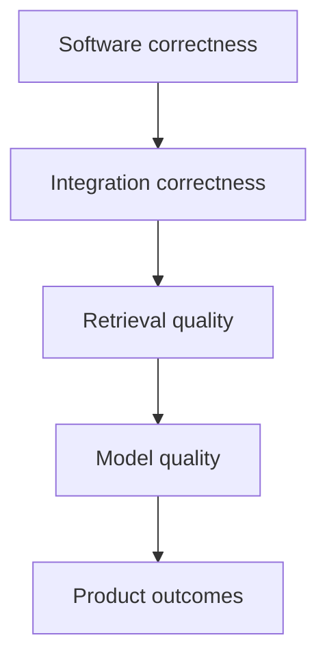
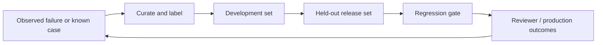

# Evaluation strategy

Tropos evaluates software correctness, retrieval quality, model behavior, and product outcomes as separate layers. Each layer needs different evidence.

## Quality layers



Only software correctness is substantially implemented today. Later layers become executable when the corresponding capabilities exist.

## Current software gates

Every pull request and push to `main` runs:

```text
uv sync --dev --locked
uv run ruff format --check .
uv run ruff check .
uv run mypy src tests
uv run pytest
uv build
```

Unit tests cover:

- access-policy validation;
- raw and canonical identity behavior;
- normalization and structural extraction;
- canonical version resolution;
- deterministic, lossless chunking;
- Resolve closure-evidence evaluation;
- Resolve decision policy and orchestration.

Persistence, parser, and retrieval integration tests do not exist because those production adapters are not implemented.

## Retrieval evaluation

The first retrieval implementation should be evaluated on labeled cases before adding semantic retrieval complexity.

| Metric | Use |
| --- | --- |
| Recall@k | Whether expected relevant evidence appears in the retrieved set |
| Precision@k | How much of the retrieved set is relevant |
| MRR | Rank of the first relevant result |
| nDCG | Ranking quality when graded relevance labels exist |

A retrieval dataset should connect a case/query to expected evidence IDs and, where possible, graded relevance.

## Product-decision evaluation

Retrieval quality matters because it changes the four-way knowledge decision. A product evaluation record should eventually contain:

```text
EvalCase
├── resolved-case input
├── expected relevant evidence IDs
├── expected or acceptable coverage state
├── expected or acceptable knowledge action
├── reviewer notes
└── risk / criticality tag
```

This supports regression analysis at the decision level rather than only at the wording level.

## Model evaluation

Model-assisted behavior is deferred. When introduced, evaluation should distinguish:

- **context relevance** — whether retrieved evidence is useful for the task;
- **faithfulness / groundedness** — whether the output is supported by that evidence;
- **answer relevance** — whether the output addresses the requested task;
- **task correctness** — whether the output supports the expected Tropos action or reviewer workflow.

LLM-based judges can supplement deterministic checks and human review, but judge prompts and models must be versioned and calibrated against manually reviewed examples.

## Regression dataset lifecycle



Critical security or decision failures should remain visible as case-level release blockers even when aggregate scores improve.

Examples include:

- evidence crossing an access boundary;
- `CREATE` when sufficient approved knowledge exists;
- `REUSE` from incomplete evidence;
- a generated rationale citing evidence that was not retrieved;
- model processing continuing after closure evidence is insufficient.

## Release gates by capability

| Capability | Required evaluation |
| --- | --- |
| Deterministic core behavior | Unit tests, type checks, lint, build |
| Persistence | Integration and migration tests |
| Retrieval | Integration tests plus labeled retrieval metrics |
| Coverage evaluation | Decision-level regression cases |
| LLM assistance | Schema validation, groundedness/task evals, critical-case checks |
| Production workflow | Reviewer outcomes, latency/error telemetry, operational regressions |

See [CI/CD](../delivery/CI_CD.md) for the current software gate and [RAG architecture](../architecture/RAG_ARCHITECTURE.md) for the planned retrieval pipeline.
