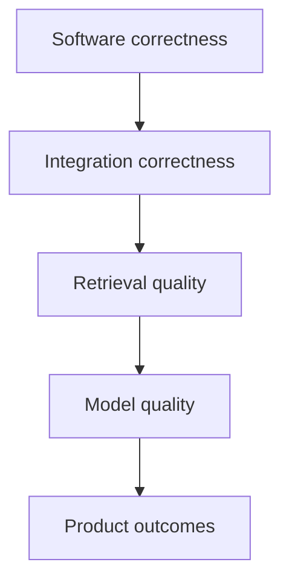
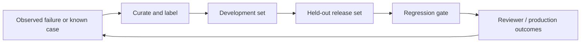

# Evaluation strategy

Tropos evaluates software correctness, integration correctness, retrieval quality, model behavior, and product outcomes as separate layers. Each layer needs different evidence and release gates.

## Quality layers


```mermaid
flowchart TB
    SW[Software correctness]
    --> INT[Integration correctness]
    --> RET[Retrieval quality]
    --> AI[Model quality]
    --> PROD[Product outcomes]
```

Software and integration correctness are implemented. Retrieval has executable regression baselines and saved runs. Training has a first deterministic grounded-generation evaluator. Reusable cross-capability evaluation contracts are now defined; broader model judging and product-outcome evaluation remain incremental work.

## Current software gates

Every pull request and push to `main` runs:

```text
uv sync --dev --locked
uv run ruff format --check .
uv run ruff check .
uv run mypy src tests
uv run pytest
uv build
```

Tests cover access-policy validation, source identity, parsing, normalization, version resolution, lossless chunking, persistence/orchestration, source reliability, governed lexical retrieval, and Resolve policy/orchestration.

Code coverage percentage is not currently measured or gated. That is separate from behavioral quality: a high line-coverage number would not prove retrieval relevance, access isolation, or freshness correctness.

## Evidence maturity and current limits

The evaluation architecture is stronger than the evidence volume currently available. The repository must not present the V1 retrieval or generation sets as production-quality estimates.

Current limitations are explicit:

- retrieval V1 contains 10 answerable and 4 expected-empty cases;
- the repository currently has no locked holdout retrieval set;
- retrieval labels are knowledge-level rather than chunk-level;
- V1 `Precision@5` uses a fixed denominator of five, so one-relevant-document cases have a maximum value of 0.20;
- dense retrieval recovered the two known semantic misses in the recorded MPNet experiment but returned irrelevant authorized nearest neighbours for three of four no-answer cases;
- hybrid RRF is implemented, but the repository does not currently contain a committed hybrid real-model scorecard;
- no confidence intervals are reported in V1;
- current real-model hybrid workflow execution does not constitute a regression gate by itself;
- model-judge evaluation is defined as a future score source but is not implemented/calibrated as a release gate.

These constraints mean that small score differences are hypotheses or regression signals, not statistically stable product-quality claims.

Before release-quality use, Tropos should report sample counts and uncertainty, separate development from holdout evidence, and use paired baseline/candidate comparisons instead of treating one aggregate number as decisive.

## Retrieval evaluation V1

The first retrieval baseline is evaluated against the versioned synthetic corpus at `apps/api/evals/retrieval/golden_v1.json`.

The corpus deliberately contains:

- lexical/exact-term cases that BM25 should handle well;
- semantic/paraphrase cases designed to expose lexical recall gaps;
- no-answer cases;
- cross-tenant and restricted-group access-boundary cases.

The V1 labels are at `knowledge_id` level rather than exact chunk ID. This keeps labels stable while chunking strategy evolves and is sufficient for the current one-chunk-per-document synthetic corpus. It is less precise than chunk-level relevance labeling and must be revisited for larger documents, graded relevance, or reranking work.

### V1 metrics

| Metric | Purpose |
| --- | --- |
| Recall@1 / @3 / @5 | Whether expected knowledge appears in the retrieved set |
| Precision@5 | How much of the five-result window is labeled relevant |
| MRR | Rank of the first relevant result |
| No-answer accuracy | Whether expected-empty cases return no evidence |

For single-relevant-document cases, `Precision@5` has a maximum of `0.2`; it should not be interpreted like a percentage of answer correctness. Recall and MRR are the more useful V1 ranking indicators.

The evaluator deduplicates repeated chunks from the same `knowledge_id` before computing knowledge-level metrics. Retrieval itself still returns chunks; this is an evaluation choice, not a runtime retrieval behavior change.

### Current lexical baseline

`sqlite-fts5-bm25-v1` is expected to establish the following V1 regression baseline on the synthetic corpus:

```text
Answerable cases       10
Expected-empty cases    4
Recall@1              0.80
Recall@3              0.80
Recall@5              0.80
MRR                   0.80
Precision@5           0.16
No-answer accuracy    1.00
```

The two deliberately semantic cases are expected misses for the lexical baseline. This is evidence of a semantic-recall gap, not evidence by itself that vector retrieval should ship. A vector or hybrid strategy should be added as a separate versioned retriever and compared on the same corpus plus a larger production-like set.

## Retrieval-design implications

The core retrieval contract remains strategy-neutral. `KnowledgeSearchRequest` carries query, access context, and limit; the concrete adapter owns lexical, vector, or hybrid behavior.

Do not add a generic score threshold to the core contract yet. BM25 scores are strategy-native and are not normalized probabilities; future vector and reranker scores will have different semantics. Thresholding, if introduced, should be strategy-specific and justified by evaluation.

Do not replace BM25 with vector search by default. Exact identifiers, policy names, codes, and product terms are strong lexical use cases. The likely future shape is hybrid retrieval if evaluation shows that semantic recall improves without damaging exact-match behavior, access guarantees, latency, or operational simplicity.

## Product-decision evaluation

Retrieval quality matters because it changes the four-way knowledge decision. A product evaluation record should eventually contain:

```text
EvalCase
├── resolved-case input
├── expected relevant evidence IDs
├── expected or acceptable coverage state
├── expected or acceptable knowledge action
├── reviewer notes
└── risk / criticality tag
```

This supports regression analysis at the decision level rather than only at the wording level.

## Model evaluation

Model-assisted generation is now present behind provider-neutral contracts for Training and Knowledge Article generation. Training has a deterministic synthetic golden set that checks expected step coverage, stable evidence alignment, exception separation, and typed gap coverage. Knowledge Article generation has deterministic schema/evidence invariants; its capability-specific golden set is the next evaluation slice.

Evaluation should continue to distinguish context relevance, faithfulness/groundedness, answer relevance, and task correctness rather than collapsing them into one score. LLM-based judges may supplement deterministic checks and human review, but judge prompts/models must be versioned and calibrated against manually reviewed examples before they can become release gates. Calibration should use a human-labelled claim/evidence set and report agreement statistics such as a confusion matrix and Cohen's kappa. Alias validation proves citation identity, not semantic entailment.

## Reusable evaluation contract

The shared contract in `tropos.evals.contracts` defines vendor-neutral `EvalCase`, `EvalDataset`, `EvalRun`, `EvalObservation`, `EvalScore`, evaluator identity, split, approval state, and provenance. It complements rather than replaces the existing retrieval-specific runner.

Approved golden cases remain Tropos-owned/version-controlled product specifications. Synthetic model-generated examples remain candidates until curated. Hosted tools such as LangSmith, Langfuse, or Phoenix may later execute or visualize synchronized runs through adapters; they do not own correctness semantics.

See [Evaluation contracts](../architecture/EVALUATION_CONTRACTS.md).

## Regression dataset lifecycle


```mermaid
flowchart LR
    Failure[Observed failure or known case]
    --> Curate[Curate and label]
    --> Dev[Development set]
    --> Holdout[Held-out release set]
    --> Gate[Regression gate]
    --> Observe[Reviewer / production outcomes]
    --> Failure
```

The V1 corpus is a development/regression seed, not a held-out enterprise benchmark. The next retrieval benchmark must add a locked holdout, explicit scenario tags, chunk-level labels, larger answerable/no-answer populations, and uncertainty reporting. Development data may be used for threshold or policy tuning; holdout data must not.

Critical security or decision failures remain case-level blockers even when aggregate scores improve. Cross-tenant evidence leakage, restricted-group leakage, or stale historical evidence are zero-tolerance failures.

For statistical decision metrics, Tropos should prefer paired baseline/candidate comparisons because the same cases are evaluated under both configurations. Retrieval comparisons should support paired bootstrap confidence intervals once the benchmark size is large enough to make them useful. Hard invariants and statistical decision metrics must remain separate gate types.

## Release gates by capability

| Capability | Required evaluation |
| --- | --- |
| Deterministic core behavior | Unit tests, type checks, lint, build |
| Persistence | Integration and migration tests |
| Retrieval | Integration tests plus labeled retrieval metrics and access-boundary cases |
| Coverage evaluation | Decision-level regression cases |
| LLM assistance | Schema validation, groundedness/task evals, critical-case checks |
| Production workflow | Reviewer outcomes, latency/error telemetry, operational regressions |

See [CI/CD](../delivery/CI_CD.md) and [RAG architecture](../architecture/RAG_ARCHITECTURE.md).

## V2 catalogue and saved execution

The V1 baseline above remains unchanged. `catalogue_v2.json` adds exact-identifier, content-version and access-revocation scenarios, plus a visible draft deletion case. Real BM25 currently yields 15 passes, 2 known semantic misses and 1 not-run draft. Execution completion does not imply a passing quality outcome. All observations, expectations, error states, invariants and metric denominators are saved. See [Evaluation runs](../architecture/EVALUATION_RUNS.md) for commands and scope.
